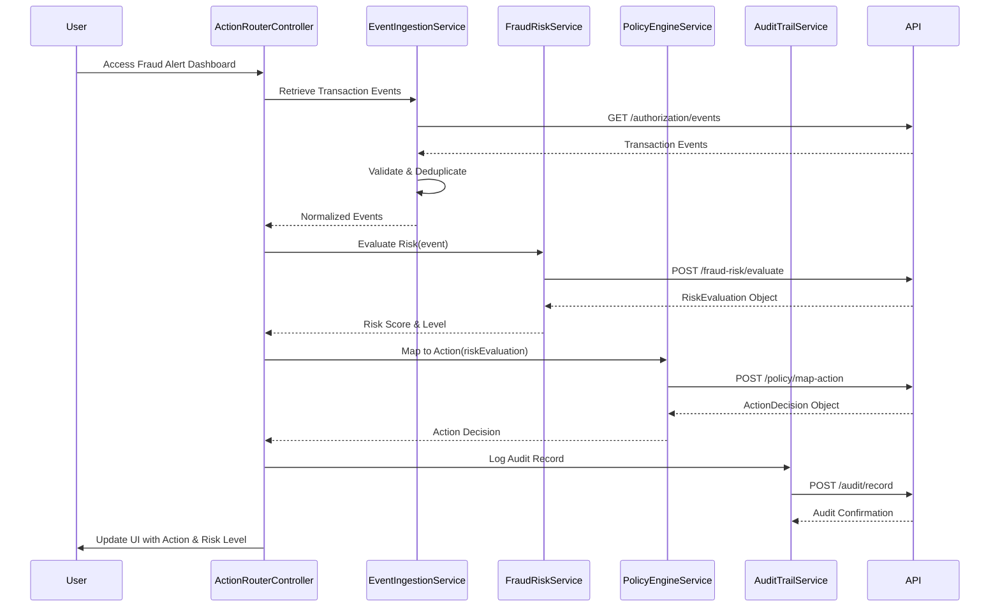

# Low-Level Design: QE-4559

## a. Architecture Mapping

- **Authorization Platform** → AngularJS Service (AuthorizationEventService) - retrieves transaction events via REST API
- **Transaction Event Ingestion** → AngularJS Service (EventIngestionService) - validates, normalizes, and handles idempotency
- **Fraud Risk Engine** → AngularJS Service (FraudRiskService) - evaluates risk scores using REST API with multiple signals
- **Policy Decision Engine** → AngularJS Service (PolicyEngineService) - maps risk levels to actions via REST API
- **Action Router** → AngularJS Controller (ActionRouterController) - executes actions and updates UI
- **Audit Service** → AngularJS Service (AuditTrailService) - logs audit records via REST API

**Recommended Folder Structure:**
```
/app
  /modules
    /fraud-alert
      /controllers
      /services
      /directives
      /views
  /shared
    /services
    /filters
  /assets
```

## b. Component Specifications

| Name | Artifact Type | Responsibility | Key Dependencies |
|------|---------------|----------------|------------------|
| FraudAlertModule | Module | Root module for fraud alert system | angular, ngRoute, ui.bootstrap |
| AuthorizationEventService | Service/Factory | Fetches transaction events from authorization platform | $http, $q |
| EventIngestionService | Service | Validates, normalizes, deduplicates transaction events | AuthorizationEventService, CacheService |
| FraudRiskService | Service | Calls fraud-risk engine API with transaction signals | $http, $q, ConfigService |
| PolicyEngineService | Service | Maps risk scores to actions using policy engine API | $http, FraudRiskService |
| ActionRouterController | Controller | Orchestrates action execution and UI rendering | $scope, EventIngestionService, FraudRiskService, PolicyEngineService, AuditTrailService |
| AuditTrailService | Service | Logs decisions and compliance data to audit API | $http, $q |
| TransactionMonitorDirective | Directive | Displays transaction monitoring dashboard with risk levels | ActionRouterController |
| RiskLevelFilter | Filter | Formats risk level labels (low/medium/high/confirmed fraud) | none |
| ConfigService | Service | Manages configurable thresholds and operational settings | $http, LocalStorageService |

## c. Data Model

**TransactionEvent Object:**
```javascript
{
  eventId: String,
  transactionId: String,
  cardNumber: String (masked),
  amount: Number,
  currency: String,
  merchantId: String,
  merchantCategory: String,
  timestamp: Date,
  geoLocation: Object { latitude: Number, longitude: Number },
  deviceFingerprint: String,
  ipAddress: String,
  compromisedIndicator: Boolean
}
```

**RiskEvaluation Object:**
```javascript
{
  transactionId: String,
  riskScore: Number,
  riskLevel: String, // 'low', 'medium', 'high', 'confirmed_fraud'
  signals: Object {
    amountPattern: Boolean,
    merchantBehavior: String,
    geoInconsistency: Boolean,
    velocityPattern: Boolean,
    compromisedCard: Boolean
  },
  engineVersion: String
}
```

**ActionDecision Object:**
```javascript
{
  transactionId: String,
  action: String, // 'approve', 'alert', 'step_up_verify', 'hold', 'decline'
  riskLevel: String,
  decisionTimestamp: Date,
  engineVersion: String
}
```

## d. Data Flow

User accesses the fraud alert dashboard (View) managed by ActionRouterController. The controller calls EventIngestionService to retrieve transaction events from AuthorizationEventService. The ingestion service validates and deduplicates events using idempotency checks. Normalized transaction data with risk signals is sent to FraudRiskService, which invokes the fraud-risk engine REST API and returns a RiskEvaluation object. PolicyEngineService receives the risk evaluation and calls the policy engine API to map the risk level to an action decision (approve/alert/step-up/hold/decline). The controller executes the action, updates the UI with risk indicators, and invokes AuditTrailService to log the decision to the audit API for compliance tracking.

## e. Primary Sequence Diagram



## f. Implementation Notes

- Use AngularJS dependency injection for all services and controllers to support unit testing and loose coupling
- Implement ES6 classes for services with promise-based REST API calls using $http and $q for asynchronous operations
- Use AngularJS $http interceptors for centralized error handling, authentication token injection, and request/response logging
- Apply MVC architecture: controllers manage UI state and orchestration, services handle business logic and API integration, views use data binding
- Leverage Bootstrap components (panels, badges, modals) for displaying risk levels and action notifications

## g. Error Handling

Interceptor-based approach using $http interceptors for API errors, try/catch blocks for data validation, and user notifications via Bootstrap modals and alert components.

## h. Security Notes

Requires token-based authentication via existing SSO with secure HTTPS API calls; standard input validation and sanitization for all transaction data fields to prevent injection attacks.