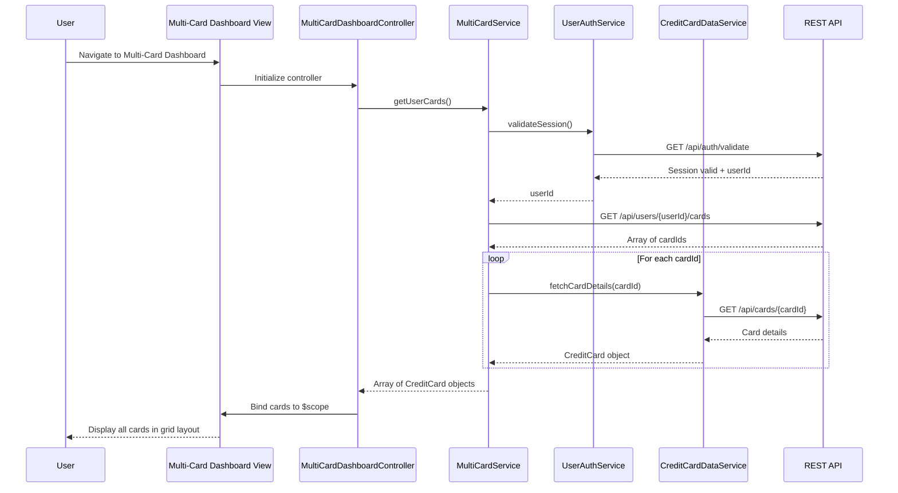

# Low-Level Design: Multi-Card Management and Visualization

**Epic ID:** QE-4620  
**Technology Stack:** AngularJS 1.x, JavaScript ES6, HTML5, CSS3, Bootstrap, REST APIs, MVC Architecture

---

## a. Architecture Mapping

| HLD Component | AngularJS Artifact | Mapping |
|---------------|-------------------|----------|
| User Interface | Module: `multiCardModule` | Root module for multi-card management feature |
| User Interface | Controller: `MultiCardDashboardController` | Manages card portfolio display and user interactions |
| User Interface | Controller: `CardSpendAnalysisController` | Handles card-wise spend analysis view |
| Multi-Card Management Service | Service: `MultiCardService` | Orchestrates card data retrieval and aggregation |
| Credit Card Data Service | Service: `CreditCardDataService` | Fetches card information and metadata via REST API |
| User Service | Service: `UserAuthService` | Validates user authentication and card associations |
| Analytics Engine | Service: `CardAnalyticsService` | Aggregates and processes card-wise spend data |
| User Interface | Directive: `cardTile` | Reusable component for displaying individual card details |
| User Interface | Directive: `spendComparisonChart` | Renders card-wise spend comparison visualization |

**Recommended Folder Structure:**
```
app/
├── modules/
│   └── multi-card/
│       ├── controllers/
│       │   ├── multi-card-dashboard.controller.js
│       │   └── card-spend-analysis.controller.js
│       ├── services/
│       │   ├── multi-card.service.js
│       │   ├── credit-card-data.service.js
│       │   ├── user-auth.service.js
│       │   └── card-analytics.service.js
│       ├── directives/
│       │   ├── card-tile.directive.js
│       │   └── spend-comparison-chart.directive.js
│       ├── views/
│       │   ├── multi-card-dashboard.html
│       │   └── card-spend-analysis.html
│       └── multi-card.module.js
└── assets/
    └── css/
        └── multi-card.css
```

---

## b. Component Specifications

| Component Name | Artifact Type | Responsibility | Key Dependencies |
|----------------|---------------|----------------|------------------|
| `multiCardModule` | Module | Encapsulates all multi-card management functionality | `ngRoute`, `ngResource` |
| `MultiCardDashboardController` | Controller | Fetches and displays all user credit cards in consolidated view | `MultiCardService`, `$scope` |
| `CardSpendAnalysisController` | Controller | Displays card-wise spend analysis and enables comparison | `CardAnalyticsService`, `MultiCardService`, `$scope` |
| `MultiCardService` | Service | Coordinates data retrieval from CreditCardDataService and UserAuthService | `CreditCardDataService`, `UserAuthService`, `$q` |
| `CreditCardDataService` | Service | Calls REST API to fetch card details, balances, and metadata | `$http`, `API_CONFIG` |
| `UserAuthService` | Service | Validates user session and retrieves user-to-card associations | `$http`, `$window`, `API_CONFIG` |
| `CardAnalyticsService` | Service | Aggregates transaction data and computes card-wise spend breakdowns | `$http`, `API_CONFIG` |
| `cardTile` | Directive | Renders individual card information (card number, balance, type) | None |
| `spendComparisonChart` | Directive | Visualizes spend comparison across multiple cards using Chart.js | `Chart.js` library |

---

## c. Data Model

**CreditCard Object:**
```javascript
{
  cardId: String,
  cardNumber: String,        // Masked (e.g., "**** **** **** 1234")
  cardType: String,          // e.g., "Visa", "MasterCard", "Amex"
  cardHolderName: String,
  expiryDate: String,        // Format: "MM/YY"
  currentBalance: Number,
  creditLimit: Number,
  availableCredit: Number,
  status: String             // e.g., "Active", "Blocked"
}
```

**CardSpendAnalysis Object:**
```javascript
{
  cardId: String,
  totalSpend: Number,
  spendByCategory: Array,    // [{ category: String, amount: Number }]
  transactionCount: Number,
  averageTransactionValue: Number,
  period: String             // e.g., "Last 30 days"
}
```

**UserCardPortfolio Object:**
```javascript
{
  userId: String,
  cards: Array               // Array of CreditCard objects
}
```

---

## d. Data Flow

User navigates to the multi-card dashboard → `MultiCardDashboardController` initializes and calls `MultiCardService.getUserCards()` → `MultiCardService` first authenticates the user via `UserAuthService.validateSession()`, then retrieves the user's card associations → `CreditCardDataService.fetchCardDetails()` is invoked for each associated card ID, making REST API calls to `/api/cards/{cardId}` → Card data is aggregated and returned to the controller → Controller binds the card array to `$scope.cards` → View renders each card using the `cardTile` directive with Bootstrap grid layout → When user selects "Card-wise Spend Analysis", `CardSpendAnalysisController` calls `CardAnalyticsService.getSpendAnalysis()` → Service fetches spend data from `/api/analytics/cards/{cardId}/spend` for each card → Aggregated spend data is bound to scope and rendered via `spendComparisonChart` directive → User can compare spending patterns across cards in a visual format.

---

## e. Primary Sequence Diagram



---

## f. Implementation Notes

- **Dependency Injection:** Use AngularJS DI to inject all services into controllers; declare dependencies in array notation for minification safety (e.g., `['$scope', 'MultiCardService', function($scope, MultiCardService) {...}]`).
- **Promise Chaining:** Use `$q.all()` in `MultiCardService` to fetch multiple card details in parallel and aggregate results before returning to controller.
- **REST API Integration:** Configure base API URL in `API_CONFIG` constant; use `$http` service with interceptors for token-based authentication headers.
- **Reusable Directives:** Implement `cardTile` and `spendComparisonChart` as isolated-scope directives with two-way binding for card data to enable reuse across views.
- **Responsive Design:** Use Bootstrap grid classes (col-xs, col-sm, col-md) in card tile layout to ensure dashboard adapts to mobile, tablet, and desktop viewports.

---

## g. Error Handling

HTTP interceptor captures API errors (4xx/5xx), logs to console, and displays user-friendly error messages via a shared notification service with Bootstrap alerts.

---

## h. Security Notes

Standard input validation and secure API calls assumed; card numbers are masked on the server side before transmission to the client.

---

**End of LLD Document**