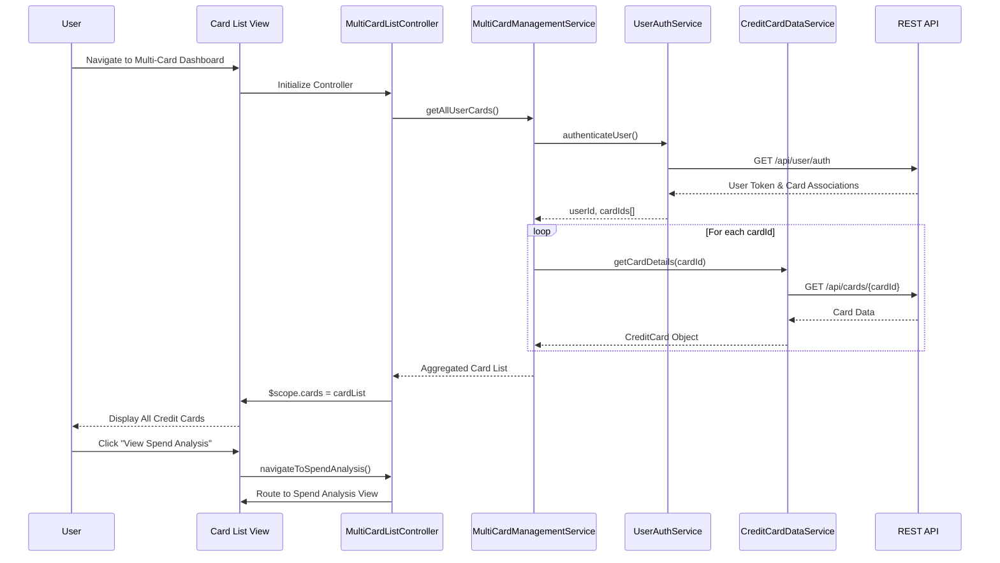

# Low-Level Design: Multi-Card Management and Visualization
## Epic ID: QE-4620

---

## a. Architecture Mapping

| HLD Component | AngularJS Artifact | Mapping |
|---------------|-------------------|----------|
| User Interface | Module: `creditCardApp.multiCard` | Root module for multi-card management features |
| User Interface - Card List View | Controller: `MultiCardListController` | Manages card portfolio display and user interactions |
| User Interface - Spend Analysis View | Controller: `CardSpendAnalysisController` | Handles card-wise spend analysis and comparison |
| Multi-Card Management Service | Service: `MultiCardManagementService` | Orchestrates card retrieval, aggregation, and business logic |
| Credit Card Data Service | Service: `CreditCardDataService` | Handles API calls to retrieve card information and metadata |
| User Service | Service: `UserAuthService` | Manages user authentication and card-user associations |
| Analytics Engine | Service: `CardAnalyticsService` | Aggregates and processes spend data for analysis |

**Recommended Folder Structure:**
```
app/
├── modules/
│   └── multi-card/
│       ├── controllers/
│       │   ├── multi-card-list.controller.js
│       │   └── card-spend-analysis.controller.js
│       ├── services/
│       │   ├── multi-card-management.service.js
│       │   ├── credit-card-data.service.js
│       │   ├── card-analytics.service.js
│       │   └── user-auth.service.js
│       ├── views/
│       │   ├── card-list.html
│       │   └── spend-analysis.html
│       └── multi-card.module.js
```

---

## b. Component Specifications

| Component Name | Artifact Type | Responsibility | Key Dependencies |
|----------------|---------------|----------------|------------------|
| `creditCardApp.multiCard` | Module | Root module for multi-card management functionality | `ngRoute`, `ngResource` |
| `MultiCardListController` | Controller | Display all user credit cards with relevant details and handle card selection | `MultiCardManagementService`, `$scope` |
| `CardSpendAnalysisController` | Controller | Display card-wise spend breakdown and enable comparison across cards | `CardAnalyticsService`, `MultiCardManagementService`, `$scope` |
| `MultiCardManagementService` | Service/Factory | Orchestrate card retrieval, validate user associations, aggregate card data | `CreditCardDataService`, `UserAuthService`, `$q` |
| `CreditCardDataService` | Service/Factory | Fetch card information, metadata, and balances via REST API | `$http`, `$q` |
| `UserAuthService` | Service/Factory | Authenticate user and retrieve user-to-card associations | `$http`, `$window` (for token storage) |
| `CardAnalyticsService` | Service/Factory | Aggregate transaction data, calculate spend by card, provide comparison metrics | `$http`, `$q` |
| `cardListView` | Directive | Render individual card tiles with key information (card number, balance, type) | `MultiCardManagementService` |
| `spendComparisonChart` | Directive | Render visual comparison of spending across multiple cards | `CardAnalyticsService`, Chart library (e.g., Chart.js) |

---

## c. Data Model

**CreditCard Model:**
```javascript
{
  cardId: String,              // Unique card identifier
  cardNumber: String,          // Masked card number (e.g., "****1234")
  cardType: String,            // Card type (e.g., "Visa", "MasterCard")
  cardName: String,            // User-defined card name
  balance: Number,             // Current outstanding balance
  creditLimit: Number,         // Total credit limit
  availableCredit: Number,     // Available credit (limit - balance)
  expiryDate: String,          // Card expiry (MM/YY)
  status: String               // Card status ("Active", "Blocked", "Expired")
}
```

**CardSpendAnalysis Model:**
```javascript
{
  cardId: String,              // Reference to credit card
  totalSpend: Number,          // Total spend for the period
  spendByCategory: Array,      // [{category: String, amount: Number}]
  transactionCount: Number,    // Number of transactions
  averageTransaction: Number,  // Average transaction amount
  period: String               // Analysis period (e.g., "2024-01", "Last 30 days")
}
```

**UserCardAssociation Model:**
```javascript
{
  userId: String,              // User identifier
  cardIds: Array               // Array of card IDs associated with user
}
```

---

## d. Data Flow

User navigates to the multi-card dashboard → View (`card-list.html`) loads and invokes `MultiCardListController` → Controller calls `MultiCardManagementService.getAllUserCards()` → Service authenticates user via `UserAuthService` and retrieves user-to-card associations → Service fetches detailed card data for each associated card via `CreditCardDataService` (REST API call to `/api/cards/{cardId}`) → Aggregated card list returned to controller and bound to `$scope.cards` → View renders card tiles using `cardListView` directive → User selects "Spend Analysis" → `CardSpendAnalysisController` invokes `CardAnalyticsService.getCardWiseSpend()` → Service fetches spend data via REST API (`/api/analytics/spend?cardIds=...`) → Spend breakdown and comparison metrics returned to controller → View updates with spend charts via `spendComparisonChart` directive.

---

## e. Primary Sequence Diagram



---

## f. Implementation Notes

- **Module Definition**: Use `angular.module('creditCardApp.multiCard', ['ngRoute', 'ngResource'])` with lazy-loaded routing for multi-card views.
- **Dependency Injection**: All services use constructor-based DI (e.g., `function MultiCardManagementService($http, $q, CreditCardDataService, UserAuthService) {...}`).
- **API Integration**: Use `$http` service with promise-based pattern; all API calls return `$q` promises for consistent error handling and chaining.
- **State Management**: Store active card list in controller scope; use `$rootScope.$broadcast` for cross-controller card selection events if needed.
- **Performance Optimization**: Implement card data caching in `CreditCardDataService` using a simple in-memory cache with TTL to reduce redundant API calls for unlimited card scenarios.

---

## g. Error Handling

HTTP interceptor registered at module level to catch API errors (4xx/5xx), display user-friendly notifications via a toast service, and log errors to console; controllers wrap service calls in try/catch for synchronous errors.

---

## h. Security Notes

User authentication token stored in `$window.sessionStorage` and included in all API requests via Authorization header; card numbers masked on client-side; input validation applied to all user-provided card names and filters.