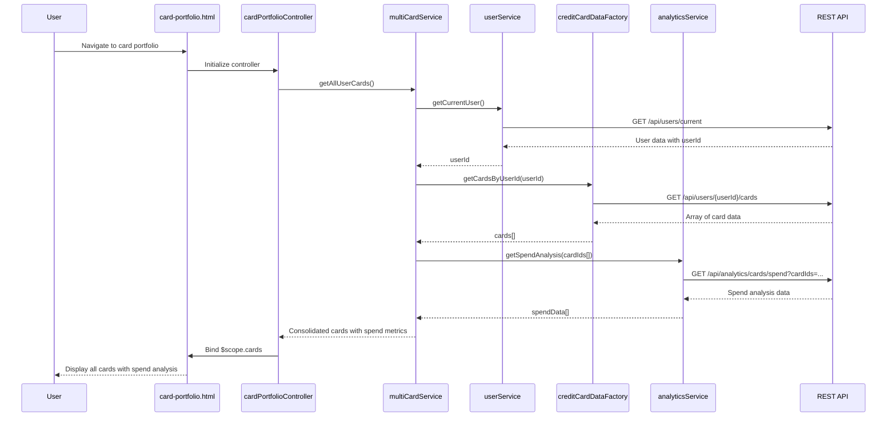

# Low-Level Design: Multi-Card Management and Visualization

**Epic ID:** QE-4620  
**Technology Stack:** AngularJS (1.x), JavaScript ES6, HTML5, CSS3, Bootstrap, REST APIs, MVC Architecture

---

## a. Architecture Mapping

- **Multi-Card Management Service** → AngularJS Service (`multiCardService.js`) - Orchestrates card retrieval and aggregation
- **Credit Card Data Service** → AngularJS Factory (`creditCardDataFactory.js`) - Handles REST API calls for card data
- **User Service** → AngularJS Service (`userService.js`) - Manages user authentication and card associations
- **Analytics Engine** → AngularJS Service (`analyticsService.js`) - Aggregates and processes spend data per card
- **User Interface** → AngularJS Controller (`cardPortfolioController.js`) + View (`card-portfolio.html`) - Displays consolidated card dashboard
- **Card Comparison Component** → AngularJS Directive (`cardComparison`) - Enables side-by-side card comparison

**Recommended Folder Structure:**
```
app/
├── modules/
│   └── card-management/
│       ├── controllers/
│       │   └── cardPortfolioController.js
│       ├── services/
│       │   ├── multiCardService.js
│       │   ├── analyticsService.js
│       │   └── userService.js
│       ├── factories/
│       │   └── creditCardDataFactory.js
│       ├── directives/
│       │   └── cardComparison.js
│       └── views/
│           ├── card-portfolio.html
│           └── card-comparison.html
├── models/
│   └── creditCard.model.js
└── assets/
    ├── css/
    └── images/
```

---

## b. Component Specifications

| Component Name | Artifact Type | Responsibility | Key Dependencies |
|----------------|---------------|----------------|------------------|
| `cardManagementModule` | Module | Root module for multi-card management feature | `ngRoute`, `ngResource` |
| `cardPortfolioController` | Controller | Manages card portfolio view state and user interactions | `multiCardService`, `$scope` |
| `multiCardService` | Service | Orchestrates card retrieval, aggregation, and coordination between services | `creditCardDataFactory`, `userService`, `analyticsService` |
| `creditCardDataFactory` | Factory | Executes REST API calls to retrieve card data and metadata | `$http`, `$q` |
| `userService` | Service | Handles user authentication and retrieves user-card associations | `$http`, `$window` (for session storage) |
| `analyticsService` | Service | Aggregates spend data per card and provides comparison metrics | `creditCardDataFactory`, `$q` |
| `cardComparison` | Directive | Renders side-by-side card comparison UI with spend breakdowns | `analyticsService` |
| `cardListView` | Directive | Displays consolidated list of all user credit cards with key details | None |

---

## c. Data Model

**CreditCard Model** (`creditCard.model.js`):
```javascript
class CreditCard {
  constructor(data) {
    this.cardId = data.cardId;                    // String
    this.cardNumber = data.cardNumber;            // String (masked)
    this.cardType = data.cardType;                // String (Visa, MasterCard, Amex)
    this.cardName = data.cardName;                // String
    this.balance = data.balance;                  // Number
    this.creditLimit = data.creditLimit;          // Number
    this.availableCredit = data.availableCredit;  // Number
    this.dueDate = data.dueDate;                  // Date
    this.minPayment = data.minPayment;            // Number
    this.userId = data.userId;                    // String
  }
}
```

**CardSpendAnalysis Model:**
```javascript
class CardSpendAnalysis {
  constructor(data) {
    this.cardId = data.cardId;                    // String
    this.totalSpend = data.totalSpend;            // Number
    this.categoryBreakdown = data.categoryBreakdown; // Array of {category: String, amount: Number}
    this.monthlySpend = data.monthlySpend;        // Array of {month: String, amount: Number}
    this.comparisonMetrics = data.comparisonMetrics; // Object {avgSpend: Number, rank: Number}
  }
}
```

---

## d. Data Flow

User navigates to the card portfolio dashboard → `card-portfolio.html` view loads → `cardPortfolioController` initializes and calls `multiCardService.getAllUserCards()` → Service authenticates user via `userService.getCurrentUser()` → `creditCardDataFactory` makes REST API call (`GET /api/users/{userId}/cards`) to retrieve all associated cards → `analyticsService.getSpendAnalysis(cardIds)` fetches spend data via `GET /api/analytics/cards/spend` → Services aggregate card data with spend metrics → Controller receives consolidated card array and binds to `$scope.cards` → View renders card list using `ng-repeat` with Bootstrap card components → User selects card comparison → `cardComparison` directive triggers, fetches detailed comparison data, and renders side-by-side view with spend breakdowns.

---

## e. Primary Sequence Diagram



---

## f. Implementation Notes

- Use AngularJS Dependency Injection to inject services into controllers and directives; register all components with the `cardManagementModule`.
- Implement ES6 classes for data models (`CreditCard`, `CardSpendAnalysis`) and use constructor functions for instantiation in factories.
- Use `$http` service with promise chaining (`$q`) for all REST API calls; implement response transformations in factory methods.
- Apply Bootstrap grid system (`col-md-4`, `col-sm-6`) for responsive card layout; use Bootstrap card components for consistent styling.
- Implement `ng-repeat` with `track by cardId` for optimal rendering performance when displaying multiple cards; use one-time binding (`::`) for static card properties.

---

## g. Error Handling

HTTP interceptor registered at module level to catch API errors (4xx/5xx), log to console, and display user-friendly error messages via Bootstrap alert component; controller-level try/catch for service method failures.

---

## h. Security Notes

Card numbers are masked on the server side before transmission; user authentication token validated on every API call via HTTP interceptor; standard input validation and secure API calls assumed.