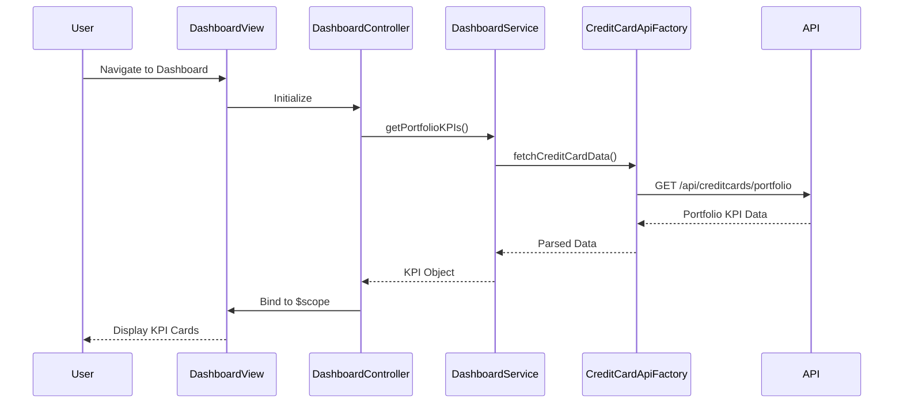

# Low-Level Design: Credit Card Portfolio Dashboard

**Epic ID:** QE-4628

---

## a. Architecture Mapping

- **Dashboard UI Component** → AngularJS Module (`creditCardApp.dashboard`)
- **Dashboard Controller** → AngularJS Controller (`DashboardController`)
- **KPI Display Components** → AngularJS Directives (`kpiCard`, `creditSummary`)
- **Dashboard Service** → AngularJS Service (`DashboardService`)
- **API Integration** → AngularJS Factory (`CreditCardApiFactory`)

**Recommended Folder Structure:**
```
app/
├── modules/
│   └── dashboard/
│       ├── controllers/
│       ├── services/
│       ├── directives/
│       └── views/
├── shared/
│   ├── factories/
│   └── models/
└── assets/
```

---

## b. Component Specifications

| Component Name | Artifact Type | Responsibility | Key Dependencies |
|----------------|---------------|----------------|------------------|
| DashboardController | Controller | Orchestrate dashboard view, fetch and bind KPI data to scope | DashboardService, $scope |
| DashboardService | Service | Aggregate and calculate KPIs (monthly spend, total limit, available credit, outstanding) | CreditCardApiFactory |
| CreditCardApiFactory | Factory | Handle REST API calls to backend credit card data service | $http, $q |
| kpiCard | Directive | Render individual KPI metric card with value and label | None |
| creditSummary | Directive | Display consolidated credit summary view | None |

---

## c. Data Model

**CreditCardPortfolio (JS Object):**
```javascript
{
  monthlySpend: Number,
  totalCreditLimit: Number,
  availableCredit: Number,
  outstandingAmount: Number,
  lastUpdated: Date
}
```

---

## d. Data Flow

User navigates to the dashboard view, triggering DashboardController initialization. The controller invokes DashboardService.getPortfolioKPIs(), which calls CreditCardApiFactory to fetch card balances, limits, and transaction data via REST API. The backend returns aggregated KPI data, which the service processes and returns to the controller. The controller binds the KPI data to $scope, and AngularJS two-way binding updates the view, rendering KPI cards through directives with real-time metrics.

---

## e. Primary Sequence Diagram



---

## f. Implementation Notes

- Use AngularJS module pattern with dependency injection for DashboardService and CreditCardApiFactory
- Implement ES6 classes for service logic with arrow functions for cleaner promise handling
- Use $http service with promise-based API calls; handle responses with .then() and .catch()
- Apply Bootstrap grid system (col-md-3, col-sm-6) for responsive KPI card layout across devices
- Leverage AngularJS $interval for periodic KPI refresh to support near-real-time updates

---

## g. Error Handling

HTTP interceptor captures API errors; display user-friendly toast notifications using AngularJS service for network failures or data unavailability.

---

## h. Security Notes

Standard input validation and secure API calls assumed; API endpoints protected with authentication tokens passed via HTTP headers.