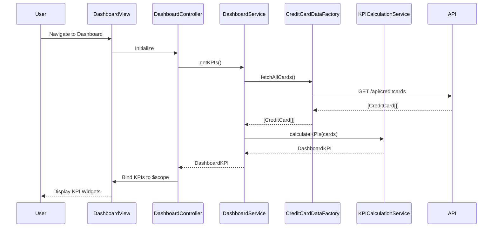

# Low-Level Design: Credit Card Portfolio Dashboard

**Epic ID:** QE-4628

---

## a. Architecture Mapping

- **Dashboard Service** → AngularJS Service (`dashboardService.js`) - orchestrates data fetching and KPI calculations
- **Credit Card Data Service** → AngularJS Factory (`creditCardDataFactory.js`) - handles REST API calls for card data
- **KPI Calculation Engine** → AngularJS Service (`kpiCalculationService.js`) - performs client-side aggregations and computations
- **User Interface** → AngularJS Controller (`dashboardController.js`) + View (`dashboard.html`) - manages UI state and renders KPIs
- **Dashboard Module** → AngularJS Module (`app.dashboard`) - encapsulates all dashboard-related components

**Recommended Folder Structure:**
```
app/
├── modules/
│   └── dashboard/
│       ├── controllers/
│       │   └── dashboardController.js
│       ├── services/
│       │   ├── dashboardService.js
│       │   └── kpiCalculationService.js
│       ├── factories/
│       │   └── creditCardDataFactory.js
│       ├── views/
│       │   └── dashboard.html
│       └── dashboard.module.js
├── shared/
│   └── services/
└── assets/
    └── css/
        └── dashboard.css
```

---

## b. Component Specifications

| Component Name | Artifact Type | Responsibility | Key Dependencies |
|---|---|---|---|
| `app.dashboard` | Module | Root module for dashboard feature | `ngRoute`, `app.shared` |
| `dashboardController` | Controller | Manages dashboard view state, triggers data refresh, binds KPIs to view | `dashboardService`, `$scope` |
| `dashboardService` | Service | Orchestrates data retrieval and delegates KPI calculations | `creditCardDataFactory`, `kpiCalculationService` |
| `creditCardDataFactory` | Factory | Fetches credit card data via REST API (`/api/creditcards`) | `$http`, `$q` |
| `kpiCalculationService` | Service | Aggregates monthly spend, calculates available credit (limit - outstanding), computes totals | None |
| `dashboardView` | View/Template | Renders KPI widgets (monthly spend, total limit, available credit, outstanding) using Bootstrap grid | `dashboardController` |

---

## c. Data Model

**CreditCard Model:**
```javascript
{
  cardId: String,
  cardNumber: String (masked),
  cardType: String,
  creditLimit: Number,
  outstandingAmount: Number,
  availableCredit: Number,
  monthlySpend: Number,
  lastUpdated: Date
}
```

**DashboardKPI Model:**
```javascript
{
  totalCreditLimit: Number,
  totalAvailableCredit: Number,
  totalOutstanding: Number,
  totalMonthlySpend: Number,
  cardCount: Number
}
```

---

## d. Data Flow

User navigates to dashboard → `dashboardController` initializes and calls `dashboardService.getKPIs()` → `dashboardService` invokes `creditCardDataFactory.fetchAllCards()` which makes GET request to `/api/creditcards` → API returns array of credit card objects → `kpiCalculationService.calculateKPIs(cards)` aggregates monthly spend, sums credit limits, computes total available credit (sum of limit - outstanding per card), and totals outstanding amounts → Calculated KPIs are bound to `$scope.kpis` → View updates responsive Bootstrap widgets displaying financial health metrics in real-time.

---

## e. Primary Sequence Diagram



---

## f. Implementation Notes

- Use AngularJS dependency injection to inject `dashboardService`, `creditCardDataFactory`, and `kpiCalculationService` into controllers and services
- Implement ES6 classes or factory pattern for services; use `$http` promises with `.then()` chaining for asynchronous API calls
- Apply Bootstrap responsive grid (col-xs/sm/md/lg) for KPI widgets to ensure mobile, tablet, and desktop compatibility
- Cache API responses in `creditCardDataFactory` using `$cacheFactory` or service-level caching to optimize repeated calls
- Use AngularJS `$interval` or manual refresh button to periodically update KPIs for near real-time data

---

## g. Error Handling

HTTP interceptor captures API failures; display user-friendly error messages via Bootstrap alerts and log errors to console.

---

## h. Security Notes

Standard input validation and secure API calls assumed; ensure API endpoints use authentication tokens (e.g., JWT in headers).