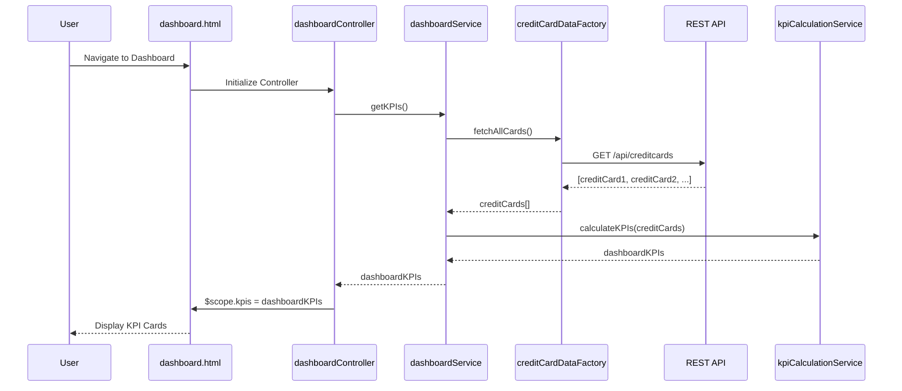

# Low-Level Design: Credit Card Portfolio Dashboard

**Epic ID:** QE-4628

---

## a. Architecture Mapping

- **Dashboard Service** → AngularJS Service (`dashboardService.js`) - orchestrates data fetching and KPI aggregation
- **Credit Card Data Service** → AngularJS Factory (`creditCardDataFactory.js`) - handles REST API calls for card data
- **KPI Calculation Engine** → AngularJS Service (`kpiCalculationService.js`) - performs client-side calculations for metrics
- **User Interface** → AngularJS Controller (`dashboardController.js`) + View (`dashboard.html`) - renders KPIs and handles user interactions
- **Dashboard Module** → AngularJS Module (`app.dashboard`) - encapsulates all dashboard-related components

**Recommended Folder Structure:**
```
app/
├── modules/
│   └── dashboard/
│       ├── controllers/
│       │   └── dashboardController.js
│       ├── services/
│       │   ├── dashboardService.js
│       │   └── kpiCalculationService.js
│       ├── factories/
│       │   └── creditCardDataFactory.js
│       ├── views/
│       │   └── dashboard.html
│       └── dashboard.module.js
├── shared/
│   └── models/
│       └── creditCard.model.js
└── assets/
    └── css/
        └── dashboard.css
```

---

## b. Component Specifications

| Name | Artifact Type | Responsibility | Key Dependencies |
|------|---------------|----------------|------------------|
| `app.dashboard` | Module | Root module for dashboard feature | `ngRoute`, `app.shared` |
| `dashboardController` | Controller | Manages dashboard view state, triggers data fetch, exposes KPIs to view | `dashboardService`, `$scope` |
| `dashboardService` | Service | Orchestrates data retrieval and KPI computation, caches results | `creditCardDataFactory`, `kpiCalculationService`, `$q` |
| `creditCardDataFactory` | Factory | Executes REST API calls to fetch credit card data | `$http`, `API_ENDPOINTS` |
| `kpiCalculationService` | Service | Aggregates monthly spend, calculates available credit, computes totals | None |
| `dashboard.html` | View/Template | Displays KPI cards (monthly spend, total limit, available credit, outstanding), responsive layout | Bootstrap grid, AngularJS directives |

---

## c. Data Model

**CreditCard Model** (`creditCard.model.js`):
```javascript
{
  cardId: String,
  cardNumber: String,
  cardType: String,
  creditLimit: Number,
  outstandingAmount: Number,
  availableCredit: Number,
  monthlySpend: Number,
  lastUpdated: Date
}
```

**DashboardKPI Model** (in-memory):
```javascript
{
  totalCreditLimit: Number,
  totalAvailableCredit: Number,
  totalOutstanding: Number,
  totalMonthlySpend: Number,
  cardCount: Number
}
```

---

## d. Data Flow

User navigates to dashboard → `dashboard.html` loads and `dashboardController` initializes → Controller calls `dashboardService.getKPIs()` → Service invokes `creditCardDataFactory.fetchAllCards()` which makes GET request to `/api/creditcards` → API returns array of credit card objects → `kpiCalculationService` aggregates data (sums monthly spend, credit limits, outstanding amounts; calculates available credit as limit minus outstanding) → Computed KPIs are returned to controller → Controller binds KPIs to `$scope` → View updates with KPI cards displaying financial metrics in responsive Bootstrap grid.

---

## e. Primary Sequence Diagram



---

## f. Implementation Notes

- Use AngularJS dependency injection to inject `dashboardService` into controller and `creditCardDataFactory` + `kpiCalculationService` into service
- Implement `creditCardDataFactory` using `$http` service with promise-based API calls; cache results using `$cacheFactory` for performance
- Use ES6 arrow functions and const/let in services; leverage Array.reduce() for KPI aggregation in `kpiCalculationService`
- Apply Bootstrap responsive grid (col-xs/sm/md/lg) in `dashboard.html` to ensure mobile/tablet/desktop compatibility
- Bind KPIs to view using AngularJS expressions ({{ }}) and ng-bind for dynamic updates

---

## g. Error Handling

HTTP interceptor captures API errors; display user-friendly error messages via Bootstrap alerts in dashboard view; log errors to console for debugging.

---

## h. Security Notes

Standard input validation and secure API calls assumed; ensure API endpoints use authentication tokens passed via HTTP headers.