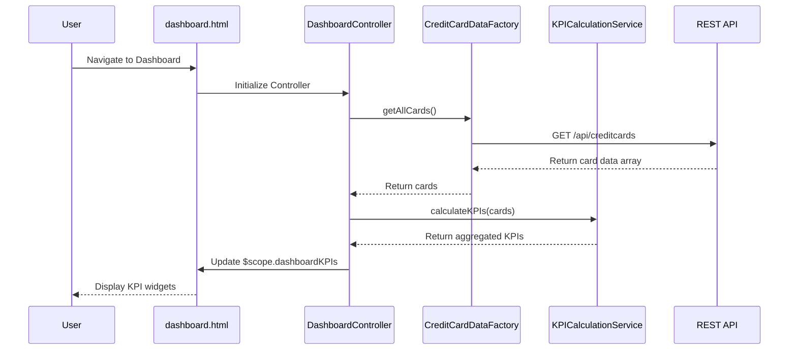

# Low-Level Design: Credit Card Portfolio Dashboard

**Epic ID:** QE-4628

## a. Architecture Mapping

- **Dashboard Service** → AngularJS Module (`creditCardDashboardModule`) + Controller (`DashboardController`)
- **Credit Card Data Service** → AngularJS Factory (`CreditCardDataFactory`) for REST API calls
- **KPI Calculation Engine** → AngularJS Service (`KPICalculationService`) for client-side aggregation
- **User Interface** → HTML5 views with Bootstrap responsive grid + AngularJS directives for KPI widgets
- **Data Store Integration** → REST API endpoints consumed via `$http` service

**Recommended Folder Structure:**
```
app/
├── modules/
│   └── dashboard/
│       ├── controllers/
│       │   └── DashboardController.js
│       ├── services/
│       │   ├── CreditCardDataFactory.js
│       │   └── KPICalculationService.js
│       ├── directives/
│       │   └── kpiWidget.js
│       └── views/
│           └── dashboard.html
├── assets/
│   ├── css/
│   └── js/
└── app.js
```

## b. Component Specifications

| Component Name | Artifact Type | Responsibility | Key Dependencies |
|---|---|---|---|
| creditCardDashboardModule | Module | Root module for dashboard feature | angular, ngRoute |
| DashboardController | Controller | Orchestrates dashboard view, fetches data, triggers KPI calculations | CreditCardDataFactory, KPICalculationService, $scope |
| CreditCardDataFactory | Factory | Fetches credit card data from REST API endpoints | $http, $q |
| KPICalculationService | Service | Aggregates monthly spend, calculates available credit, computes totals | None |
| kpiWidget | Directive | Reusable widget for displaying individual KPI metrics | None |
| dashboard.html | View | Responsive layout with Bootstrap grid displaying all KPIs | Bootstrap CSS |

## c. Data Model

**CreditCard Object:**
```javascript
{
  cardId: String,
  cardNumber: String,
  cardType: String,
  creditLimit: Number,
  outstandingAmount: Number,
  availableCredit: Number,
  monthlySpend: Number
}
```

**DashboardKPI Object:**
```javascript
{
  totalMonthlySpend: Number,
  totalCreditLimit: Number,
  totalAvailableCredit: Number,
  totalOutstanding: Number,
  lastUpdated: Date
}
```

## d. Data Flow

User navigates to dashboard → `dashboard.html` view loads → `DashboardController` initializes and calls `CreditCardDataFactory.getAllCards()` → Factory makes GET request to `/api/creditcards` REST endpoint → API returns array of credit card objects → `KPICalculationService.calculateKPIs(cards)` aggregates monthly spend, sums credit limits, computes available credit (limit - outstanding), and totals outstanding amounts → Calculated KPIs are bound to `$scope.dashboardKPIs` → View updates via two-way data binding, rendering responsive KPI widgets with Bootstrap grid layout.

## e. Primary Sequence Diagram



## f. Implementation Notes

- Use AngularJS Dependency Injection to inject `CreditCardDataFactory` and `KPICalculationService` into `DashboardController`
- Implement Factory pattern for API calls using `$http` service with promise-based error handling via `$q`
- Use Bootstrap responsive grid (col-xs-*, col-sm-*, col-md-*) for mobile-first responsive layout
- Implement custom directive `kpiWidget` with isolated scope for reusable KPI display components
- Cache API responses in Factory using simple object cache with configurable TTL to optimize performance

## g. Error Handling

HTTP interceptor registered at module level to catch API errors, with controller-level try/catch for calculation errors and user-friendly toast notifications via Bootstrap alerts.

## h. Security Notes

Standard input validation and secure API calls assumed; ensure API endpoints use authentication tokens passed via HTTP headers.