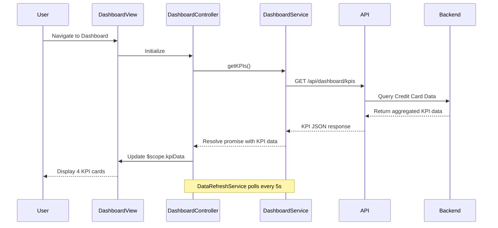

# Low-Level Design: Credit Card Portfolio Dashboard

**Epic ID:** QE-4628

## a. Architecture Mapping

- **Dashboard Module** (`app.dashboard`) → AngularJS Module containing all dashboard-related components
- **Dashboard Controller** (`DashboardController`) → Manages dashboard state and orchestrates KPI data retrieval
- **Dashboard Service** (`DashboardService`) → Factory handling REST API calls to backend dashboard endpoints
- **KPI Card Directive** (`kpiCard`) → Reusable directive for rendering individual KPI metrics (spend, limit, available credit, outstanding)
- **Data Refresh Service** (`DataRefreshService`) → Service managing near-real-time polling/refresh logic

**Recommended Folder Structure:**
```
app/
  modules/
    dashboard/
      controllers/
      services/
      directives/
      views/
      dashboard.module.js
```

## b. Component Specifications

| Component Name | Artifact Type | Responsibility | Key Dependencies |
|----------------|---------------|----------------|------------------|
| DashboardController | Controller | Fetch and bind KPI data to view, handle refresh actions | DashboardService, $scope, $interval |
| DashboardService | Factory | Execute REST API calls to /api/dashboard/kpis endpoint | $http, $q |
| kpiCard | Directive | Render individual KPI with label, value, and icon | None |
| DataRefreshService | Service | Poll backend every 5 seconds for updated KPI data | $interval, DashboardService |
| DashboardView | HTML Template | Responsive layout displaying four KPI cards in grid | Bootstrap grid classes |

## c. Data Model

**DashboardKPI Object:**
```javascript
{
  monthlySpend: Number,        // Total spend in current month
  totalCreditLimit: Number,    // Sum of all card limits
  availableCredit: Number,     // Total limit - outstanding
  outstandingAmount: Number,   // Total balance across cards
  lastUpdated: Date            // Timestamp of last data refresh
}
```

## d. Data Flow

User navigates to the dashboard view, triggering DashboardController initialization. The controller invokes DashboardService.getKPIs(), which sends a GET request to `/api/dashboard/kpis`. The backend Dashboard Service aggregates data from Credit Card Data Service and returns calculated KPIs. DataRefreshService polls the same endpoint every 5 seconds to provide near-real-time updates. Upon receiving the response, the controller updates $scope.kpiData, and Angular's two-way binding refreshes the four kpiCard directives displaying monthly spend, total credit limit, available credit, and outstanding amount in a responsive Bootstrap grid.

## e. Primary Sequence Diagram



## f. Implementation Notes

- Use AngularJS 1.x module pattern with dependency injection for DashboardService and DataRefreshService
- Implement $http interceptor for global error handling and loading states
- Leverage Bootstrap responsive grid (col-xs-12 col-sm-6 col-md-3) for KPI card layout across devices
- Use $interval service for polling; ensure cleanup on $scope.$destroy to prevent memory leaks
- Apply ES6 arrow functions and const/let in service implementations for cleaner code

## g. Error Handling

HTTP interceptor captures API errors, displays user-friendly toast notifications using angular-toastr, and logs errors to console for debugging.

## h. Security Notes

Standard input validation and secure API calls assumed; JWT token passed in Authorization header for authenticated requests.