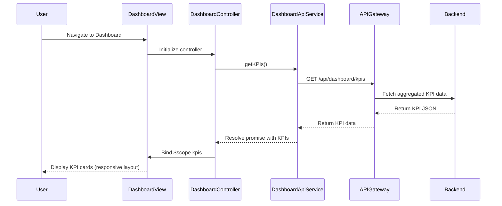

# Low-Level Design: Credit Card Portfolio Dashboard

**Epic ID:** QE-4628

---

## a. Architecture Mapping

- **Dashboard UI Component** → AngularJS Module (`creditCardDashboard`) + Controller (`DashboardController`)
- **API Gateway Integration** → AngularJS Service/Factory (`DashboardApiService`)
- **KPI Display Logic** → Controller methods + View bindings
- **Responsive Layout** → HTML5 templates with Bootstrap grid + CSS3 media queries

**Recommended Folder Structure:**
```
app/
  modules/
    dashboard/
      controllers/
        dashboard.controller.js
      services/
        dashboard-api.service.js
      views/
        dashboard.html
      dashboard.module.js
  shared/
    services/
      api-gateway.service.js
  assets/
    css/
      dashboard.css
```

---

## b. Component Specifications

| Component Name | Artifact Type | Responsibility | Key Dependencies |
|----------------|---------------|----------------|------------------|
| creditCardDashboard | Module | Root module for dashboard feature | angular, ngRoute |
| DashboardController | Controller | Manages dashboard state, fetches KPIs, handles user interactions | DashboardApiService, $scope |
| DashboardApiService | Factory | Fetches aggregated KPI data from backend via REST API | $http, ApiGatewayService |
| ApiGatewayService | Service | Centralizes API endpoint configuration and HTTP interceptors | $http |
| dashboardView | HTML Template | Renders KPI cards (monthly spend, credit limit, available credit, outstanding) with responsive layout | Bootstrap grid, ng-repeat, filters |
| dashboardDirective | Directive (optional) | Encapsulates KPI card rendering logic for reusability | DashboardController |

---

## c. Data Model

**DashboardKPI (JavaScript Object):**
```javascript
{
  monthlySpend: Number,          // Total spend in current month
  totalCreditLimit: Number,      // Sum of all card limits
  availableCredit: Number,       // Total available credit across cards
  outstandingAmount: Number,     // Total outstanding balance
  lastUpdated: Date              // Timestamp of last data refresh
}
```

**CreditCard (JavaScript Object):**
```javascript
{
  cardId: String,
  cardNumber: String,            // Masked (e.g., "****1234")
  balance: Number,
  creditLimit: Number,
  availableCredit: Number
}
```

---

## d. Data Flow

User navigates to the dashboard view, triggering `DashboardController` initialization. The controller invokes `DashboardApiService.getKPIs()`, which sends a GET request to `/api/dashboard/kpis` via `ApiGatewayService`. The backend aggregates data from the Credit Card Data Service and returns a JSON payload containing monthly spend, total credit limit, available credit, and outstanding amount. The controller binds this data to `$scope.kpis`, and AngularJS updates the view to display the four KPI cards in a responsive Bootstrap grid layout.

---

## e. Primary Sequence Diagram



---

## f. Implementation Notes

- Use AngularJS Dependency Injection to inject `DashboardApiService` into `DashboardController`.
- Leverage ES6 Promises or AngularJS `$q` for asynchronous API calls; handle success/error callbacks.
- Apply Bootstrap responsive grid classes (`col-xs-*`, `col-md-*`) to KPI cards for mobile/tablet/desktop support.
- Use AngularJS filters (e.g., `currency`, `number`) for formatting monetary values in the view.
- Implement periodic data refresh using `$interval` service for near-real-time updates (e.g., every 30 seconds).

---

## g. Error Handling

HTTP interceptor in `ApiGatewayService` catches API errors; display user-friendly error messages via AngularJS `$rootScope` broadcast and toast notifications.

---

## h. Security Notes

Standard input validation and secure API calls assumed; ensure HTTPS for all API requests and token-based authentication via HTTP headers.