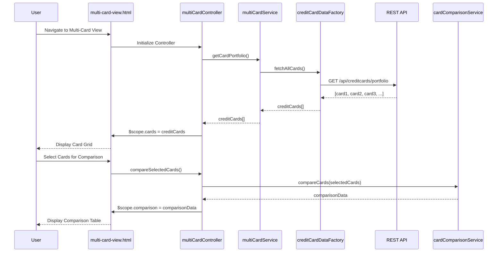

# Low-Level Design: Multi-Card Management and Comparison

**Epic ID:** QE-4629

---

## a. Architecture Mapping

- **Multi-Card Management Service** → AngularJS Service (`multiCardService.js`) - orchestrates card portfolio retrieval and management
- **Credit Card Data Service** → AngularJS Factory (`creditCardDataFactory.js`) - handles REST API calls for multiple card data
- **Card Comparison Module** → AngularJS Service (`cardComparisonService.js`) - performs side-by-side card comparisons
- **Spend Analysis Module** → AngularJS Service (`spendAnalysisService.js`) - computes card-wise spend metrics
- **User Interface** → AngularJS Controller (`multiCardController.js`) + View (`multi-card-view.html`) - displays card list and comparison UI
- **Multi-Card Module** → AngularJS Module (`app.multiCard`) - encapsulates multi-card management components

**Recommended Folder Structure:**
```
app/
├── modules/
│   └── multi-card/
│       ├── controllers/
│       │   └── multiCardController.js
│       ├── services/
│       │   ├── multiCardService.js
│       │   ├── cardComparisonService.js
│       │   └── spendAnalysisService.js
│       ├── factories/
│       │   └── creditCardDataFactory.js
│       ├── views/
│       │   └── multi-card-view.html
│       ├── directives/
│       │   └── cardTile.directive.js
│       └── multiCard.module.js
└── assets/
    └── css/
        └── multi-card.css
```

---

## b. Component Specifications

| Name | Artifact Type | Responsibility | Key Dependencies |
|------|---------------|----------------|------------------|
| `app.multiCard` | Module | Root module for multi-card management feature | `ngRoute`, `app.shared` |
| `multiCardController` | Controller | Manages card portfolio view state, triggers comparison and analysis | `multiCardService`, `cardComparisonService`, `$scope` |
| `multiCardService` | Service | Fetches and manages user's credit card portfolio | `creditCardDataFactory`, `$q` |
| `creditCardDataFactory` | Factory | Executes REST API calls to retrieve multiple card details | `$http`, `API_ENDPOINTS` |
| `cardComparisonService` | Service | Compares selected cards on key metrics (limit, balance, APR, rewards) | None |
| `spendAnalysisService` | Service | Calculates card-wise spend totals and usage percentages | None |
| `cardTile.directive` | Directive | Reusable card display component showing individual card details | None |
| `multi-card-view.html` | View/Template | Displays card grid, comparison table, and analysis charts | Bootstrap, `cardTile` directive |

---

## c. Data Model

**CreditCard Model** (`creditCard.model.js`):
```javascript
{
  cardId: String,
  cardNumber: String,
  cardType: String,
  issuer: String,
  creditLimit: Number,
  currentBalance: Number,
  availableCredit: Number,
  apr: Number,
  rewardsProgram: String,
  monthlySpend: Number,
  usagePercentage: Number
}
```

**CardComparison Model** (in-memory):
```javascript
{
  cards: Array<CreditCard>,
  comparisonMetrics: {
    limits: Array<Number>,
    balances: Array<Number>,
    aprs: Array<Number>,
    rewards: Array<String>
  }
}
```

---

## d. Data Flow

User navigates to multi-card view → `multi-card-view.html` loads and `multiCardController` initializes → Controller calls `multiCardService.getCardPortfolio()` → Service invokes `creditCardDataFactory.fetchAllCards()` which makes GET request to `/api/creditcards/portfolio` → API returns array of all user's credit cards → `spendAnalysisService` computes card-wise spend and usage percentages → Controller binds card array to `$scope` → View renders card grid using `cardTile` directive for each card → User selects cards for comparison → Controller calls `cardComparisonService.compareCards(selectedCards)` → Comparison metrics are computed and displayed in table format.

---

## e. Primary Sequence Diagram



---

## f. Implementation Notes

- Use AngularJS dependency injection to wire all services and factories into controllers
- Implement `cardTile` directive with isolated scope for reusability; pass card object as attribute
- Use ES6 Array methods (map, filter, reduce) in `spendAnalysisService` and `cardComparisonService` for data processing
- Apply Bootstrap grid and card components for responsive multi-card layout; use ng-repeat to iterate over card array
- Implement card selection using ng-model with checkboxes; store selected cards in controller scope array

---

## g. Error Handling

HTTP interceptor handles API failures; display error notification using Bootstrap alert component; implement try/catch in service methods.

---

## h. Security Notes

Standard input validation and secure API calls assumed; mask sensitive card numbers in UI (show last 4 digits only).