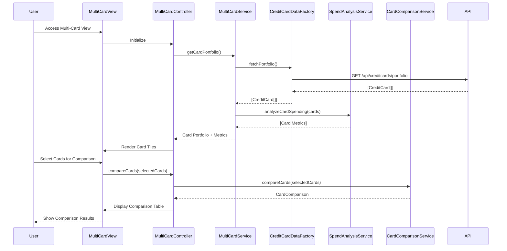

# Low-Level Design: Multi-Card Management and Comparison

**Epic ID:** QE-4629

---

## a. Architecture Mapping

- **Multi-Card Management Service** → AngularJS Service (`multiCardService.js`) - orchestrates card portfolio retrieval and management
- **Credit Card Data Service** → AngularJS Factory (`creditCardDataFactory.js`) - handles REST API calls for multiple card data
- **Card Comparison Module** → AngularJS Service (`cardComparisonService.js`) - performs side-by-side card comparison logic
- **Spend Analysis Module** → AngularJS Service (`spendAnalysisService.js`) - calculates card-wise spending metrics
- **User Interface** → AngularJS Controller (`multiCardController.js`) + View (`multi-card-view.html`) - manages card display and interactions
- **Multi-Card Module** → AngularJS Module (`app.multiCard`) - encapsulates multi-card management components

**Recommended Folder Structure:**
```
app/
├── modules/
│   └── multi-card/
│       ├── controllers/
│       │   └── multiCardController.js
│       ├── services/
│       │   ├── multiCardService.js
│       │   ├── cardComparisonService.js
│       │   └── spendAnalysisService.js
│       ├── factories/
│       │   └── creditCardDataFactory.js
│       ├── views/
│       │   └── multi-card-view.html
│       ├── directives/
│       │   └── cardTile.directive.js
│       └── multiCard.module.js
└── assets/
    └── css/
        └── multi-card.css
```

---

## b. Component Specifications

| Component Name | Artifact Type | Responsibility | Key Dependencies |
|---|---|---|---|
| `app.multiCard` | Module | Root module for multi-card management feature | `ngRoute`, `app.shared` |
| `multiCardController` | Controller | Manages card portfolio view, triggers comparison and analysis actions | `multiCardService`, `$scope` |
| `multiCardService` | Service | Orchestrates fetching card portfolio and delegates to comparison/analysis modules | `creditCardDataFactory`, `cardComparisonService`, `spendAnalysisService` |
| `creditCardDataFactory` | Factory | Fetches all user credit cards via REST API (`/api/creditcards/portfolio`) | `$http`, `$q` |
| `cardComparisonService` | Service | Compares selected cards on limit, balance, APR, rewards, and usage metrics | None |
| `spendAnalysisService` | Service | Calculates card-wise monthly spend, utilization rate, and spending trends | None |
| `cardTileDirective` | Directive | Reusable card tile component displaying individual card details | `multiCardController` |

---

## c. Data Model

**CreditCard Model:**
```javascript
{
  cardId: String,
  cardNumber: String (masked),
  cardType: String,
  issuer: String,
  creditLimit: Number,
  currentBalance: Number,
  availableCredit: Number,
  apr: Number,
  rewardsPoints: Number,
  monthlySpend: Number,
  utilizationRate: Number,
  lastTransactionDate: Date
}
```

**CardComparison Model:**
```javascript
{
  cards: [CreditCard],
  comparisonMetrics: {
    limits: [Number],
    balances: [Number],
    aprs: [Number],
    utilizationRates: [Number]
  }
}
```

---

## d. Data Flow

User navigates to multi-card view → `multiCardController` initializes and calls `multiCardService.getCardPortfolio()` → `multiCardService` invokes `creditCardDataFactory.fetchPortfolio()` which makes GET request to `/api/creditcards/portfolio` → API returns normalized array of all user credit cards → `spendAnalysisService.analyzeCardSpending(cards)` calculates card-wise metrics and utilization rates → User selects cards for comparison → `cardComparisonService.compareCards(selectedCards)` generates side-by-side comparison data → Controller binds card portfolio and comparison results to `$scope` → View renders card tiles using `cardTileDirective` and displays comparison table.

---

## e. Primary Sequence Diagram



---

## f. Implementation Notes

- Use AngularJS DI to inject services into controllers; leverage `$http` with promise chaining for API calls
- Implement `cardTileDirective` as isolated scope directive with two-way binding for card selection state
- Use ES6 array methods (`.map()`, `.filter()`, `.reduce()`) in analysis and comparison services for efficient data processing
- Apply Bootstrap card components and responsive grid for scalable card display; use `ng-repeat` with `track by cardId` for performance
- Implement lazy loading or pagination if card count exceeds threshold (e.g., >20 cards) to maintain UI performance

---

## g. Error Handling

HTTP interceptor with global error handler; display toast notifications for API failures and fallback to cached data if available.

---

## h. Security Notes

Standard input validation and secure API calls assumed; mask sensitive card data (full card numbers) in UI and API responses.