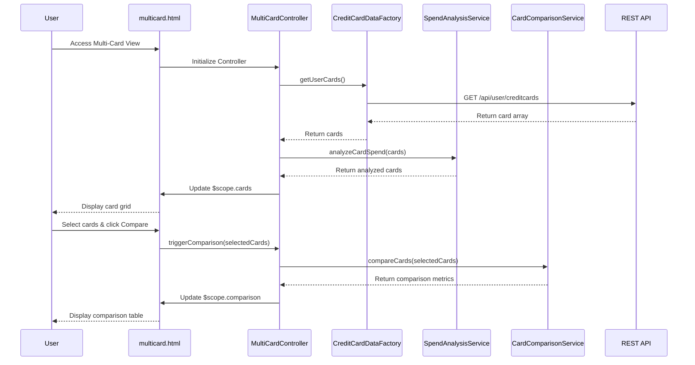

# Low-Level Design: Multi-Card Management Interface

**Epic ID:** QE-4629

## a. Architecture Mapping

- **Multi-Card Management Service** → AngularJS Module (`multiCardModule`) + Controller (`MultiCardController`)
- **Credit Card Data Service** → AngularJS Factory (`CreditCardDataFactory`) for REST API integration
- **Card Comparison Module** → AngularJS Service (`CardComparisonService`) for card-to-card comparison logic
- **Spend Analysis Module** → AngularJS Service (`SpendAnalysisService`) for card-wise spend calculations
- **User Interface** → HTML5 views with Bootstrap cards/panels + AngularJS directives for card display and comparison

**Recommended Folder Structure:**
```
app/
├── modules/
│   └── multicard/
│       ├── controllers/
│       │   └── MultiCardController.js
│       ├── services/
│       │   ├── CreditCardDataFactory.js
│       │   ├── CardComparisonService.js
│       │   └── SpendAnalysisService.js
│       ├── directives/
│       │   ├── cardDisplay.js
│       │   └── cardComparison.js
│       └── views/
│           ├── multicard.html
│           └── comparison.html
├── assets/
│   ├── css/
│   └── js/
└── app.js
```

## b. Component Specifications

| Component Name | Artifact Type | Responsibility | Key Dependencies |
|---|---|---|---|
| multiCardModule | Module | Root module for multi-card management feature | angular, ngRoute |
| MultiCardController | Controller | Manages card portfolio view, orchestrates comparison and analysis | CreditCardDataFactory, CardComparisonService, SpendAnalysisService, $scope |
| CreditCardDataFactory | Factory | Fetches all user credit cards from REST API | $http, $q |
| CardComparisonService | Service | Compares cards by limit, balance, APR, rewards, and usage patterns | None |
| SpendAnalysisService | Service | Calculates card-wise spend metrics and usage percentages | None |
| cardDisplay | Directive | Renders individual card details with responsive Bootstrap card layout | None |
| cardComparison | Directive | Displays side-by-side card comparison table | CardComparisonService |

## c. Data Model

**CreditCard Object:**
```javascript
{
  cardId: String,
  cardNumber: String,
  cardType: String,
  bankName: String,
  creditLimit: Number,
  outstandingBalance: Number,
  availableCredit: Number,
  apr: Number,
  rewardsPoints: Number,
  monthlySpend: Number,
  utilizationPercentage: Number
}
```

**CardComparison Object:**
```javascript
{
  cards: Array<CreditCard>,
  comparisonMetrics: {
    highestLimit: CreditCard,
    lowestAPR: CreditCard,
    highestRewards: CreditCard,
    mostUsed: CreditCard
  }
}
```

## d. Data Flow

User accesses multi-card view → `multicard.html` loads → `MultiCardController` initializes and invokes `CreditCardDataFactory.getUserCards()` → Factory calls GET `/api/user/creditcards` REST endpoint → API returns array of all user credit cards → Controller passes cards to `SpendAnalysisService.analyzeCardSpend(cards)` to compute card-wise spend and utilization → When user clicks compare, `CardComparisonService.compareCards(selectedCards)` generates comparison metrics → Results bound to `$scope.cards` and `$scope.comparison` → View renders card grid using `cardDisplay` directive and comparison table using `cardComparison` directive with Bootstrap responsive layout.

## e. Primary Sequence Diagram



## f. Implementation Notes

- Use AngularJS DI to inject all services and factories into `MultiCardController`
- Implement `cardDisplay` directive with isolated scope accepting card object as attribute for reusability
- Use `ng-repeat` with `track by cardId` for efficient card list rendering and performance with large portfolios
- Implement card selection using `ng-model` with checkbox inputs for comparison feature
- Use Bootstrap card component (or panel for Angular 1.x compatibility) with responsive grid (col-md-4, col-sm-6, col-xs-12)

## g. Error Handling

HTTP interceptor for API failures with controller-level error handling displaying user-friendly messages via Bootstrap alert components.

## h. Security Notes

Standard input validation and secure API calls assumed; mask sensitive card numbers in UI displaying only last 4 digits.