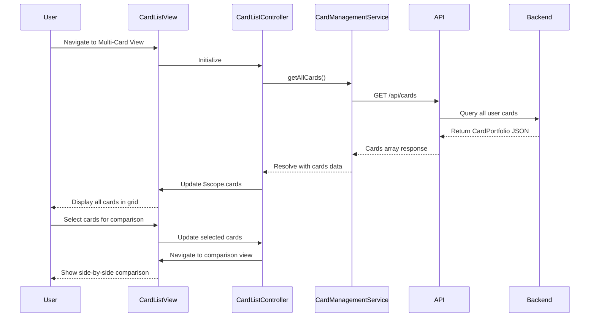

# Low-Level Design: Multi-Card Management Interface

**Epic ID:** QE-4629

## a. Architecture Mapping

- **Card Management Module** (`app.cardManagement`) → AngularJS Module for multi-card functionality
- **Card List Controller** (`CardListController`) → Manages display and interaction for multiple cards
- **Card Management Service** (`CardManagementService`) → Factory for REST API calls to card endpoints
- **Card Comparison Controller** (`CardComparisonController`) → Handles side-by-side card comparison logic
- **Card Item Directive** (`cardItem`) → Reusable directive rendering individual card details (limit, balance, usage)
- **Card Filter Service** (`CardFilterService`) → Service for client-side filtering and sorting of cards

**Recommended Folder Structure:**
```
app/
  modules/
    card-management/
      controllers/
      services/
      directives/
      views/
      card-management.module.js
```

## b. Component Specifications

| Component Name | Artifact Type | Responsibility | Key Dependencies |
|----------------|---------------|----------------|------------------|
| CardListController | Controller | Fetch and display all user cards, handle card selection | CardManagementService, $scope |
| CardManagementService | Factory | Execute REST API calls to /api/cards endpoint for multi-card data | $http, $q |
| cardItem | Directive | Render individual card with limit, balance, usage bar, and card details | None |
| CardComparisonController | Controller | Manage comparison view for selected cards (up to 3 cards) | CardManagementService, $scope |
| CardFilterService | Service | Filter and sort cards by usage, balance, or limit on client side | None |
| SpendAnalysisController | Controller | Display card-wise spending breakdown and trends | CardManagementService, $filter |

## c. Data Model

**CreditCard Object:**
```javascript
{
  cardId: String,              // Unique card identifier
  cardName: String,            // Display name (e.g., "Visa Platinum")
  cardNumber: String,          // Masked card number (e.g., "****1234")
  creditLimit: Number,         // Total credit limit
  currentBalance: Number,      // Outstanding balance
  availableCredit: Number,     // Limit - balance
  usagePercentage: Number,     // (balance/limit) * 100
  monthlySpend: Number,        // Current month spend for this card
  lastTransactionDate: Date    // Most recent transaction timestamp
}
```

**CardPortfolio Object:**
```javascript
{
  cards: Array<CreditCard>,    // Array of all user cards
  totalCards: Number           // Count of cards
}
```

## d. Data Flow

User navigates to the multi-card management view, triggering CardListController initialization. The controller calls CardManagementService.getAllCards(), which sends a GET request to `/api/cards`. The backend Card Management Service retrieves all card details from Credit Card Data Service and returns a CardPortfolio object. The controller binds the cards array to $scope.cards, and Angular renders each card using the cardItem directive in a responsive grid. Users can select cards for comparison, triggering CardComparisonController to display side-by-side details. For spend analysis, SpendAnalysisController fetches card-wise transaction summaries via CardManagementService.getCardSpendAnalysis(cardId) and displays category breakdowns per card.

## e. Primary Sequence Diagram



## f. Implementation Notes

- Use AngularJS module with CardManagementService as singleton factory injected into all controllers
- Implement client-side filtering with AngularJS $filter service for sorting cards by balance, limit, or usage
- Use Bootstrap grid (col-md-4) for card layout; ensure responsive stacking on mobile devices
- Apply ng-repeat with track by cardId for efficient rendering of card list
- Use ES6 template literals for dynamic card display strings and arrow functions in service methods

## g. Error Handling

HTTP interceptor-based error handling with user notification via toast messages; retry logic for failed card data fetch.

## h. Security Notes

Standard input validation and secure API calls assumed; card numbers masked on client side before rendering.