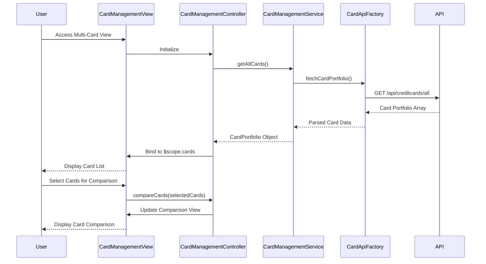

# Low-Level Design: Multi-Card Management Interface

**Epic ID:** QE-4629

---

## a. Architecture Mapping

- **Multi-Card View UI** → AngularJS Module (`creditCardApp.cardManagement`)
- **Card Management Controller** → AngularJS Controller (`CardManagementController`)
- **Card List Component** → AngularJS Directive (`cardList`)
- **Card Comparison Component** → AngularJS Directive (`cardComparison`)
- **Card Management Service** → AngularJS Service (`CardManagementService`)
- **API Integration** → AngularJS Factory (`CardApiFactory`)

**Recommended Folder Structure:**
```
app/
├── modules/
│   └── card-management/
│       ├── controllers/
│       ├── services/
│       ├── directives/
│       └── views/
├── shared/
│   ├── factories/
│   └── models/
└── assets/
```

---

## b. Component Specifications

| Component Name | Artifact Type | Responsibility | Key Dependencies |
|----------------|---------------|----------------|------------------|
| CardManagementController | Controller | Manage multi-card view state, fetch card portfolio, handle card selection | CardManagementService, $scope |
| CardManagementService | Service | Retrieve and process multiple card data, perform card-wise spend analysis | CardApiFactory |
| CardApiFactory | Factory | Execute REST API calls to fetch card details, balances, and usage patterns | $http, $q |
| cardList | Directive | Render scrollable list of all user credit cards with key details | None |
| cardComparison | Directive | Display side-by-side card comparison view with limits, balances, and usage | None |

---

## c. Data Model

**CreditCard (JS Object):**
```javascript
{
  cardId: String,
  cardName: String,
  cardNumber: String,
  creditLimit: Number,
  currentBalance: Number,
  availableCredit: Number,
  utilizationPercentage: Number,
  monthlySpend: Number
}
```

**CardPortfolio (JS Object):**
```javascript
{
  cards: Array<CreditCard>,
  totalCards: Number
}
```

---

## d. Data Flow

User accesses the multi-card management view, triggering CardManagementController to invoke CardManagementService.getAllCards(). The service calls CardApiFactory to fetch the complete card portfolio via REST API in a single request. The API returns an array of card objects with details, balances, and usage patterns. The service processes the data and returns it to the controller, which binds it to $scope. The view renders the card list using the cardList directive, and users can select cards to view details or trigger the cardComparison directive for side-by-side analysis.

---

## e. Primary Sequence Diagram



---

## f. Implementation Notes

- Use AngularJS module with dependency injection for CardManagementService and CardApiFactory
- Implement ES6 array methods (map, filter, reduce) for client-side card-wise spend analysis and sorting
- Use $http service for single API call to fetch all cards; cache response with $cacheFactory for performance
- Apply Bootstrap responsive grid and card components for consistent card display across devices
- Use ng-repeat with track by cardId for efficient list rendering of up to 30 cards

---

## g. Error Handling

HTTP interceptor-based error handling with try/catch blocks; display user notifications for API failures or empty card portfolio scenarios.

---

## h. Security Notes

Standard input validation and secure API calls assumed; sensitive card data (full card numbers) masked in UI display.