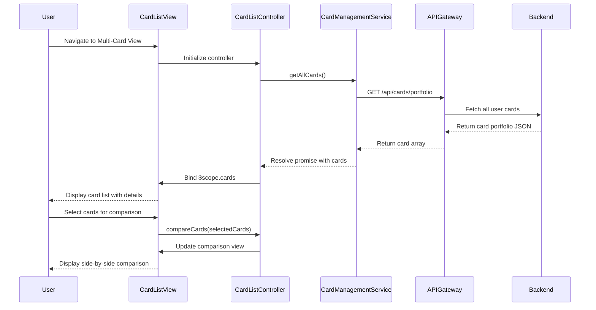

# Low-Level Design: Multi-Card Management Interface

**Epic ID:** QE-4629

---

## a. Architecture Mapping

- **Multi-Card View UI** → AngularJS Module (`multiCardManagement`) + Controller (`CardListController`)
- **Card Management Service Integration** → AngularJS Factory (`CardManagementService`)
- **Card Comparison Logic** → Controller method (`compareCards`) + View component
- **Card Details Display** → Directive (`cardDetailsCard`) for reusable card rendering
- **Responsive Layout** → HTML5 templates with Bootstrap grid + CSS3 flexbox

**Recommended Folder Structure:**
```
app/
  modules/
    card-management/
      controllers/
        card-list.controller.js
      services/
        card-management.service.js
      directives/
        card-details-card.directive.js
      views/
        card-list.html
        card-comparison.html
      card-management.module.js
  shared/
    services/
      api-gateway.service.js
  assets/
    css/
      card-management.css
```

---

## b. Component Specifications

| Component Name | Artifact Type | Responsibility | Key Dependencies |
|----------------|---------------|----------------|------------------|
| multiCardManagement | Module | Root module for multi-card management feature | angular, ngRoute |
| CardListController | Controller | Manages card list state, fetches all user cards, handles comparison and filtering | CardManagementService, $scope, $filter |
| CardManagementService | Factory | Retrieves card portfolio data (all cards with details, balances, usage) via REST API | $http, ApiGatewayService |
| cardDetailsCard | Directive | Reusable component to render individual card details (limit, balance, usage) | None |
| cardComparisonView | HTML Template | Displays side-by-side card comparison with key metrics | Bootstrap grid, ng-repeat |
| ApiGatewayService | Service | Centralizes API endpoint configuration and HTTP interceptors | $http |

---

## c. Data Model

**CreditCard (JavaScript Object):**
```javascript
{
  cardId: String,
  cardNumber: String,            // Masked (e.g., "****5678")
  cardType: String,              // e.g., "Visa", "Mastercard"
  balance: Number,
  creditLimit: Number,
  availableCredit: Number,
  monthlySpend: Number,
  lastTransactionDate: Date,
  usagePercentage: Number        // (balance / creditLimit) * 100
}
```

**CardPortfolio (JavaScript Object):**
```javascript
{
  userId: String,
  cards: Array<CreditCard>,      // Array of CreditCard objects
  totalCards: Number
}
```

---

## d. Data Flow

User navigates to the multi-card management view, triggering `CardListController` initialization. The controller calls `CardManagementService.getAllCards()`, which sends a GET request to `/api/cards/portfolio` via `ApiGatewayService`. The backend queries the Credit Card Data Service and returns a JSON array of all user cards with details, balances, and usage patterns. The controller binds this data to `$scope.cards` and calculates derived metrics (e.g., usage percentage). The view renders individual card details using the `cardDetailsCard` directive. When the user selects cards for comparison, the controller filters selected cards and updates the comparison view to display side-by-side metrics.

---

## e. Primary Sequence Diagram



---

## f. Implementation Notes

- Use AngularJS Dependency Injection to inject `CardManagementService` into `CardListController`.
- Leverage `ng-repeat` with `track by cardId` for efficient rendering of card lists.
- Implement `cardDetailsCard` directive with isolated scope to encapsulate card rendering logic and enable reusability.
- Use ES6 array methods (`.filter()`, `.map()`) for card comparison and filtering logic in the controller.
- Apply Bootstrap responsive utilities and CSS3 flexbox for adaptive card grid layout across devices.

---

## g. Error Handling

HTTP interceptor in `ApiGatewayService` catches API errors; display user-friendly error messages via AngularJS toast notifications and fallback UI states.

---

## h. Security Notes

Standard input validation and secure API calls assumed; mask sensitive card numbers in UI and ensure token-based authentication for API requests.