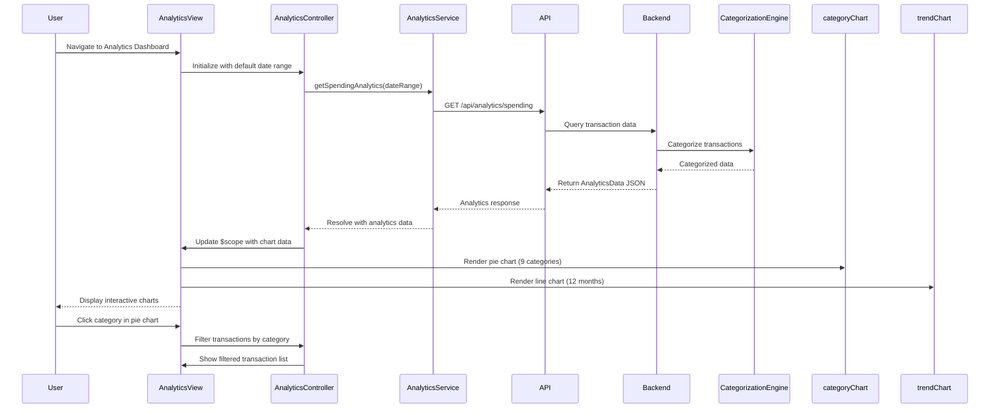

# Low-Level Design: Spending Analytics and Visualization

**Epic ID:** QE-4630

## a. Architecture Mapping

- **Analytics Module** (`app.analytics`) → AngularJS Module for spending analytics functionality
- **Analytics Controller** (`AnalyticsController`) → Manages analytics view state and chart data preparation
- **Analytics Service** (`AnalyticsService`) → Factory for REST API calls to analytics and transaction endpoints
- **Category Chart Directive** (`categoryChart`) → Directive rendering category-wise spending pie/donut chart using Chart.js
- **Trend Chart Directive** (`trendChart`) → Directive rendering monthly spend trend line chart
- **Categorization Service** (`CategorizationService`) → Service handling transaction category mapping and aggregation

**Recommended Folder Structure:**
```
app/
  modules/
    analytics/
      controllers/
      services/
      directives/
      views/
      analytics.module.js
```

## b. Component Specifications

| Component Name | Artifact Type | Responsibility | Key Dependencies |
|----------------|---------------|----------------|------------------|
| AnalyticsController | Controller | Fetch analytics data, prepare chart datasets, handle date range selection | AnalyticsService, $scope, $filter |
| AnalyticsService | Factory | Execute REST API calls to /api/analytics/spending and /api/analytics/trends | $http, $q |
| categoryChart | Directive | Render interactive pie/donut chart for 9 spending categories using Chart.js | Chart.js library |
| trendChart | Directive | Render line chart showing monthly spend trends (up to 12 months) | Chart.js library |
| CategorizationService | Service | Map transaction data to 9 categories and aggregate spending per category | None |
| TransactionListController | Controller | Display categorized transaction list with filtering by category | AnalyticsService, $filter |

## c. Data Model

**CategorySpending Object:**
```javascript
{
  category: String,            // One of 9 categories (Food & Dining, Fuel, Shopping, Travel, Entertainment, Utilities, Healthcare, Education, Miscellaneous)
  amount: Number,              // Total spend in this category
  percentage: Number,          // (amount / totalSpend) * 100
  transactionCount: Number     // Number of transactions in category
}
```

**MonthlyTrend Object:**
```javascript
{
  month: String,               // Month label (e.g., "Jan 2024")
  totalSpend: Number,          // Total spend for the month
  categoryBreakdown: Array<CategorySpending>  // Per-category spend for the month
}
```

**AnalyticsData Object:**
```javascript
{
  categorySpending: Array<CategorySpending>,   // Current period category breakdown
  monthlyTrends: Array<MonthlyTrend>,          // 12 months of trend data
  totalSpend: Number,                          // Total spend across all categories
  dateRange: { start: Date, end: Date }        // Analysis period
}
```

## d. Data Flow

User navigates to the analytics dashboard, triggering AnalyticsController initialization. The controller invokes AnalyticsService.getSpendingAnalytics(dateRange), which sends a GET request to `/api/analytics/spending?start=<date>&end=<date>`. The backend Analytics Service retrieves transaction history from Transaction Data Service, applies categorization via Categorization Engine, and aggregates spending into nine categories. The API returns AnalyticsData JSON. The controller processes the response, prepares chart datasets, and updates $scope.analyticsData. Angular renders categoryChart directive with pie chart showing category-wise breakdown and trendChart directive with line chart displaying monthly trends. Users can interact with charts to drill down into specific categories or months, triggering filtered transaction list views.

## e. Primary Sequence Diagram



## f. Implementation Notes

- Use AngularJS module with AnalyticsService factory; inject Chart.js library via angular-chart.js wrapper for directive integration
- Implement categoryChart and trendChart as isolated scope directives with data binding for chart datasets
- Use AngularJS $filter service for date range filtering and category-based transaction filtering
- Apply ES6 array methods (map, reduce, filter) in CategorizationService for aggregating transaction data by category
- Cache analytics data in service for 5 minutes to reduce API calls when user switches between chart views

## g. Error Handling

Interceptor-based error handling with try/catch in chart rendering directives; display user-friendly error message if chart data is invalid or API fails.

## h. Security Notes

Standard input validation and secure API calls assumed; date range parameters validated on client before API request to prevent injection attacks.