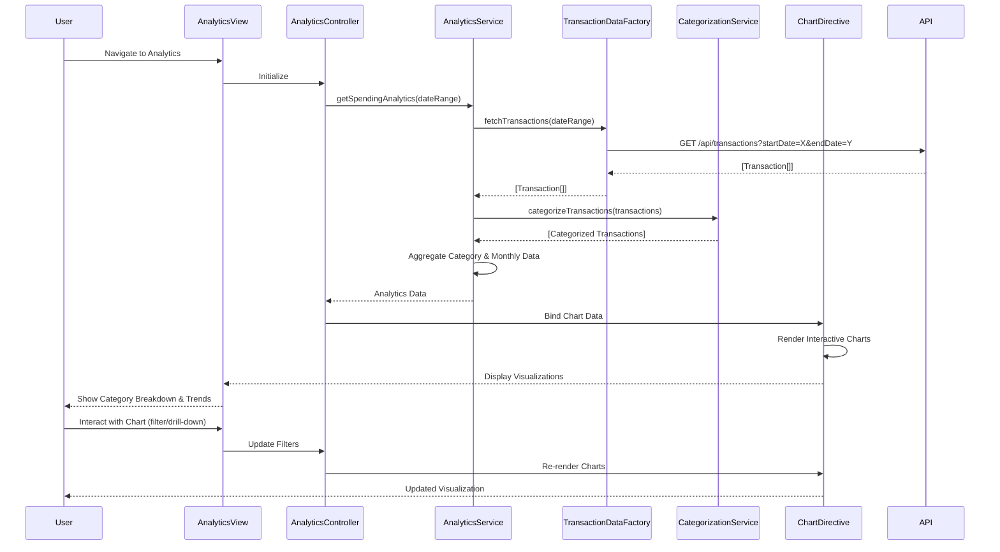

# Low-Level Design: Interactive Spending Analytics

**Epic ID:** QE-4630

---

## a. Architecture Mapping

- **Analytics Service** → AngularJS Service (`analyticsService.js`) - orchestrates analytics data retrieval and processing
- **Transaction Data Service** → AngularJS Factory (`transactionDataFactory.js`) - handles REST API calls for transaction history
- **Categorization Engine** → AngularJS Service (`categorizationService.js`) - classifies transactions into nine spending categories
- **Visualization Engine** → AngularJS Directive (`chartDirective.js`) - renders interactive charts using Chart.js or D3.js
- **User Interface** → AngularJS Controller (`analyticsController.js`) + View (`analytics.html`) - manages analytics view and user interactions
- **Analytics Module** → AngularJS Module (`app.analytics`) - encapsulates all analytics components

**Recommended Folder Structure:**
```
app/
├── modules/
│   └── analytics/
│       ├── controllers/
│       │   └── analyticsController.js
│       ├── services/
│       │   ├── analyticsService.js
│       │   └── categorizationService.js
│       ├── factories/
│       │   └── transactionDataFactory.js
│       ├── directives/
│       │   └── chartDirective.js
│       ├── views/
│       │   └── analytics.html
│       └── analytics.module.js
└── assets/
    ├── js/
    │   └── chart.min.js
    └── css/
        └── analytics.css
```

---

## b. Component Specifications

| Component Name | Artifact Type | Responsibility | Key Dependencies |
|---|---|---|---|
| `app.analytics` | Module | Root module for spending analytics feature | `ngRoute`, `app.shared`, `chart.js` |
| `analyticsController` | Controller | Manages analytics view state, handles user filter interactions, binds chart data | `analyticsService`, `$scope`, `$filter` |
| `analyticsService` | Service | Orchestrates transaction fetching, categorization, and aggregation for visualization | `transactionDataFactory`, `categorizationService` |
| `transactionDataFactory` | Factory | Fetches transaction history via REST API (`/api/transactions`) | `$http`, `$q` |
| `categorizationService` | Service | Assigns transactions to categories (Food & Dining, Fuel, Shopping, Travel, Entertainment, Utilities, Healthcare, Education, Miscellaneous) | None |
| `chartDirective` | Directive | Renders interactive pie/bar/line charts for category-wise and monthly trend visualization | Chart.js library |

---

## c. Data Model

**Transaction Model:**
```javascript
{
  transactionId: String,
  cardId: String,
  merchantName: String,
  amount: Number,
  transactionDate: Date,
  category: String,
  description: String
}
```

**CategorySpending Model:**
```javascript
{
  category: String,
  totalAmount: Number,
  transactionCount: Number,
  percentage: Number
}
```

**MonthlyTrend Model:**
```javascript
{
  month: String,
  year: Number,
  categoryBreakdown: [CategorySpending],
  totalSpend: Number
}
```

---

## d. Data Flow

User navigates to analytics view → `analyticsController` initializes and calls `analyticsService.getSpendingAnalytics(dateRange)` → `analyticsService` invokes `transactionDataFactory.fetchTransactions(dateRange)` which makes GET request to `/api/transactions?startDate=X&endDate=Y` → API returns transaction history array → `categorizationService.categorizeTransactions(transactions)` processes each transaction and assigns it to one of nine categories using predefined rules → `analyticsService` aggregates data for category-wise totals and monthly trends → Chart data is bound to `$scope.chartData` → `chartDirective` renders interactive pie chart (category breakdown) and line chart (monthly trends) → User interacts with charts to explore spending patterns and drill down into specific categories.

---

## e. Primary Sequence Diagram



---

## f. Implementation Notes

- Use AngularJS DI to inject services; leverage `$http` with promise chaining for asynchronous transaction data retrieval
- Implement `categorizationService` with rule-based logic (merchant name/MCC code mapping) or integrate ML model endpoint for classification
- Use Chart.js library integrated via `chartDirective` with isolated scope; pass chart type, data, and options as directive attributes
- Apply ES6 `Array.reduce()` for efficient category aggregation and `Map` for monthly trend grouping
- Implement date range picker (e.g., Angular Bootstrap Datepicker) for user-controlled filtering; default to current month

---

## g. Error Handling

HTTP interceptor captures API errors; display user-friendly messages via Bootstrap modals and provide retry mechanism for failed requests.

---

## h. Security Notes

Standard input validation and secure API calls assumed; validate date range inputs to prevent injection attacks and ensure API uses authentication tokens.