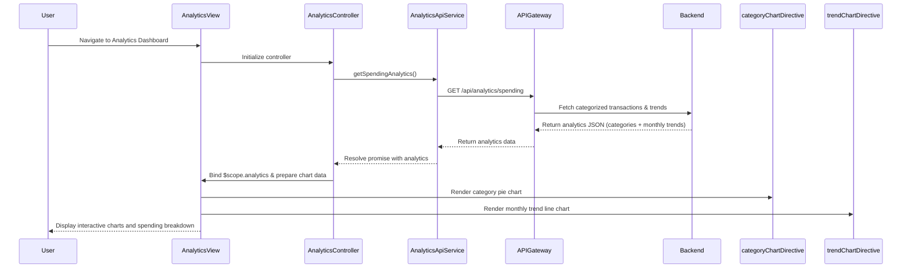

# Low-Level Design: Spending Analytics and Visualization

**Epic ID:** QE-4630

---

## a. Architecture Mapping

- **Analytics Dashboard UI** → AngularJS Module (`spendingAnalytics`) + Controller (`AnalyticsController`)
- **Analytics Service Integration** → AngularJS Factory (`AnalyticsApiService`)
- **Category-wise Spending Visualization** → Directive (`categoryChartDirective`) using Chart.js or D3.js
- **Monthly Trends Visualization** → Directive (`trendChartDirective`) for line/bar charts
- **Interactive Charts** → Third-party charting library (Chart.js) wrapped in AngularJS directives
- **Responsive Layout** → HTML5 templates with Bootstrap grid + CSS3

**Recommended Folder Structure:**
```
app/
  modules/
    analytics/
      controllers/
        analytics.controller.js
      services/
        analytics-api.service.js
      directives/
        category-chart.directive.js
        trend-chart.directive.js
      views/
        analytics-dashboard.html
      analytics.module.js
  shared/
    services/
      api-gateway.service.js
  assets/
    css/
      analytics.css
    js/
      chart.min.js
```

---

## b. Component Specifications

| Component Name | Artifact Type | Responsibility | Key Dependencies |
|----------------|---------------|----------------|------------------|
| spendingAnalytics | Module | Root module for spending analytics feature | angular, ngRoute, chart.js |
| AnalyticsController | Controller | Manages analytics state, fetches spending data, prepares chart data | AnalyticsApiService, $scope |
| AnalyticsApiService | Factory | Retrieves categorized spending data and monthly trends via REST API | $http, ApiGatewayService |
| categoryChartDirective | Directive | Renders interactive pie/donut chart for category-wise spending breakdown | Chart.js |
| trendChartDirective | Directive | Renders interactive line/bar chart for monthly spend trends | Chart.js |
| ApiGatewayService | Service | Centralizes API endpoint configuration and HTTP interceptors | $http |

---

## c. Data Model

**SpendingAnalytics (JavaScript Object):**
```javascript
{
  categoryBreakdown: Array<CategorySpend>,  // Array of spending by category
  monthlyTrends: Array<MonthlySpend>,       // Array of monthly aggregates
  totalSpend: Number,
  dateRange: { startDate: Date, endDate: Date }
}
```

**CategorySpend (JavaScript Object):**
```javascript
{
  category: String,              // e.g., "Food & Dining", "Fuel", "Shopping"
  amount: Number,
  percentage: Number,            // Percentage of total spend
  transactionCount: Number
}
```

**MonthlySpend (JavaScript Object):**
```javascript
{
  month: String,                 // e.g., "2024-01"
  totalSpend: Number,
  categoryBreakdown: Array<CategorySpend>
}
```

---

## d. Data Flow

User navigates to the analytics dashboard, triggering `AnalyticsController` initialization. The controller invokes `AnalyticsApiService.getSpendingAnalytics()`, which sends a GET request to `/api/analytics/spending` via `ApiGatewayService`. The backend retrieves transaction history from the Transaction Data Service, applies categorization logic via the Categorization Engine, and aggregates data into nine spending categories (Food & Dining, Fuel, Shopping, Travel, Entertainment, Utilities, Healthcare, Education, Miscellaneous) and monthly trends for the past 12 months. The controller binds the returned data to `$scope.analytics` and prepares chart datasets. The `categoryChartDirective` renders an interactive pie chart for category breakdown, and the `trendChartDirective` renders a line chart for monthly trends, both using Chart.js.

---

## e. Primary Sequence Diagram



---

## f. Implementation Notes

- Use AngularJS Dependency Injection to inject `AnalyticsApiService` into `AnalyticsController`.
- Wrap Chart.js in AngularJS directives (`categoryChartDirective`, `trendChartDirective`) with isolated scope for data binding and reusability.
- Use ES6 array methods (`.reduce()`, `.map()`) to transform API response into Chart.js-compatible datasets.
- Implement responsive chart sizing using Chart.js `maintainAspectRatio` and Bootstrap container classes.
- Apply AngularJS `$watch` on date range filters to dynamically update charts when user changes date selection.

---

## g. Error Handling

HTTP interceptor in `ApiGatewayService` catches API errors; display user-friendly error messages via toast notifications and show fallback "No data available" state in charts.

---

## h. Security Notes

Standard input validation and secure API calls assumed; ensure transaction data is fetched over HTTPS with proper authentication tokens.