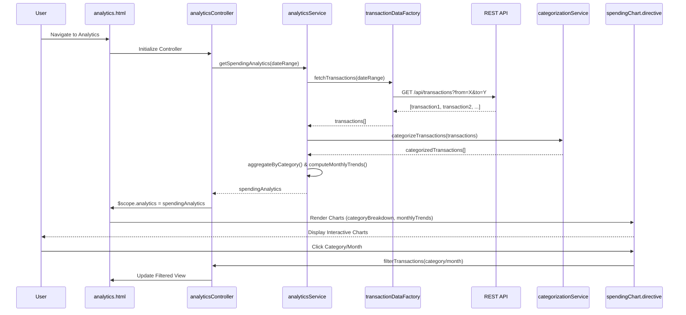

# Low-Level Design: Interactive Spending Analytics

**Epic ID:** QE-4630

---

## a. Architecture Mapping

- **Analytics Service** → AngularJS Service (`analyticsService.js`) - orchestrates analytics data retrieval and processing
- **Transaction Data Service** → AngularJS Factory (`transactionDataFactory.js`) - handles REST API calls for transaction history
- **Categorization Engine** → AngularJS Service (`categorizationService.js`) - classifies transactions into spending categories
- **Visualization Engine** → AngularJS Directive (`spendingChart.directive.js`) - renders interactive charts using Chart.js or D3.js
- **User Interface** → AngularJS Controller (`analyticsController.js`) + View (`analytics.html`) - displays analytics dashboard with charts
- **Analytics Module** → AngularJS Module (`app.analytics`) - encapsulates analytics feature components

**Recommended Folder Structure:**
```
app/
├── modules/
│   └── analytics/
│       ├── controllers/
│       │   └── analyticsController.js
│       ├── services/
│       │   ├── analyticsService.js
│       │   └── categorizationService.js
│       ├── factories/
│       │   └── transactionDataFactory.js
│       ├── directives/
│       │   └── spendingChart.directive.js
│       ├── views/
│       │   └── analytics.html
│       └── analytics.module.js
└── assets/
    ├── css/
    │   └── analytics.css
    └── js/
        └── chart.min.js
```

---

## b. Component Specifications

| Name | Artifact Type | Responsibility | Key Dependencies |
|------|---------------|----------------|------------------|
| `app.analytics` | Module | Root module for spending analytics feature | `ngRoute`, `chart.js`, `app.shared` |
| `analyticsController` | Controller | Manages analytics view state, triggers data fetch, exposes chart data | `analyticsService`, `$scope`, `$filter` |
| `analyticsService` | Service | Orchestrates transaction retrieval, categorization, and aggregation | `transactionDataFactory`, `categorizationService`, `$q` |
| `transactionDataFactory` | Factory | Executes REST API calls to fetch transaction history | `$http`, `API_ENDPOINTS` |
| `categorizationService` | Service | Assigns transactions to 9 categories using rule-based logic | None |
| `spendingChart.directive` | Directive | Renders interactive pie/bar/line charts for spending visualization | Chart.js library |
| `analytics.html` | View/Template | Displays category breakdown, monthly trends, and interactive charts | Bootstrap, `spendingChart` directive |

---

## c. Data Model

**Transaction Model** (`transaction.model.js`):
```javascript
{
  transactionId: String,
  cardId: String,
  amount: Number,
  merchant: String,
  category: String,
  transactionDate: Date,
  description: String
}
```

**SpendingAnalytics Model** (in-memory):
```javascript
{
  categoryBreakdown: {
    'Food & Dining': Number,
    'Fuel': Number,
    'Shopping': Number,
    'Travel': Number,
    'Entertainment': Number,
    'Utilities': Number,
    'Healthcare': Number,
    'Education': Number,
    'Miscellaneous': Number
  },
  monthlyTrends: Array<{month: String, totalSpend: Number}>,
  totalTransactions: Number,
  totalSpend: Number
}
```

---

## d. Data Flow

User navigates to analytics page → `analytics.html` loads and `analyticsController` initializes → Controller calls `analyticsService.getSpendingAnalytics(dateRange)` → Service invokes `transactionDataFactory.fetchTransactions(dateRange)` which makes GET request to `/api/transactions?from=X&to=Y` → API returns transaction array → `categorizationService` processes each transaction and assigns to one of 9 categories based on merchant/description rules → Service aggregates spending by category and computes monthly trends → Aggregated analytics data is returned to controller → Controller binds data to `$scope` → View renders category breakdown using `spendingChart` directive (pie chart) and monthly trends using line chart → User interacts with charts to drill down into specific categories or time periods.

---

## e. Primary Sequence Diagram



---

## f. Implementation Notes

- Use AngularJS dependency injection to inject services and factories; integrate Chart.js library for visualization
- Implement `categorizationService` with ES6 Map for category rules (merchant keywords → category); use String.includes() for matching
- Create `spendingChart` directive with isolated scope accepting chartType and chartData attributes; use Chart.js API in directive's link function
- Apply AngularJS $filter service for date range filtering and currency formatting in view
- Use ng-click on chart segments to trigger drill-down functionality; update controller scope to filter transactions by selected category

---

## g. Error Handling

HTTP interceptor captures API errors; display user-friendly message in analytics view; implement try/catch in categorization logic with fallback to 'Miscellaneous' category.

---

## h. Security Notes

Standard input validation and secure API calls assumed; validate date range parameters to prevent injection attacks.