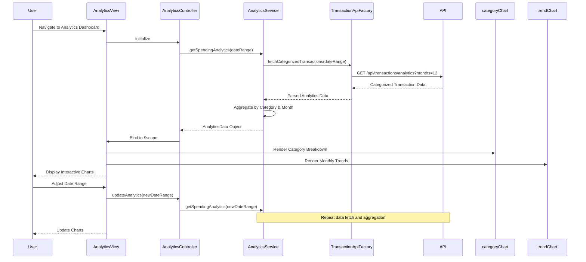

# Low-Level Design: Spending Analytics & Visualization

**Epic ID:** QE-4630

---

## a. Architecture Mapping

- **Analytics Dashboard UI** → AngularJS Module (`creditCardApp.analytics`)
- **Analytics Controller** → AngularJS Controller (`AnalyticsController`)
- **Category Chart Component** → AngularJS Directive (`categoryChart`)
- **Trend Chart Component** → AngularJS Directive (`trendChart`)
- **Analytics Service** → AngularJS Service (`AnalyticsService`)
- **API Integration** → AngularJS Factory (`TransactionApiFactory`)

**Recommended Folder Structure:**
```
app/
├── modules/
│   └── analytics/
│       ├── controllers/
│       ├── services/
│       ├── directives/
│       └── views/
├── shared/
│   ├── factories/
│   └── models/
└── assets/
    └── charts/
```

---

## b. Component Specifications

| Component Name | Artifact Type | Responsibility | Key Dependencies |
|----------------|---------------|----------------|------------------|
| AnalyticsController | Controller | Manage analytics view state, fetch spending data, handle date range selection | AnalyticsService, $scope |
| AnalyticsService | Service | Process transaction data, aggregate by category and month, prepare chart data | TransactionApiFactory |
| TransactionApiFactory | Factory | Execute REST API calls to retrieve categorized transaction history | $http, $q |
| categoryChart | Directive | Render interactive pie/donut chart for category-wise spending breakdown | Chart.js or D3.js |
| trendChart | Directive | Display line/bar chart for monthly spend trends over 12 months | Chart.js or D3.js |

---

## c. Data Model

**CategorySpending (JS Object):**
```javascript
{
  category: String,
  amount: Number,
  percentage: Number,
  transactionCount: Number
}
```

**MonthlyTrend (JS Object):**
```javascript
{
  month: String,
  year: Number,
  totalSpend: Number
}
```

**AnalyticsData (JS Object):**
```javascript
{
  categoryBreakdown: Array<CategorySpending>,
  monthlyTrends: Array<MonthlyTrend>,
  categories: ['Food & Dining', 'Fuel', 'Shopping', 'Travel', 'Entertainment', 'Utilities', 'Healthcare', 'Education', 'Miscellaneous']
}
```

---

## d. Data Flow

User navigates to the analytics dashboard, triggering AnalyticsController to call AnalyticsService.getSpendingAnalytics() with default 12-month date range. The service invokes TransactionApiFactory to fetch categorized transaction data via REST API. The backend returns pre-categorized transactions across nine categories with monthly aggregations. The service processes the data into chart-ready formats (category breakdown and monthly trends) and returns it to the controller. The controller binds the data to $scope, and AngularJS directives (categoryChart, trendChart) render interactive visualizations using Chart.js, updating dynamically when users adjust date ranges.

---

## e. Primary Sequence Diagram



---

## f. Implementation Notes

- Use AngularJS module with dependency injection for AnalyticsService and TransactionApiFactory
- Integrate Chart.js library via angular-chart.js wrapper for declarative chart directives
- Implement ES6 array reduce() for client-side category aggregation and percentage calculations
- Use $http service with query parameters for date range filtering; cache recent queries with $cacheFactory
- Apply Bootstrap responsive layout for side-by-side chart display on desktop, stacked on mobile

---

## g. Error Handling

HTTP interceptor captures API errors; display user-friendly error messages for data fetch failures with retry option.

---

## h. Security Notes

Standard input validation and secure API calls assumed; transaction data filtered by authenticated user context on backend.