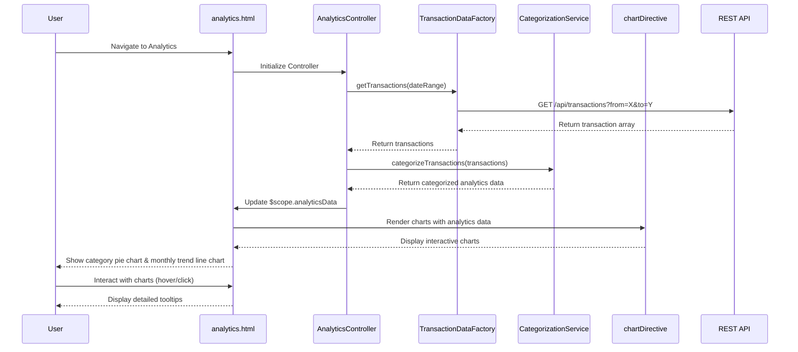

# Low-Level Design: Interactive Spending Analytics

**Epic ID:** QE-4630

## a. Architecture Mapping

- **Analytics Service** → AngularJS Module (`spendingAnalyticsModule`) + Controller (`AnalyticsController`)
- **Transaction Data Service** → AngularJS Factory (`TransactionDataFactory`) for REST API calls
- **Categorization Engine** → AngularJS Service (`CategorizationService`) for transaction classification logic
- **Visualization Engine** → AngularJS Directive (`chartDirective`) wrapping Chart.js or D3.js for interactive charts
- **User Interface** → HTML5 views with Bootstrap layout + interactive chart components

**Recommended Folder Structure:**
```
app/
├── modules/
│   └── analytics/
│       ├── controllers/
│       │   └── AnalyticsController.js
│       ├── services/
│       │   ├── TransactionDataFactory.js
│       │   └── CategorizationService.js
│       ├── directives/
│       │   └── chartDirective.js
│       └── views/
│           └── analytics.html
├── assets/
│   ├── css/
│   └── js/
│       └── chart.min.js
└── app.js
```

## b. Component Specifications

| Component Name | Artifact Type | Responsibility | Key Dependencies |
|---|---|---|---|
| spendingAnalyticsModule | Module | Root module for spending analytics feature | angular, ngRoute, chart.js |
| AnalyticsController | Controller | Orchestrates analytics view, fetches transactions, triggers categorization and visualization | TransactionDataFactory, CategorizationService, $scope |
| TransactionDataFactory | Factory | Fetches transaction history from REST API endpoints | $http, $q |
| CategorizationService | Service | Classifies transactions into 9 categories and computes category-wise totals | None |
| chartDirective | Directive | Renders interactive charts (pie, bar, line) using Chart.js library | Chart.js |
| analytics.html | View | Responsive layout with category filters and chart containers | Bootstrap CSS |

## c. Data Model

**Transaction Object:**
```javascript
{
  transactionId: String,
  cardId: String,
  amount: Number,
  date: Date,
  merchantName: String,
  category: String,
  description: String
}
```

**CategorySpend Object:**
```javascript
{
  category: String,
  totalAmount: Number,
  transactionCount: Number,
  percentage: Number
}
```

**AnalyticsData Object:**
```javascript
{
  categories: Array<CategorySpend>,
  monthlyTrends: Array<{month: String, amount: Number}>,
  totalSpend: Number
}
```

**Categories:** Food & Dining, Fuel, Shopping, Travel, Entertainment, Utilities, Healthcare, Education, Miscellaneous

## d. Data Flow

User navigates to analytics view → `analytics.html` loads → `AnalyticsController` initializes and calls `TransactionDataFactory.getTransactions(dateRange)` → Factory makes GET request to `/api/transactions?from=X&to=Y` REST endpoint → API returns transaction array → `CategorizationService.categorizeTransactions(transactions)` processes each transaction, assigns category based on merchant/description rules, and aggregates category-wise spending → Service also computes monthly trends by grouping transactions by month → Processed analytics data bound to `$scope.analyticsData` → `chartDirective` watches scope data and renders interactive pie chart for category breakdown and line chart for monthly trends using Chart.js → User can interact with charts (hover, click) to explore spending patterns.

## e. Primary Sequence Diagram



## f. Implementation Notes

- Use AngularJS DI to inject `TransactionDataFactory` and `CategorizationService` into `AnalyticsController`
- Implement `chartDirective` with isolated scope accepting data and chart type as attributes, using Chart.js for rendering
- Use `$watch` in directive to re-render charts when underlying data changes
- Implement date range filter using Bootstrap datepicker with `ng-model` binding for dynamic transaction fetching
- Cache categorization rules in `CategorizationService` as constant mapping object (merchant patterns → category)

## g. Error Handling

HTTP interceptor for API errors with fallback empty state messaging; chart rendering errors caught in directive with try/catch displaying "Unable to load chart" message.

## h. Security Notes

Standard input validation and secure API calls assumed; sanitize transaction descriptions before display to prevent XSS.