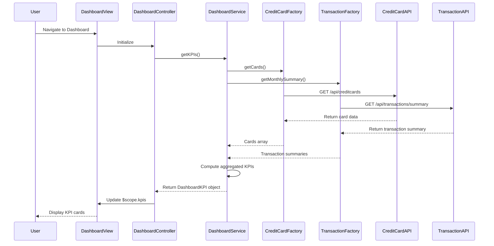

# Low-Level Design: Credit Card Portfolio Dashboard (QE-4643)

## a. Architecture Mapping

- **Dashboard Service** → AngularJS Service (dashboardService.js) - Aggregates KPI data from backend APIs
- **Credit Card Data Service** → AngularJS Factory (creditCardFactory.js) - Manages credit card data retrieval
- **Transaction Service** → AngularJS Factory (transactionFactory.js) - Handles transaction and spend data
- **User Dashboard UI** → AngularJS Controller (dashboardController.js) + View (dashboard.html) + Directive (kpiCard.directive.js)
- **Main Application** → AngularJS Module (creditCardApp.module.js)

**Recommended Folder Structure:**
```
app/
├── modules/
│   └── dashboard/
│       ├── controllers/
│       │   └── dashboardController.js
│       ├── services/
│       │   └── dashboardService.js
│       ├── directives/
│       │   └── kpiCard.directive.js
│       └── views/
│           └── dashboard.html
├── shared/
│   ├── factories/
│   │   ├── creditCardFactory.js
│   │   └── transactionFactory.js
│   └── services/
│       └── apiService.js
├── assets/
│   ├── css/
│   └── images/
└── app.module.js
```

## b. Component Specifications

| Component Name | Artifact Type | Responsibility | Key Dependencies |
|----------------|---------------|----------------|------------------|
| creditCardApp | Module | Root application module, configures routing and DI | angular, ngRoute, ngResource |
| dashboardController | Controller | Manages dashboard view state, orchestrates KPI data loading | $scope, dashboardService |
| dashboardService | Service | Aggregates data from creditCardFactory and transactionFactory, computes KPIs | $q, creditCardFactory, transactionFactory |
| creditCardFactory | Factory | REST API calls to Credit Card Data Service for card details, limits, balances | $resource, apiService |
| transactionFactory | Factory | REST API calls to Transaction Service for monthly spend and outstanding amounts | $resource, apiService |
| kpiCard | Directive | Reusable KPI card component for displaying individual metrics with responsive layout | None |
| apiService | Service | Centralized HTTP interceptor and error handling for all API calls | $http, $q |

## c. Data Model

**CreditCard (JS Object):**
```javascript
{
  cardId: String,
  cardNumber: String (masked),
  cardType: String,
  creditLimit: Number,
  currentBalance: Number,
  availableCredit: Number
}
```

**DashboardKPI (JS Object):**
```javascript
{
  monthlySpend: Number,
  totalCreditLimit: Number,
  totalAvailableCredit: Number,
  totalOutstandingAmount: Number,
  cardCount: Number,
  lastUpdated: Date
}
```

**TransactionSummary (JS Object):**
```javascript
{
  cardId: String,
  monthlySpend: Number,
  outstandingAmount: Number,
  billingCycle: String
}
```

## d. Data Flow

User navigates to dashboard → dashboard.html view loads → dashboardController initializes and calls dashboardService.getKPIs() → dashboardService makes parallel API calls via creditCardFactory.getCards() and transactionFactory.getMonthlySummary() → creditCardFactory and transactionFactory invoke REST endpoints (/api/creditcards and /api/transactions/summary) → Backend services return aggregated data → dashboardService computes total KPIs (sum credit limits, available credit, monthly spend, outstanding amounts) → Resolved promise updates $scope.kpis in dashboardController → View renders KPI cards using kpiCard directive with Bootstrap responsive grid → User sees dashboard with real-time KPIs.

## e. Primary Sequence Diagram



## f. Implementation Notes

- Use AngularJS $q.all() to parallelize API calls to creditCardFactory and transactionFactory for optimal 2-second load time
- Implement DI via function array notation for minification safety: `['$scope', 'dashboardService', function($scope, dashboardService) {...}]`
- Use $resource for REST API integration with caching enabled (`cache: true`) for repeated requests within session
- Apply Bootstrap grid classes (col-xs-12, col-sm-6, col-md-3) in kpiCard directive template for responsive layout
- Leverage ES6 arrow functions and const/let in service logic; use Array.reduce() for KPI aggregation computations

## g. Error Handling

HTTP interceptor in apiService catches API errors, logs to console, displays user-friendly toast notification via Bootstrap alerts, and returns rejected promise to caller.

## h. Security Notes

Standard input validation and secure API calls assumed; card numbers masked on client side; HTTPS enforced for all API communication.