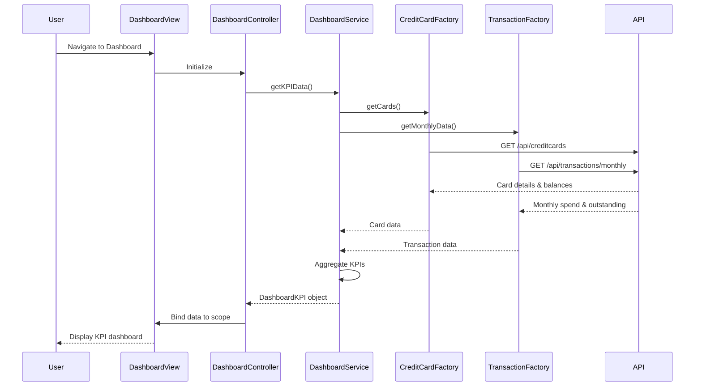

# Low-Level Design: Credit Card Portfolio Dashboard (QE-4643)

## a. Architecture Mapping

- **Dashboard Module** → AngularJS Module (`app.dashboard`)
- **Dashboard UI** → AngularJS Controller (`DashboardController`) + HTML Template (`dashboard.html`)
- **Dashboard Service** → AngularJS Service (`DashboardService`) for orchestrating API calls
- **Credit Card Data Service** → AngularJS Factory (`CreditCardFactory`) for credit card API integration
- **Transaction Service** → AngularJS Factory (`TransactionFactory`) for transaction API integration
- **KPI Display Components** → AngularJS Directives (`kpiCard`, `creditSummary`)

**Recommended Folder Structure:**
```
app/
├── modules/
│   └── dashboard/
│       ├── controllers/
│       │   └── DashboardController.js
│       ├── services/
│       │   └── DashboardService.js
│       ├── factories/
│       │   ├── CreditCardFactory.js
│       │   └── TransactionFactory.js
│       ├── directives/
│       │   ├── kpiCard.js
│       │   └── creditSummary.js
│       └── views/
│           └── dashboard.html
├── shared/
│   └── services/
│       └── HttpInterceptor.js
└── app.module.js
```

## b. Component Specifications

| Component Name | Artifact Type | Responsibility | Key Dependencies |
|----------------|---------------|----------------|------------------|
| DashboardController | Controller | Manages dashboard view state, fetches KPI data on load, handles refresh actions | DashboardService, $scope |
| DashboardService | Service | Orchestrates parallel API calls to CreditCardFactory and TransactionFactory, aggregates KPI data | CreditCardFactory, TransactionFactory, $q |
| CreditCardFactory | Factory | Provides REST API methods for fetching card details, limits, and balances | $http |
| TransactionFactory | Factory | Provides REST API methods for fetching monthly spend and outstanding amounts | $http |
| kpiCard | Directive | Renders individual KPI card with value, label, and icon in responsive layout | None |
| creditSummary | Directive | Displays aggregated credit summary across all cards with visual indicators | None |
| HttpInterceptor | Service | Handles loading states, error responses, and authentication headers | $q, $injector |

## c. Data Model

**DashboardKPI (JavaScript Object):**
```javascript
{
  monthlySpend: Number,           // Total spend for current month across all cards
  totalCreditLimit: Number,       // Sum of credit limits across all cards
  availableCredit: Number,        // Total available credit (limit - outstanding)
  outstandingAmount: Number,      // Total outstanding balance across all cards
  cards: Array<CreditCard>        // Array of individual card objects
}
```

**CreditCard (JavaScript Object):**
```javascript
{
  cardId: String,                 // Unique card identifier
  cardNumber: String,             // Masked card number (e.g., "****1234")
  cardType: String,               // Card type (e.g., "Visa", "Mastercard")
  creditLimit: Number,            // Card's credit limit
  availableCredit: Number,        // Card's available credit
  outstandingAmount: Number       // Card's outstanding balance
}
```

## d. Data Flow

User navigates to dashboard → DashboardController initializes and calls DashboardService.getKPIData() → DashboardService uses $q.all() to make parallel REST API calls via CreditCardFactory.getCards() and TransactionFactory.getMonthlyData() → Both factories execute $http GET requests to backend APIs → Responses are aggregated in DashboardService (calculating totals, available credit) → Aggregated DashboardKPI object returned to DashboardController → Controller binds data to $scope → View renders KPI cards using kpiCard and creditSummary directives with Bootstrap responsive grid → User sees dashboard with all KPIs displayed within 2 seconds.

## e. Primary Sequence Diagram



## f. Implementation Notes

- Use AngularJS Dependency Injection to inject DashboardService, factories, and $q into controllers/services
- Leverage $q.all() for parallel API calls to meet 2-second load time requirement
- Implement responsive Bootstrap grid (col-xs-12, col-sm-6, col-md-3) for KPI cards to support desktop/tablet/mobile
- Use $http interceptor pattern for centralized error handling, loading states, and authentication token injection
- Cache aggregated KPI data in DashboardService for 30 seconds using simple timestamp-based cache to reduce API calls on refresh

## g. Error Handling

HTTP interceptor catches all API errors, displays user-friendly notifications via Bootstrap alerts, and logs errors to console; controller handles promise rejections with fallback empty state UI.

## h. Security Notes

Standard input validation and secure API calls assumed; authentication tokens passed via HTTP headers in interceptor; sensitive card data masked in UI.