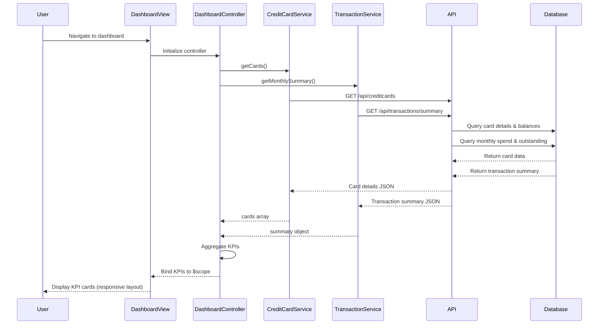

# Low-Level Design: Credit Card Analysis Dashboard

**Epic ID:** QE-4643  
**Technology Stack:** AngularJS 1.x, JavaScript ES6, HTML5, CSS3, Bootstrap, REST APIs, MVC Architecture

---

## a. Architecture Mapping

- **Dashboard Module** → `app.dashboard` (AngularJS Module)
- **Dashboard Controller** → `DashboardController` (Controller managing KPI display logic)
- **Credit Card Data Service** → `CreditCardService` (Factory for credit card API calls)
- **Transaction Service** → `TransactionService` (Factory for transaction API calls)
- **Dashboard View** → `dashboard.html` (HTML5 template with Bootstrap grid)
- **KPI Display Directive** → `kpiCard` (Directive for reusable KPI card components)

**Recommended Folder Structure:**
```
app/
├── modules/
│   └── dashboard/
│       ├── dashboard.module.js
│       ├── dashboard.controller.js
│       ├── dashboard.html
│       └── directives/
│           └── kpi-card.directive.js
├── services/
│   ├── credit-card.service.js
│   └── transaction.service.js
└── assets/
    └── css/
        └── dashboard.css
```

---

## b. Component Specifications

| Component Name | Artifact Type | Responsibility | Key Dependencies |
|----------------|---------------|----------------|------------------|
| `app.dashboard` | Module | Register dashboard module and dependencies | `ngRoute`, `app.services` |
| `DashboardController` | Controller | Orchestrate KPI data retrieval and bind to view | `CreditCardService`, `TransactionService`, `$scope` |
| `CreditCardService` | Factory | Fetch credit card details, limits, and balances via REST API | `$http`, `API_CONFIG` |
| `TransactionService` | Factory | Fetch monthly spend and outstanding amounts via REST API | `$http`, `API_CONFIG` |
| `kpiCard` | Directive | Render individual KPI card with title, value, and icon | None |
| `dashboard.html` | View | Display KPIs in responsive Bootstrap grid layout | Bootstrap CSS |

---

## c. Data Model

**CreditCardSummary (JavaScript Object):**
```javascript
{
  totalCreditLimit: Number,      // Sum of all card limits
  availableCredit: Number,       // Sum of available credit across cards
  outstandingAmount: Number,     // Total outstanding balance
  monthlySpend: Number,          // Current month's total spend
  cards: Array<CreditCard>       // Array of individual card objects
}
```

**CreditCard (JavaScript Object):**
```javascript
{
  cardId: String,
  cardNumber: String,            // Masked (e.g., "****1234")
  creditLimit: Number,
  availableCredit: Number,
  outstandingBalance: Number
}
```

---

## d. Data Flow

User navigates to dashboard → `dashboard.html` loads → `DashboardController` initializes and calls `CreditCardService.getCards()` and `TransactionService.getMonthlySummary()` → Both services make parallel REST API calls to backend → Backend queries database and returns aggregated data → Controller receives responses, computes derived KPIs (if needed), and binds data to `$scope` → View updates via two-way data binding, rendering KPI cards using `kpiCard` directive with Bootstrap responsive layout.

---

## e. Primary Sequence Diagram



---

## f. Implementation Notes

- Use AngularJS Dependency Injection to inject `CreditCardService` and `TransactionService` into `DashboardController`.
- Implement services as factories using `$http` with promise-based API calls; use `$q.all()` for parallel requests.
- Apply Bootstrap grid classes (`col-xs-12`, `col-sm-6`, `col-md-3`) in `dashboard.html` for responsive KPI card layout.
- Cache API responses in services using simple in-memory cache or `$cacheFactory` to meet 2-second load time NFR.
- Use ES6 arrow functions and `const`/`let` for cleaner service and controller code.

---

## g. Error Handling

Use HTTP interceptor to catch API errors globally; display user-friendly error messages via Bootstrap alert component in the view.

---

## h. Security Notes

Standard input validation and secure API calls assumed; ensure HTTPS for all REST API calls and mask sensitive card numbers in UI.