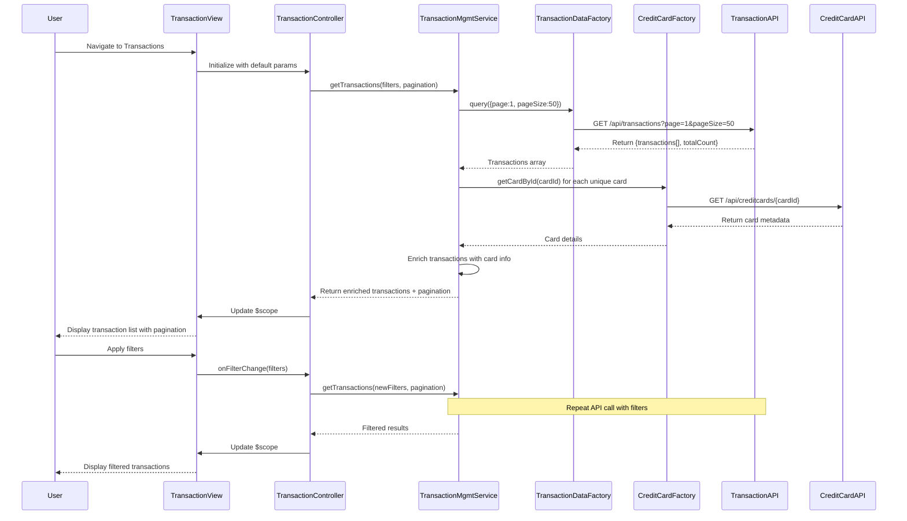

# Low-Level Design: Credit Card Transaction Management (QE-4644)

## a. Architecture Mapping

- **Transaction Management Service** → AngularJS Service (transactionManagementService.js) - Orchestrates transaction retrieval and filtering
- **Transaction Data Service** → AngularJS Factory (transactionDataFactory.js) - REST API calls for transaction data
- **Credit Card Service** → AngularJS Factory (creditCardFactory.js) - Retrieves card metadata for transaction association
- **User Transaction UI** → AngularJS Controller (transactionController.js) + View (transactions.html) + Directive (transactionList.directive.js)
- **Main Application** → AngularJS Module (creditCardApp.module.js)

**Recommended Folder Structure:**
```
app/
├── modules/
│   └── transactions/
│       ├── controllers/
│       │   └── transactionController.js
│       ├── services/
│       │   └── transactionManagementService.js
│       ├── directives/
│       │   ├── transactionList.directive.js
│       │   └── transactionFilter.directive.js
│       └── views/
│           ├── transactions.html
│           └── transactionDetail.html
├── shared/
│   ├── factories/
│   │   ├── transactionDataFactory.js
│   │   └── creditCardFactory.js
│   └── services/
│       └── apiService.js
├── assets/
│   ├── css/
│   └── images/
└── app.module.js
```

## b. Component Specifications

| Component Name | Artifact Type | Responsibility | Key Dependencies |
|----------------|---------------|----------------|------------------|
| creditCardApp | Module | Root application module with routing for transaction views | angular, ngRoute, ngResource |
| transactionController | Controller | Manages transaction list state, pagination, filtering, and detail view navigation | $scope, $routeParams, transactionManagementService |
| transactionManagementService | Service | Coordinates transaction retrieval, filtering, pagination, and card association logic | $q, transactionDataFactory, creditCardFactory |
| transactionDataFactory | Factory | REST API calls to Transaction Data Service with pagination and filter parameters | $resource, apiService |
| creditCardFactory | Factory | REST API calls to Credit Card Service for card metadata | $resource, apiService |
| transactionList | Directive | Renders paginated transaction list with sorting and filtering UI | None |
| transactionFilter | Directive | Reusable filter component for date range, amount, category, and card selection | None |
| apiService | Service | Centralized HTTP interceptor, error handling, and request/response transformation | $http, $q |

## c. Data Model

**Transaction (JS Object):**
```javascript
{
  transactionId: String,
  cardId: String,
  merchantName: String,
  category: String,
  amount: Number,
  currency: String,
  transactionDate: Date,
  status: String,
  description: String
}
```

**TransactionFilter (JS Object):**
```javascript
{
  cardId: String,
  startDate: Date,
  endDate: Date,
  minAmount: Number,
  maxAmount: Number,
  category: String,
  status: String
}
```

**PaginationParams (JS Object):**
```javascript
{
  page: Number,
  pageSize: Number,
  totalRecords: Number,
  totalPages: Number
}
```

## d. Data Flow

User navigates to transaction list view → transactions.html loads → transactionController initializes with default pagination (page 1, pageSize 50) and empty filters → Controller calls transactionManagementService.getTransactions(filters, pagination) → Service invokes transactionDataFactory.query() with query parameters → transactionDataFactory makes GET /api/transactions?page=1&pageSize=50 → Backend returns paginated transaction array and total count → Service calls creditCardFactory.getCardById() for each unique cardId to enrich transaction objects with card details → Enriched transactions and pagination metadata returned to controller → Controller updates $scope.transactions and $scope.pagination → transactionList directive renders table with Bootstrap pagination controls → User applies filters via transactionFilter directive → Controller re-invokes service with updated filters → Updated results displayed.

## e. Primary Sequence Diagram



## f. Implementation Notes

- Use $resource with custom query action supporting pagination: `TransactionDataFactory = $resource('/api/transactions', {}, {query: {method: 'GET', isArray: false}})`
- Implement server-side filtering by passing TransactionFilter object as query params; use ES6 template literals to build query strings
- Cache card metadata in transactionManagementService using ES6 Map to avoid redundant API calls for same cardId within session
- Apply AngularJS ng-repeat with track by transactionId for optimal list rendering performance with 10,000 records
- Use Bootstrap pagination component with AngularJS dirPaginate or custom pagination directive for page navigation

## g. Error Handling

HTTP interceptor in apiService catches errors, logs details, displays Bootstrap toast notification with retry option, and returns rejected promise; controller handles rejection with fallback empty state message.

## h. Security Notes

Standard input validation and secure API calls assumed; transaction data transmitted over HTTPS; sensitive fields (full card numbers) never exposed in API responses.