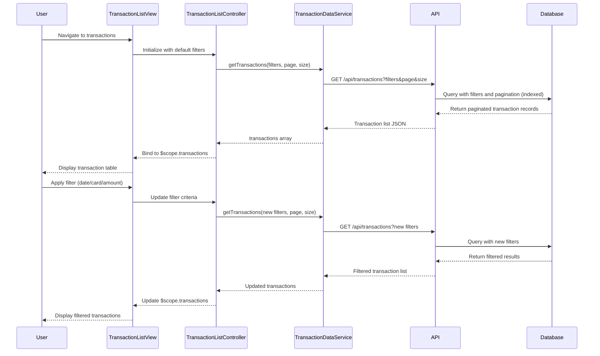

# Low-Level Design: Credit Card Transaction Management

**Epic ID:** QE-4644  
**Technology Stack:** AngularJS 1.x, JavaScript ES6, HTML5, CSS3, Bootstrap, REST APIs, MVC Architecture

---

## a. Architecture Mapping

- **Transaction Module** → `app.transactions` (AngularJS Module)
- **Transaction List Controller** → `TransactionListController` (Controller managing transaction list and filtering)
- **Transaction Detail Controller** → `TransactionDetailController` (Controller for individual transaction view)
- **Transaction Data Service** → `TransactionDataService` (Factory for transaction API calls with pagination)
- **Credit Card Service** → `CreditCardService` (Factory for card metadata)
- **Transaction List View** → `transaction-list.html` (HTML5 template with Bootstrap table)
- **Transaction Detail View** → `transaction-detail.html` (HTML5 template for detail modal)
- **Filter Directive** → `transactionFilter` (Directive for filter controls)

**Recommended Folder Structure:**
```
app/
├── modules/
│   └── transactions/
│       ├── transactions.module.js
│       ├── transaction-list.controller.js
│       ├── transaction-detail.controller.js
│       ├── transaction-list.html
│       ├── transaction-detail.html
│       └── directives/
│           └── transaction-filter.directive.js
├── services/
│   ├── transaction-data.service.js
│   └── credit-card.service.js
└── assets/
    └── css/
        └── transactions.css
```

---

## b. Component Specifications

| Component Name | Artifact Type | Responsibility | Key Dependencies |
|----------------|---------------|----------------|------------------|
| `app.transactions` | Module | Register transaction module and routing | `ngRoute`, `ui.bootstrap`, `app.services` |
| `TransactionListController` | Controller | Manage transaction list display, pagination, and filtering | `TransactionDataService`, `CreditCardService`, `$scope` |
| `TransactionDetailController` | Controller | Display detailed view of a single transaction | `TransactionDataService`, `$routeParams`, `$scope` |
| `TransactionDataService` | Factory | Fetch paginated and filtered transaction data via REST API | `$http`, `API_CONFIG` |
| `CreditCardService` | Factory | Fetch credit card metadata for transaction association | `$http`, `API_CONFIG` |
| `transactionFilter` | Directive | Render filter controls (date range, card selector, amount range) | None |
| `transaction-list.html` | View | Display transactions in Bootstrap responsive table with pagination | Bootstrap CSS, `ng-repeat` |
| `transaction-detail.html` | View | Display full transaction details in modal or separate view | Bootstrap modal |

---

## c. Data Model

**Transaction (JavaScript Object):**
```javascript
{
  transactionId: String,
  cardId: String,
  cardNumber: String,            // Masked
  merchantName: String,
  transactionDate: Date,
  amount: Number,
  currency: String,
  category: String,
  status: String,                // "Posted", "Pending"
  description: String
}
```

**TransactionListResponse (JavaScript Object):**
```javascript
{
  transactions: Array<Transaction>,
  totalCount: Number,
  pageNumber: Number,
  pageSize: Number
}
```

**FilterCriteria (JavaScript Object):**
```javascript
{
  cardId: String,
  startDate: Date,
  endDate: Date,
  minAmount: Number,
  maxAmount: Number,
  category: String
}
```

---

## d. Data Flow

User navigates to transaction list → `transaction-list.html` loads → `TransactionListController` initializes with default filter and pagination parameters → Controller calls `TransactionDataService.getTransactions(filterCriteria, pageNumber, pageSize)` → Service makes REST API call with query parameters → Backend performs indexed database query with filters → API returns paginated transaction list → Controller binds data to `$scope.transactions` → View renders transactions in Bootstrap table using `ng-repeat` → User applies filters via `transactionFilter` directive → Controller updates filter criteria and re-fetches data → User clicks transaction row → `TransactionDetailController` loads transaction details in modal.

---

## e. Primary Sequence Diagram



---

## f. Implementation Notes

- Use AngularJS `$http` service with query parameter serialization for filter criteria; implement server-side pagination to handle 10,000+ transactions efficiently.
- Implement `TransactionDataService` as a factory with methods `getTransactions(filters, page, size)` and `getTransactionById(id)` returning promises.
- Use Bootstrap table with `ng-repeat` and `limitTo` filter for client-side rendering; integrate `ui.bootstrap.pagination` directive for page navigation.
- Apply AngularJS filters for date formatting (`| date:'short'`) and currency display (`| currency`) in the view.
- Use `$routeParams` or `$stateParams` (if using ui-router) to pass transaction ID to detail view; alternatively, use Bootstrap modal with `$uibModal` service.

---

## g. Error Handling

HTTP interceptor captures API errors; controller displays error messages using Bootstrap alert component with retry option for failed requests.

---

## h. Security Notes

Ensure all API calls use HTTPS; mask full card numbers in UI; validate filter inputs client-side to prevent injection attacks before sending to API.