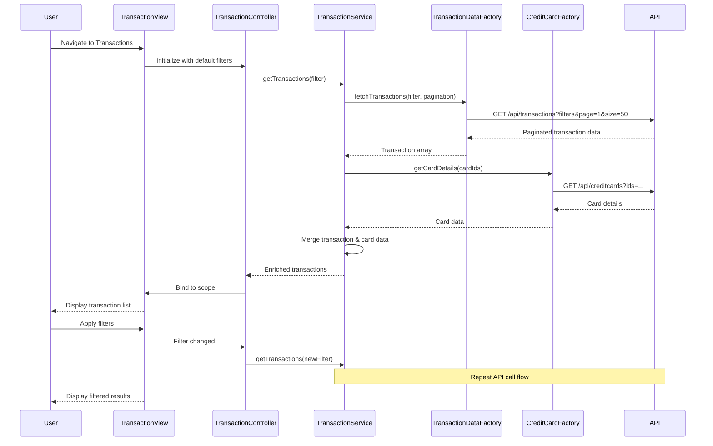

# Low-Level Design: Credit Card Transaction Management (QE-4644)

## a. Architecture Mapping

- **Transaction Module** → AngularJS Module (`app.transactions`)
- **Transaction UI** → AngularJS Controller (`TransactionController`) + HTML Template (`transactions.html`)
- **Transaction Management Service** → AngularJS Service (`TransactionService`) for business logic and API orchestration
- **Transaction Data Service** → AngularJS Factory (`TransactionDataFactory`) for transaction API integration
- **Credit Card Service** → AngularJS Factory (`CreditCardFactory`) for card association
- **Filter Component** → AngularJS Directive (`transactionFilter`) for filter UI
- **Transaction List Component** → AngularJS Directive (`transactionList`) for displaying paginated transactions

**Recommended Folder Structure:**
```
app/
├── modules/
│   └── transactions/
│       ├── controllers/
│       │   └── TransactionController.js
│       ├── services/
│       │   └── TransactionService.js
│       ├── factories/
│       │   ├── TransactionDataFactory.js
│       │   └── CreditCardFactory.js
│       ├── directives/
│       │   ├── transactionFilter.js
│       │   └── transactionList.js
│       └── views/
│           ├── transactions.html
│           └── transaction-detail.html
├── shared/
│   └── services/
│       └── HttpInterceptor.js
└── app.module.js
```

## b. Component Specifications

| Component Name | Artifact Type | Responsibility | Key Dependencies |
|----------------|---------------|----------------|------------------|
| TransactionController | Controller | Manages transaction list view state, handles pagination, filter changes, and detail view navigation | TransactionService, $scope, $location |
| TransactionService | Service | Orchestrates transaction retrieval with filters, manages pagination state, joins transaction and card data | TransactionDataFactory, CreditCardFactory, $q |
| TransactionDataFactory | Factory | Provides REST API methods for fetching paginated and filtered transaction records | $http |
| CreditCardFactory | Factory | Provides REST API methods for fetching card details to associate with transactions | $http |
| transactionFilter | Directive | Renders filter UI (date range, card selector, amount range, category) and emits filter change events | None |
| transactionList | Directive | Displays paginated transaction list with sorting, handles row click for detail view | None |
| HttpInterceptor | Service | Handles loading states, error responses, and authentication headers | $q, $injector |

## c. Data Model

**Transaction (JavaScript Object):**
```javascript
{
  transactionId: String,          // Unique transaction identifier
  cardId: String,                 // Associated card ID
  cardNumber: String,             // Masked card number (e.g., "****1234")
  merchantName: String,           // Merchant/vendor name
  category: String,               // Transaction category
  amount: Number,                 // Transaction amount
  currency: String,               // Currency code (e.g., "USD")
  transactionDate: Date,          // Transaction date/time
  status: String,                 // Status (e.g., "Posted", "Pending")
  description: String             // Transaction description
}
```

**TransactionFilter (JavaScript Object):**
```javascript
{
  cardIds: Array<String>,         // Selected card IDs (empty = all cards)
  startDate: Date,                // Filter start date
  endDate: Date,                  // Filter end date
  minAmount: Number,              // Minimum transaction amount
  maxAmount: Number,              // Maximum transaction amount
  category: String,               // Category filter
  pageNumber: Number,             // Current page (1-indexed)
  pageSize: Number                // Records per page (default: 50)
}
```

## d. Data Flow

User navigates to transaction list → TransactionController initializes with default filters (last 30 days, all cards) → Controller calls TransactionService.getTransactions(filter) → TransactionService calls TransactionDataFactory.fetchTransactions() with pagination and filter params → Factory executes $http GET with query parameters to backend API → API returns paginated transaction data (50 records per page) → TransactionService calls CreditCardFactory.getCardDetails() to enrich transactions with card info → Service merges transaction and card data → Enriched transaction array returned to controller → Controller binds to $scope → transactionList directive renders table with Bootstrap styling → User applies filters via transactionFilter directive → Filter change triggers new API call with updated parameters → UI updates with filtered results within 300ms.

## e. Primary Sequence Diagram



## f. Implementation Notes

- Use AngularJS $http with query parameter serialization for filter and pagination parameters in GET requests
- Implement server-side pagination with page number and page size (default 50 records per page) to handle 10,000+ transactions efficiently
- Use AngularJS two-way data binding for filter inputs; debounce filter changes by 300ms using $timeout to reduce API calls
- Leverage Bootstrap table-responsive class for mobile-friendly transaction list display
- Store filter state in TransactionService to maintain filters across navigation and back-button usage

## g. Error Handling

HTTP interceptor pattern for centralized error handling; API failures display user-friendly error messages via Bootstrap alerts; empty state UI shown when no transactions match filters.

## h. Security Notes

Authentication tokens passed via HTTP headers; transaction data encrypted in transit (HTTPS); sensitive card numbers masked in UI and API responses.