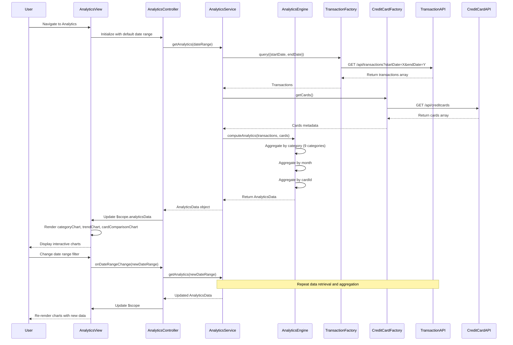

# Low-Level Design: Credit Card Spending Analytics (QE-4645)

## a. Architecture Mapping

- **Analytics Service** → AngularJS Service (analyticsService.js) - Orchestrates analytics data retrieval and aggregation
- **Transaction Service** → AngularJS Factory (transactionFactory.js) - Retrieves raw transaction data
- **Analytics Engine** → AngularJS Service (analyticsEngineService.js) - Client-side aggregation and computation for category, monthly, and card-wise analysis
- **Credit Card Service** → AngularJS Factory (creditCardFactory.js) - Provides card metadata for card-wise analysis
- **User Analytics UI** → AngularJS Controller (analyticsController.js) + View (analytics.html) + Directives (categoryChart.directive.js, trendChart.directive.js, cardComparisonChart.directive.js)
- **Main Application** → AngularJS Module (creditCardApp.module.js)

**Recommended Folder Structure:**
```
app/
├── modules/
│   └── analytics/
│       ├── controllers/
│       │   └── analyticsController.js
│       ├── services/
│       │   ├── analyticsService.js
│       │   └── analyticsEngineService.js
│       ├── directives/
│       │   ├── categoryChart.directive.js
│       │   ├── trendChart.directive.js
│       │   └── cardComparisonChart.directive.js
│       └── views/
│           └── analytics.html
├── shared/
│   ├── factories/
│   │   ├── transactionFactory.js
│   │   └── creditCardFactory.js
│   └── services/
│       └── apiService.js
├── assets/
│   ├── css/
│   ├── js/
│   │   └── chart.min.js (Chart.js library)
│   └── images/
└── app.module.js
```

## b. Component Specifications

| Component Name | Artifact Type | Responsibility | Key Dependencies |
|----------------|---------------|----------------|------------------|
| creditCardApp | Module | Root application module with routing for analytics views | angular, ngRoute, ngResource, chart.js |
| analyticsController | Controller | Manages analytics view state, date range selection, and chart data binding | $scope, $filter, analyticsService |
| analyticsService | Service | Coordinates data retrieval from transactionFactory and creditCardFactory, delegates aggregation to analyticsEngineService | $q, transactionFactory, creditCardFactory, analyticsEngineService |
| analyticsEngineService | Service | Performs client-side aggregation for category-wise, monthly trend, and card-wise spending analysis | None |
| transactionFactory | Factory | REST API calls to Transaction Service for raw transaction data with date range filters | $resource, apiService |
| creditCardFactory | Factory | REST API calls to Credit Card Service for card metadata | $resource, apiService |
| categoryChart | Directive | Renders interactive pie/donut chart for 9-category spending breakdown using Chart.js | chart.js |
| trendChart | Directive | Renders line/bar chart for monthly spending trends over time using Chart.js | chart.js |
| cardComparisonChart | Directive | Renders bar chart comparing spending across multiple cards using Chart.js | chart.js |
| apiService | Service | Centralized HTTP interceptor and error handling for all API calls | $http, $q |

## c. Data Model

**CategorySpending (JS Object):**
```javascript
{
  category: String, // One of 9: Food & Dining, Fuel, Shopping, Travel, Entertainment, Utilities, Healthcare, Education, Miscellaneous
  totalAmount: Number,
  transactionCount: Number,
  percentage: Number
}
```

**MonthlyTrend (JS Object):**
```javascript
{
  month: String, // YYYY-MM format
  totalSpend: Number,
  transactionCount: Number,
  categoryBreakdown: Array<{category: String, amount: Number}>
}
```

**CardSpending (JS Object):**
```javascript
{
  cardId: String,
  cardName: String,
  totalSpend: Number,
  categoryBreakdown: Array<{category: String, amount: Number}>
}
```

**AnalyticsData (JS Object):**
```javascript
{
  categorySpending: Array<CategorySpending>,
  monthlyTrends: Array<MonthlyTrend>,
  cardSpending: Array<CardSpending>,
  dateRange: {startDate: Date, endDate: Date}
}
```

## d. Data Flow

User navigates to analytics view → analytics.html loads → analyticsController initializes with default date range (last 12 months) → Controller calls analyticsService.getAnalytics(dateRange) → analyticsService invokes transactionFactory.query() with date range filters to retrieve raw transactions → transactionFactory makes GET /api/transactions?startDate=X&endDate=Y → Backend returns transaction array → analyticsService calls creditCardFactory.getCards() for card metadata → analyticsService passes transactions and cards to analyticsEngineService.computeAnalytics() → analyticsEngineService aggregates data: groups transactions by category (9 categories), by month, and by cardId; computes totals and percentages → Computed AnalyticsData object returned to controller → Controller updates $scope.analyticsData → categoryChart, trendChart, and cardComparisonChart directives watch scope changes and render interactive Chart.js visualizations → User interacts with charts (hover, click) for drill-down or applies new date range filter → Controller re-invokes analyticsService with updated parameters → Charts re-render with new data.

## e. Primary Sequence Diagram



## f. Implementation Notes

- Use Chart.js library integrated via AngularJS directives; each chart directive isolates scope and watches data binding for reactive updates
- Implement analyticsEngineService aggregation using ES6 Array.reduce() and Map for efficient grouping by category, month, and cardId
- Apply AngularJS $filter('date') and $filter('currency') for consistent date and currency formatting in chart labels and tooltips
- Use $q.all() to parallelize transactionFactory and creditCardFactory API calls for optimal performance within 3-second rendering target
- Enable Chart.js responsive mode and Bootstrap grid layout (col-md-6, col-lg-4) for responsive chart display across devices

## g. Error Handling

HTTP interceptor in apiService catches API errors, logs to console, displays user-friendly error message via Bootstrap alert, and returns empty dataset to prevent chart rendering failures.

## h. Security Notes

Standard input validation and secure API calls assumed; transaction data filtered server-side by authenticated user; no sensitive card details exposed in analytics aggregations.