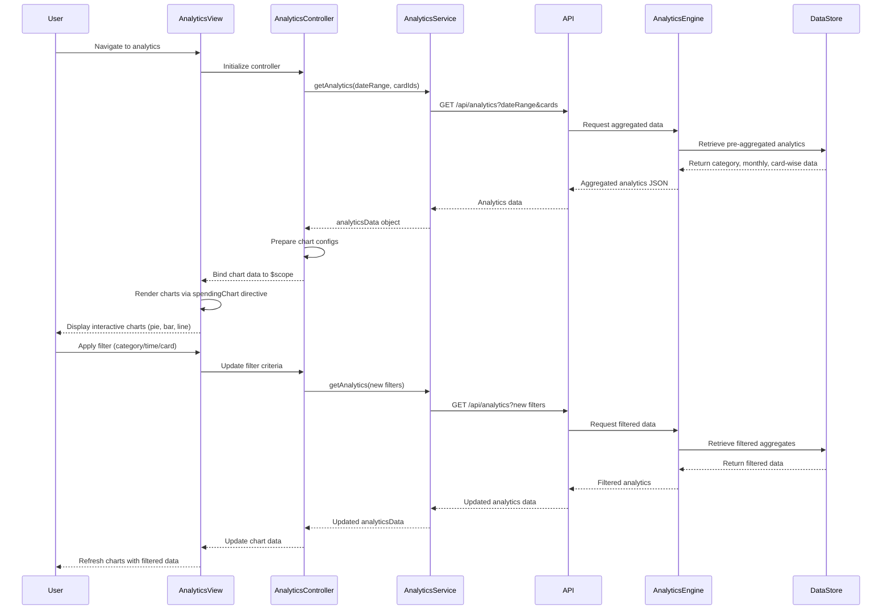

# Low-Level Design: Credit Card Spending Analytics

**Epic ID:** QE-4645  
**Technology Stack:** AngularJS 1.x, JavaScript ES6, HTML5, CSS3, Bootstrap, REST APIs, MVC Architecture

---

## a. Architecture Mapping

- **Analytics Module** → `app.analytics` (AngularJS Module)
- **Analytics Controller** → `AnalyticsController` (Controller managing analytics data and chart rendering)
- **Analytics Service** → `AnalyticsService` (Factory for analytics API calls)
- **Transaction Service** → `TransactionService` (Factory for raw transaction data)
- **Credit Card Service** → `CreditCardService` (Factory for card metadata)
- **Analytics View** → `analytics.html` (HTML5 template with chart containers)
- **Chart Directive** → `spendingChart` (Directive wrapping Chart.js or similar library)
- **Category Filter Directive** → `categoryFilter` (Directive for interactive filtering)

**Recommended Folder Structure:**
```
app/
├── modules/
│   └── analytics/
│       ├── analytics.module.js
│       ├── analytics.controller.js
│       ├── analytics.html
│       └── directives/
│           ├── spending-chart.directive.js
│           └── category-filter.directive.js
├── services/
│   ├── analytics.service.js
│   ├── transaction.service.js
│   └── credit-card.service.js
└── assets/
    ├── css/
    │   └── analytics.css
    └── js/
        └── chart.min.js
```

---

## b. Component Specifications

| Component Name | Artifact Type | Responsibility | Key Dependencies |
|----------------|---------------|----------------|------------------|
| `app.analytics` | Module | Register analytics module with routing and chart library | `ngRoute`, `chart.js`, `app.services` |
| `AnalyticsController` | Controller | Orchestrate analytics data retrieval, aggregation, and chart configuration | `AnalyticsService`, `TransactionService`, `CreditCardService`, `$scope` |
| `AnalyticsService` | Factory | Fetch pre-aggregated analytics data (category, monthly, card-wise) via REST API | `$http`, `API_CONFIG` |
| `TransactionService` | Factory | Fetch raw transaction data if client-side aggregation needed | `$http`, `API_CONFIG` |
| `CreditCardService` | Factory | Fetch card metadata for card-wise analysis | `$http`, `API_CONFIG` |
| `spendingChart` | Directive | Render interactive charts (pie, bar, line) using Chart.js library | `Chart.js` |
| `categoryFilter` | Directive | Provide interactive filter controls for category, time period, and card selection | None |
| `analytics.html` | View | Display multiple chart containers in responsive Bootstrap grid | Bootstrap CSS |

---

## c. Data Model

**CategorySpending (JavaScript Object):**
```javascript
{
  category: String,              // One of 9 categories
  amount: Number,
  percentage: Number,
  transactionCount: Number
}
```

**MonthlyTrend (JavaScript Object):**
```javascript
{
  month: String,                 // "YYYY-MM"
  totalSpend: Number,
  categoryBreakdown: Array<CategorySpending>
}
```

**CardWiseSpending (JavaScript Object):**
```javascript
{
  cardId: String,
  cardNumber: String,            // Masked
  totalSpend: Number,
  categoryBreakdown: Array<CategorySpending>
}
```

**AnalyticsData (JavaScript Object):**
```javascript
{
  categorySpending: Array<CategorySpending>,
  monthlyTrends: Array<MonthlyTrend>,
  cardWiseSpending: Array<CardWiseSpending>
}
```

---

## d. Data Flow

User navigates to analytics page → `analytics.html` loads → `AnalyticsController` initializes and calls `AnalyticsService.getAnalytics(dateRange, cardIds)` → Service makes REST API call to backend → Backend's Analytics Engine retrieves pre-aggregated data from data store (computed periodically) → API returns aggregated analytics data (category-wise, monthly trends, card-wise) → Controller processes data and prepares chart configurations (labels, datasets, colors) → Controller binds chart data to `$scope` → `spendingChart` directives render interactive charts using Chart.js → User applies filters via `categoryFilter` directive → Controller updates filter parameters and re-fetches analytics data → Charts update dynamically with drill-down capability.

---

## e. Primary Sequence Diagram



---

## f. Implementation Notes

- Integrate Chart.js library via CDN or npm; create `spendingChart` directive that wraps Chart.js initialization and update logic.
- Use AngularJS `$watch` in directive to detect data changes and call `chart.update()` for dynamic chart rendering.
- Implement `AnalyticsService` as factory with method `getAnalytics(filters)` returning promise; cache responses for 5 minutes using `$cacheFactory`.
- Configure chart options for responsive design (`responsive: true`, `maintainAspectRatio: false`) to meet cross-device NFR.
- Use ES6 array methods (`map`, `filter`, `reduce`) in controller for data transformation before binding to charts.

---

## g. Error Handling

Use HTTP interceptor for global error handling; display user-friendly error message in analytics view with retry button if API call fails.

---

## h. Security Notes

Standard input validation and secure API calls assumed; ensure transaction data includes only aggregated amounts without exposing sensitive merchant details unnecessarily.