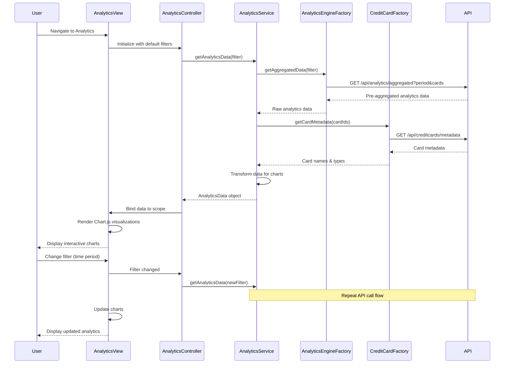

# Low-Level Design: Spending Analytics & Visualizations (QE-4645)

## a. Architecture Mapping

- **Analytics Module** → AngularJS Module (`app.analytics`)
- **Analytics UI** → AngularJS Controller (`AnalyticsController`) + HTML Template (`analytics.html`)
- **Analytics Service** → AngularJS Service (`AnalyticsService`) for orchestrating data retrieval and aggregation
- **Transaction Service** → AngularJS Factory (`TransactionFactory`) for raw transaction data
- **Analytics Engine** → AngularJS Factory (`AnalyticsEngineFactory`) for aggregated analytics data API
- **Credit Card Service** → AngularJS Factory (`CreditCardFactory`) for card metadata
- **Chart Components** → AngularJS Directives (`categoryChart`, `trendChart`, `cardComparisonChart`) using Chart.js library
- **Filter Component** → AngularJS Directive (`analyticsFilter`) for time period and card selection

**Recommended Folder Structure:**
```
app/
├── modules/
│   └── analytics/
│       ├── controllers/
│       │   └── AnalyticsController.js
│       ├── services/
│       │   └── AnalyticsService.js
│       ├── factories/
│       │   ├── TransactionFactory.js
│       │   ├── AnalyticsEngineFactory.js
│       │   └── CreditCardFactory.js
│       ├── directives/
│       │   ├── categoryChart.js
│       │   ├── trendChart.js
│       │   ├── cardComparisonChart.js
│       │   └── analyticsFilter.js
│       └── views/
│           └── analytics.html
├── shared/
│   └── services/
│       └── HttpInterceptor.js
└── app.module.js
```

## b. Component Specifications

| Component Name | Artifact Type | Responsibility | Key Dependencies |
|----------------|---------------|----------------|------------------|
| AnalyticsController | Controller | Manages analytics view state, handles filter changes, coordinates chart data updates | AnalyticsService, $scope |
| AnalyticsService | Service | Orchestrates API calls to retrieve aggregated analytics data, transforms data for chart consumption | AnalyticsEngineFactory, TransactionFactory, CreditCardFactory, $q |
| AnalyticsEngineFactory | Factory | Provides REST API methods for fetching pre-aggregated analytics data by category, time, and card | $http |
| TransactionFactory | Factory | Provides REST API methods for raw transaction data (fallback if pre-aggregation unavailable) | $http |
| CreditCardFactory | Factory | Provides REST API methods for card metadata (names, types) for labeling charts | $http |
| categoryChart | Directive | Renders interactive pie/donut chart for category-wise spending (9 categories) using Chart.js | Chart.js |
| trendChart | Directive | Renders interactive line chart for monthly spend trends over time using Chart.js | Chart.js |
| cardComparisonChart | Directive | Renders interactive bar chart for card-wise spend comparison using Chart.js | Chart.js |
| analyticsFilter | Directive | Renders filter UI for time period selection (last 30/60/90 days, custom range) and card selection | None |
| HttpInterceptor | Service | Handles loading states, error responses, and authentication headers | $q, $injector |

## c. Data Model

**AnalyticsData (JavaScript Object):**
```javascript
{
  categorySpending: Array<CategorySpend>,  // Spending by category
  monthlyTrends: Array<MonthlySpend>,      // Monthly spending trends
  cardComparison: Array<CardSpend>,        // Card-wise spending comparison
  totalSpend: Number,                      // Total spending for selected period
  period: Object                           // Selected time period {startDate, endDate}
}
```

**CategorySpend (JavaScript Object):**
```javascript
{
  category: String,              // Category name (Food & Dining, Fuel, Shopping, Travel, Entertainment, Utilities, Healthcare, Education, Miscellaneous)
  amount: Number,                // Total spend in category
  percentage: Number,            // Percentage of total spend
  transactionCount: Number       // Number of transactions in category
}
```

**MonthlySpend (JavaScript Object):**
```javascript
{
  month: String,                 // Month label (e.g., "Jan 2024")
  amount: Number,                // Total spend for month
  transactionCount: Number       // Number of transactions in month
}
```

**CardSpend (JavaScript Object):**
```javascript
{
  cardId: String,                // Card identifier
  cardName: String,              // Card display name
  amount: Number,                // Total spend on card
  percentage: Number             // Percentage of total spend
}
```

## d. Data Flow

User navigates to analytics view → AnalyticsController initializes with default filters (last 30 days, all cards) → Controller calls AnalyticsService.getAnalyticsData(filter) → AnalyticsService calls AnalyticsEngineFactory.getAggregatedData() to fetch pre-aggregated analytics from backend → Factory executes $http GET to analytics API endpoint → API returns pre-computed category, trend, and card-wise data → AnalyticsService calls CreditCardFactory.getCardMetadata() to enrich card names → Service transforms API response into chart-ready format (labels, datasets, colors) → Transformed AnalyticsData object returned to controller → Controller binds data to $scope → Chart directives (categoryChart, trendChart, cardComparisonChart) initialize Chart.js instances with bound data → Charts render with interactive tooltips, legends, and drill-down capability → User changes filters via analyticsFilter → Filter change triggers new API call → Charts update with new data within 3 seconds.

## e. Primary Sequence Diagram



## f. Implementation Notes

- Use Chart.js library (v2.x+) wrapped in AngularJS directives for responsive, interactive charts with built-in tooltips and legends
- Implement AngularJS directive pattern for each chart type; directives watch scope data changes and call chart.update() for smooth transitions
- Leverage AnalyticsEngineFactory to fetch pre-aggregated data from backend (computed hourly/daily) to meet 3-second rendering requirement
- Use AngularJS $q.all() to parallelize API calls for analytics data and card metadata
- Apply Chart.js responsive configuration and Bootstrap grid (col-md-6, col-xs-12) for mobile-friendly chart layout

## g. Error Handling

HTTP interceptor handles API failures; display user-friendly error messages with retry option; show empty state with informative message when no data available for selected filters.

## h. Security Notes

Standard input validation and secure API calls assumed; authentication tokens in HTTP headers; analytics data aggregated server-side to prevent exposure of individual transaction details.