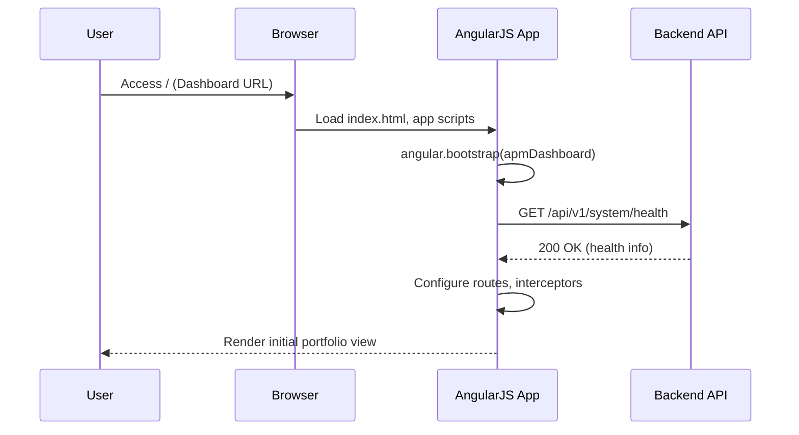
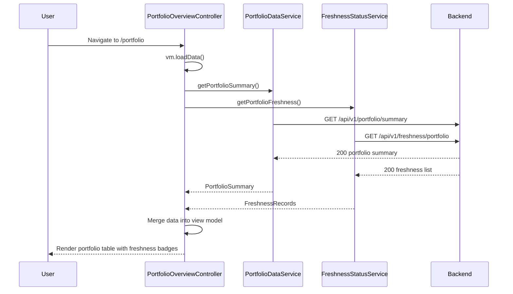
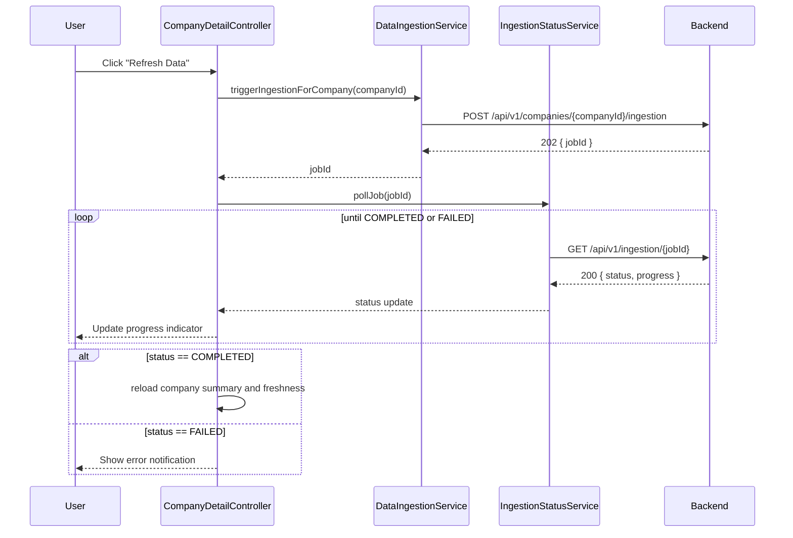
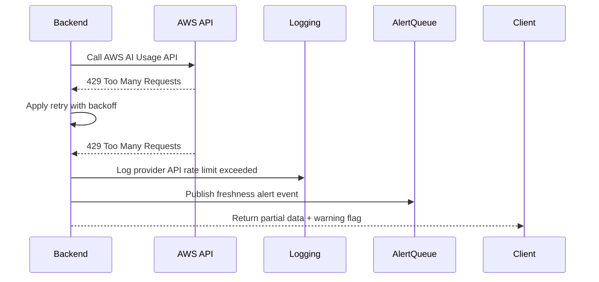

# Low-Level Design (LLD) – QE-4742

**Epic:** QE-4742 – AI Portfolio Management Dashboard – Foundational Data Layer  
**Application Stack:** AngularJS (1.x), JavaScript ES6, HTML5, CSS3, Bootstrap, REST APIs, MVC

> This LLD defines the concrete implementation design for the foundational data layer of the AI Portfolio Management Dashboard. It translates the HLD into AngularJS front-end and REST/MVC back-end interactions suitable for enterprise-grade deployment.

---

## 1. Application Architecture

### 1.1 Overall Architecture

The system follows a classic web MVC pattern:

- **Client (View Layer):** AngularJS 1.x SPA served via HTML5 pages using Bootstrap-based layout.
- **Client Controllers/Services:** Orchestrate UI state and invoke REST APIs.
- **Server (MVC Backend):** RESTful services (e.g., Java/Spring or Node/Express – technology-agnostic here) implementing: 
  - Cloud provider integrations (AWS, Azure, GCP) 
  - Data ingestion and normalization
  - Central data-store access
  - Data freshness monitoring and alerts
- **Data Store:** Relational (PostgreSQL/MySQL) or document (MongoDB) store abstracted via repository layer.

### 1.2 AngularJS MVC Mapping

**Main AngularJS Module:** `apmDashboard`  
Responsible for bootstrapping the SPA and configuring routes, interceptors, and core services.

**AngularJS Components Mapping to HLD Components:**

| HLD Component              | AngularJS Artifacts                                                                                      |
|---------------------------|-----------------------------------------------------------------------------------------------------------|
| API Integration Layer     | `CloudIntegrationService`, `CloudProviderConfigService`                                                   |
| Data Ingestion Service    | `DataIngestionService`, background status polling via `IngestionStatusService`                           |
| Data Normalization Engine | Exposed as backend APIs; client uses `NormalizedDataService`                                             |
| Central Data Store        | Accessed via REST; client uses `PortfolioDataService`                                                    |
| Data Freshness Monitor    | `FreshnessStatusService`, directives for freshness badges                                                |
| Dashboard Backend API     | REST endpoints; client uses `DashboardApiService` and multiple feature-specific services/controllers     |

### 1.3 Project Folder Structure (Front-End)

```text
/webapp
  /app
    app.module.js
    app.config.js
    app.routes.js
    app.constants.js

    /core
      /services
        cloud-integration.service.js
        portfolio-data.service.js
        freshness-status.service.js
        ingestion-status.service.js
        dashboard-api.service.js
        auth.service.js
        notification.service.js
        logging.service.js
      /interceptors
        http-error.interceptor.js
        auth-token.interceptor.js

    /features
      /portfolio
        portfolio.module.js
        portfolio.routes.js
        controllers/
          portfolio-overview.controller.js
          company-detail.controller.js
        directives/
          freshness-badge.directive.js
          provider-status-chip.directive.js
        views/
          portfolio-overview.html
          company-detail.html

      /settings
        settings.module.js
        controllers/
          provider-config.controller.js
        views/
          provider-config.html

    /shared
      /models
        portfolio.models.js
        provider.models.js
      /filters
        date-age.filter.js
        currency-compact.filter.js
      /directives
        loading-spinner.directive.js

  /assets
    /css
      main.css
    /img
      ...

  index.html
```

> Note: Back-end folder structure is not enforced by Angular; assumed to follow conventional server MVC structure (e.g., `/controllers`, `/services`, `/repositories`, etc.).

---

## 2. Component Specifications

### 2.1 `apmDashboard` Module

- **Type:** AngularJS Module
- **File:** `app/app.module.js`
- **Responsibility:** Root module aggregating feature modules and registering shared services.
- **Public API:** Module definition.
- **Dependencies:** `ngRoute`, `ngResource`, `ui.bootstrap`, `apmDashboard.portfolio`, `apmDashboard.settings`.

**Implementation Sketch:**
```js
(function() {
  'use strict';

  angular
    .module('apmDashboard', [
      'ngRoute',
      'ngResource',
      'ui.bootstrap',
      'apmDashboard.portfolio',
      'apmDashboard.settings'
    ]);
})();
```

### 2.2 `CloudIntegrationService`

- **Type:** Service
- **File:** `app/core/services/cloud-integration.service.js`
- **Responsibility:**
  - Manage configuration metadata for AWS, Azure, and GCP accounts per portfolio company.
  - Provide read-only access to which providers are enabled and their statuses.
- **Public Methods:**
  - `getProviders(companyId)` → Promise<Array<CloudProviderConfig>>
  - `getProviderStatus(companyId, providerKey)` → Promise<ProviderStatus>
  - `refreshProviderStatus(companyId)` → Promise<StatusSummary>
- **Inputs:**
  - `companyId`, `providerKey` (e.g., `"aws"`, `"azure"`, `"gcp"`).
- **Outputs:**
  - Provider configuration and status objects.
- **Dependencies:**
  - Injects `$http`, `API_BASE_URL`, `LoggingService`.

**Implementation Sketch:**
```js
(function() {
  'use strict';

  angular
    .module('apmDashboard')
    .service('CloudIntegrationService', CloudIntegrationService);

  CloudIntegrationService.$inject = ['$http', 'API_BASE_URL', 'LoggingService'];

  function CloudIntegrationService($http, API_BASE_URL, LoggingService) {
    this.getProviders = (companyId) =>
      $http.get(`${API_BASE_URL}/companies/${companyId}/providers`)
        .then(resp => resp.data);

    this.getProviderStatus = (companyId, providerKey) =>
      $http.get(`${API_BASE_URL}/companies/${companyId}/providers/${providerKey}/status`)
        .then(resp => resp.data);

    this.refreshProviderStatus = (companyId) =>
      $http.post(`${API_BASE_URL}/companies/${companyId}/providers/refresh`)
        .then(resp => resp.data)
        .catch(err => {
          LoggingService.error('Provider refresh failed', err);
          throw err;
        });
  }
})();
```

### 2.3 `DataIngestionService`

- **Type:** Service
- **File:** `app/core/services/data-ingestion.service.js`
- **Responsibility:** Trigger backend ingestion jobs and expose progress/status.
- **Public Methods:**
  - `triggerIngestionForCompany(companyId)` → Promise<IngestionJob>
  - `getIngestionStatus(jobId)` → Promise<IngestionJobStatus>
- **Dependencies:** `$http`, `API_BASE_URL`, `LoggingService`.

### 2.4 `IngestionStatusService`

- **Type:** Service
- **File:** `app/core/services/ingestion-status.service.js`
- **Responsibility:** Handle client-side polling of ingestion job status.
- **Public Methods:**
  - `pollJob(jobId, onUpdateCb)` → Promise<IngestionJobStatus>
- **Dependencies:** `$interval`, `DataIngestionService`, `LoggingService`.

### 2.5 `PortfolioDataService`

- **Type:** Service
- **File:** `app/core/services/portfolio-data.service.js`
- **Responsibility:** Access normalized and aggregated AI usage/spend data.
- **Public Methods:**
  - `getPortfolioSummary()` → Promise<PortfolioSummary>
  - `getCompanySummary(companyId)` → Promise<CompanySummary>
  - `getUsageTrends(companyId, options)` → Promise<UsageTrendSeries>
- **Dependencies:** `$http`, `API_BASE_URL`, `LoggingService`.

### 2.6 `FreshnessStatusService`

- **Type:** Service
- **File:** `app/core/services/freshness-status.service.js`
- **Responsibility:**
  - Fetch data freshness metadata per company and provider.
  - Expose freshness states for badges and alerts.
- **Public Methods:**
  - `getPortfolioFreshness()` → Promise<Array<FreshnessRecord>>
  - `getCompanyFreshness(companyId)` → Promise<Array<FreshnessRecord>>
- **Dependencies:** `$http`, `API_BASE_URL`.

### 2.7 `DashboardApiService`

- **Type:** Service
- **File:** `app/core/services/dashboard-api.service.js`
- **Responsibility:** Wrapper over backend REST API for cross-feature shared operations (health checks, global metrics).
- **Public Methods:**
  - `getSystemHealth()` → Promise<SystemHealth>
  - `getGlobalUsageStats()` → Promise<GlobalUsageStats>

### 2.8 `PortfolioOverviewController`

- **Type:** Controller
- **File:** `app/features/portfolio/controllers/portfolio-overview.controller.js`
- **Responsibility:**
  - Orchestrate portfolio overview page.
  - Load unified view of portfolio companies, usage, spend, and freshness.
- **Public Methods (bound to `$scope` or `vm`):**
  - `vm.loadData()`
  - `vm.refreshCompany(company)`
  - `vm.filterByProvider(providerKey)`
- **Inputs:**
  - Route parameters (none specific), user interactions.
- **Outputs:**
  - View-model properties: `vm.portfolioSummary`, `vm.freshnessRecords`, `vm.filteredCompanies`.
- **Dependencies:**
  - `PortfolioDataService`, `FreshnessStatusService`, `NotificationService`, `LoggingService`.

### 2.9 `CompanyDetailController`

- **Type:** Controller
- **File:** `app/features/portfolio/controllers/company-detail.controller.js`
- **Responsibility:**
  - Show details of AI usage and spend for a specific company across providers.
- **Public Methods:**
  - `vm.init()`
  - `vm.refreshIngestion()`
  - `vm.toggleProvider(providerKey)`
- **Dependencies:**
  - `$routeParams`, `PortfolioDataService`, `CloudIntegrationService`, `DataIngestionService`, `IngestionStatusService`.

### 2.10 `FreshnessBadgeDirective`

- **Type:** Directive
- **File:** `app/features/portfolio/directives/freshness-badge.directive.js`
- **Responsibility:**
  - Render a colored badge indicating freshness (e.g., Fresh, Stale, Critical).
- **Scope Inputs:**
  - `freshness` (object with `lastUpdated`, `status`).
- **Dependencies:**
  - `dateAge` filter.

### 2.11 `ProviderStatusChipDirective`

- **Type:** Directive
- **File:** `app/features/portfolio/directives/provider-status-chip.directive.js`
- **Responsibility:** Display small status chip per provider (AWS/Azure/GCP) with connection status.

### 2.12 `AuthService`

- **Type:** Service
- **File:** `app/core/services/auth.service.js`
- **Responsibility:** Provide JWT/SSO integration and attach tokens to requests.

### 2.13 `NotificationService`

- **Type:** Service
- **File:** `app/core/services/notification.service.js`
- **Responsibility:** Centralized user notifications (toasts, alerts) including freshness alerts.

### 2.14 `LoggingService`

- **Type:** Service
- **File:** `app/core/services/logging.service.js`
- **Responsibility:** Client-side logging abstraction with optional telemetry integration.

### 2.15 Filters

- **`dateAge` Filter**
  - Show relative time (e.g., "23h ago").
- **`currencyCompact` Filter**
  - Format currency values with compact notation (e.g., `1.2M`).

---

## 3. Component Responsibilities

### 3.1 Client-Side

- **Controllers** are responsible for:
  - Managing view state and orchestrating service calls.
  - Handling user events (filtering, refreshing data).
  - Performing lightweight validation before service invocations.

- **Services** own:
  - Business logic related to portfolio data aggregation on the client.
  - Transformation of REST payloads into view models.
  - Communication with backend APIs.

- **Directives** own:
  - Reusable UI elements for data freshness and provider status.
  - DOM manipulation limited to rendering and CSS-class toggling.

- **Filters** own:
  - Pure value formatting logic.

### 3.2 Backend (Conceptual Responsibilities)

- **API Integration Layer:**
  - Implement connectors for AWS, Azure, GCP using their respective SDKs.
  - Handle rate limiting, retries, and credential rotation.

- **Data Ingestion Service:**
  - Schedule and orchestrate collection jobs across all portfolio companies.
  - Persist ingestion job metadata and statuses.

- **Data Normalization Engine:**
  - Map provider-specific fields into unified schema.
  - Apply currency normalization, unit conversions, and tagging.

- **Central Data Store:**
  - Store normalized usage/spend records, company metadata, provider configs, and freshness metrics.

- **Data Freshness Monitor:**
  - Track last-updated timestamps and evaluate against 24-hour SLA.
  - Raise events for stale or missing data; persist in alert tables.

---

## 4. Interface Specifications

### 4.1 REST API Endpoints – Portfolio & Data

#### 4.1.1 Get Portfolio Summary

- **Endpoint:** `GET /api/v1/portfolio/summary`
- **Description:** Returns aggregated data across all portfolio companies.
- **Request:**
  - Query params: `provider` (optional), `limit`, `offset`.
- **Response 200:**
```json
{
  "companies": [
    {
      "companyId": "pc-001",
      "name": "Portfolio Company 1",
      "totalMonthlySpend": 120000.5,
      "aiUsageScore": 0.87,
      "providers": ["aws", "azure"],
      "freshnessStatus": "FRESH",
      "lastUpdated": "2024-08-23T10:15:00Z"
    }
  ],
  "totalCompanies": 50
}
```
- **Error Responses:**
  - `500` – Internal error.
  - `401` – Unauthorized.

#### 4.1.2 Get Company Summary

- **Endpoint:** `GET /api/v1/companies/{companyId}/summary`
- **Description:** Detailed view per company.
- **Response 200:**
```json
{
  "companyId": "pc-001",
  "name": "Portfolio Company 1",
  "providers": [
    {
      "key": "aws",
      "status": "CONNECTED",
      "monthlySpend": 80000,
      "aiServicesCount": 5,
      "lastUpdated": "2024-08-23T09:00:00Z"
    }
  ]
}
```

#### 4.1.3 Get Usage Trends

- **Endpoint:** `GET /api/v1/companies/{companyId}/usage-trends`
- **Query Params:** `provider`, `metric` (e.g., `spend`, `invocations`), `from`, `to`.
- **Response 200:**
```json
{
  "companyId": "pc-001",
  "metric": "spend",
  "points": [
    {"timestamp": "2024-08-20", "value": 30000},
    {"timestamp": "2024-08-21", "value": 32000}
  ]
}
```

### 4.2 REST API – Provider Configuration & Integration

#### 4.2.1 List Providers

- **Endpoint:** `GET /api/v1/companies/{companyId}/providers`
- **Response 200:**
```json
[
  {
    "key": "aws",
    "displayName": "Amazon Web Services",
    "status": "CONNECTED"
  },
  {
    "key": "azure",
    "displayName": "Microsoft Azure",
    "status": "PENDING"
  }
]
```

#### 4.2.2 Provider Status

- **Endpoint:** `GET /api/v1/companies/{companyId}/providers/{providerKey}/status`
- **Response 200:**
```json
{
  "key": "aws",
  "status": "CONNECTED",
  "lastApiCall": "2024-08-23T10:00:00Z",
  "lastError": null
}
```

#### 4.2.3 Refresh Provider Status

- **Endpoint:** `POST /api/v1/companies/{companyId}/providers/refresh`
- **Description:** Triggers provider status re-evaluation and ingestion.
- **Response 202:**
```json
{
  "jobId": "job-1234",
  "status": "QUEUED"
}
```

### 4.3 REST API – Data Ingestion & Freshness

#### 4.3.1 Trigger Ingestion

- **Endpoint:** `POST /api/v1/companies/{companyId}/ingestion`
- **Response 202:**
```json
{
  "jobId": "job-5678",
  "status": "QUEUED"
}
```

#### 4.3.2 Get Ingestion Status

- **Endpoint:** `GET /api/v1/ingestion/{jobId}`
- **Response 200:**
```json
{
  "jobId": "job-5678",
  "status": "RUNNING",
  "startedAt": "2024-08-23T10:00:00Z",
  "completedAt": null,
  "progress": 60
}
```

#### 4.3.3 Portfolio Freshness

- **Endpoint:** `GET /api/v1/freshness/portfolio`
- **Response 200:**
```json
[
  {
    "companyId": "pc-001",
    "providerKey": "aws",
    "lastUpdated": "2024-08-23T09:00:00Z",
    "status": "FRESH"
  }
]
```

### 4.4 Error Response Schema

All endpoints follow a standard error schema:

```json
{
  "timestamp": "2024-08-23T10:15:00Z",
  "correlationId": "abc123",
  "code": "PORTFOLIO_NOT_FOUND",
  "message": "Portfolio company not found.",
  "details": {
    "companyId": "pc-999"
  }
}
```

---

## 5. Data Model Design

### 5.1 Models (JavaScript / Client-Side)

**5.1.1 `PortfolioCompany`**

- **Attributes:**
  - `companyId: String` (required)
  - `name: String` (required)
  - `totalMonthlySpend: Number` (default `0`)
  - `aiUsageScore: Number` (0–1, default `0`)
  - `providers: Array<String>`
  - `freshnessStatus: String` (enum: `"FRESH"`, `"STALE"`, `"CRITICAL"`)
  - `lastUpdated: Date|null`
- **Validation Rules:**
  - `companyId` and `name` must be non-empty.
  - `totalMonthlySpend` ≥ 0.

**5.1.2 `ProviderConfig`**

- **Attributes:**
  - `key: String` (e.g., `aws`, `azure`, `gcp`)
  - `displayName: String`
  - `status: String` (`"CONNECTED"`, `"PENDING"`, `"ERROR"`)
  - `lastApiCall: Date|null`
  - `lastError: String|null`

**5.1.3 `FreshnessRecord`**

- **Attributes:**
  - `companyId: String`
  - `providerKey: String`
  - `lastUpdated: Date|null`
  - `status: String` (`"FRESH"`, `"STALE"`, `"CRITICAL"`, `"UNKNOWN"`)

**5.1.4 `IngestionJob`**

- **Attributes:**
  - `jobId: String`
  - `companyId: String`
  - `status: String` (`"QUEUED"`, `"RUNNING"`, `"COMPLETED"`, `"FAILED"`)
  - `progress: Number` (0–100)

**5.1.5 `UsageTrendPoint`**

- **Attributes:**
  - `timestamp: Date`
  - `value: Number`

### 5.2 State Transitions

**FreshnessStatus State Machine:**

- Initial: `UNKNOWN`.
- `UNKNOWN` → `FRESH` when lastUpdated ≤ 24h.
- `FRESH` → `STALE` when 24h < age ≤ 48h.
- `STALE` → `CRITICAL` when age > 48h.
- Any → `UNKNOWN` when lastUpdated is null.

**IngestionJob State Machine:**

- `QUEUED` → `RUNNING` when job picked up.
- `RUNNING` → `COMPLETED` on success.
- `RUNNING` → `FAILED` on error.

---

## 6. Data Flow

### 6.1 End-to-End Flow – Portfolio Overview

1. **User Action:** User navigates to `/portfolio` route.
2. **Router:** `portfolio.routes.js` loads `portfolio-overview.html` and `PortfolioOverviewController`.
3. **Controller Init:** `vm.loadData()` invoked in controller.
4. **Service Calls:**
   - `PortfolioDataService.getPortfolioSummary()`
   - `FreshnessStatusService.getPortfolioFreshness()`
5. **Backend:**
   - Aggregates data from central data store.
   - Returns normalized JSON.
6. **Controller:** Merges summary and freshness into `vm.portfolioSummary` view model.
7. **View:** Renders table of companies with spend and badges using `FreshnessBadgeDirective`.
8. **User Interaction:** User clicks a company → navigates to detail view.

### 6.2 Company Detail & Ingestion Flow

1. User hits route `/companies/:companyId`.
2. `CompanyDetailController` loads and calls:
   - `PortfolioDataService.getCompanySummary(companyId)`
   - `FreshnessStatusService.getCompanyFreshness(companyId)`
3. User clicks "Refresh Data".
4. `DataIngestionService.triggerIngestionForCompany(companyId)` called.
5. Response returns `jobId`; `IngestionStatusService.pollJob(jobId)` polls status.
6. On `COMPLETED`, controller reloads summary and freshness.
7. View updates with latest data and updated freshness badges.

---

## 7. Sequence Diagrams (Mermaid)

### 7.1 Application Initialization



### 7.2 Primary Workflow – View Portfolio Overview



### 7.3 Service/API Interaction – Trigger Ingestion



### 7.4 Error Handling Scenario – Provider API Failure



---

## 8. Implementation Details

### 8.1 AngularJS Implementation Approach

- Use **controller-as** syntax (`vm` pattern) to avoid `$scope` pollution.
- Use **services** instead of factories where stateful logic exists.
- Strict mode enabled in all scripts.
- Use **ES6 features** where supported in transpilation/bundling pipeline (arrow functions, `const`/`let`).

### 8.2 Dependency Injection

- All AngularJS components declare dependencies explicitly using `$inject` arrays.
- Core constants like `API_BASE_URL` defined in `app.constants.js`.

```js
angular
  .module('apmDashboard')
  .constant('API_BASE_URL', '/api/v1');
```

### 8.3 Business Logic Flow

- Controllers:
  - Validate input parameters.
  - Call services.
  - Translate service responses into view models with minimal processing.
- Services:
  - Encapsulate business rules such as mapping freshness states and filtering providers.
  - Manage pagination, sorting parameters.

### 8.4 Validation Logic

- Client-side validation primarily handled by AngularJS forms (required fields, patterns).
- For filters and date ranges, controllers ensure valid ranges before invoking APIs.
- Error responses from backend validated using standard error schema.

### 8.5 State Management

- Leverage AngularJS `$routeParams` and in-controller variables.
- Avoid global state; share cross-feature data via dedicated services when necessary.
- Use `$cacheFactory` for caching portfolio summaries (configurable TTL).

### 8.6 DOM Interaction

- Only directives manipulate DOM (e.g., toggling classes based on freshness status).
- No direct DOM manipulation from controllers.

### 8.7 API Integration Approach

- All HTTP calls performed via `$http`.
- `http-error.interceptor.js` intercepts responses, transforming HTTP errors into user-readable messages and logging.
- `auth-token.interceptor.js` attaches auth tokens.

---

## 9. Configuration

### 9.1 AngularJS Configuration Files

- `app.config.js` – configures routes, interceptors.
- `app.constants.js` – defines constants such as `API_BASE_URL`, `ENVIRONMENT`.

```js
(function() {
  'use strict';

  angular
    .module('apmDashboard')
    .config(configure);

  configure.$inject = ['$routeProvider', '$httpProvider'];

  function configure($routeProvider, $httpProvider) {
    $routeProvider
      .when('/portfolio', {
        templateUrl: 'app/features/portfolio/views/portfolio-overview.html',
        controller: 'PortfolioOverviewController',
        controllerAs: 'vm'
      })
      .when('/companies/:companyId', {
        templateUrl: 'app/features/portfolio/views/company-detail.html',
        controller: 'CompanyDetailController',
        controllerAs: 'vm'
      })
      .otherwise('/portfolio');

    $httpProvider.interceptors.push('AuthTokenInterceptor');
    $httpProvider.interceptors.push('HttpErrorInterceptor');
  }
})();
```

### 9.2 Environment Properties

- `ENVIRONMENT` constant: `"dev"`, `"qa"`, `"prod"`.
- Properties file (outside JS) or environment variables configure:
  - API base URL (e.g., `/api/v1` vs `https://api.prod.example.com/v1`).
  - Logging verbosity.
  - Feature flags.

### 9.3 Feature Flags

- Example flags in `app.constants.js`:

```js
.constant('FEATURE_FLAGS', {
  enableManualIngestionTrigger: true,
  showBetaMetrics: false
});
```

### 9.4 Logging & Telemetry

- `LoggingService` posts error logs to `/api/v1/logs/client` when in production.
- Non-production environments log to console with clear environment tags.

---

## 10. Error Handling and Resiliency

### 10.1 Client-Side Exception Handling

- `HttpErrorInterceptor` captures HTTP errors:
  - `401` – redirect to login / show session expired message.
  - `403` – show authorization error.
  - `500` – show generic error and log.
- Use `$exceptionHandler` override to send unhandled errors to backend logging endpoint.

### 10.2 REST API Error Handling

- All backend endpoints return standard error schema with `correlationId`.
- Client surfaces user-friendly message, but logs technical `code` and `correlationId`.

### 10.3 Retry Mechanisms

- Backend integration layer implements retries with exponential backoff for AWS/Azure/GCP API calls.
- Client does not retry high-cost operations automatically; only idempotent reads may be retried once via interceptor.

### 10.4 Logging Strategy

- Front-end logs summary errors, not full payloads, to avoid sensitive data leaks.
- Backend logs include:
  - Provider API endpoints called.
  - Response codes/time.
  - Correlation IDs.

### 10.5 Recovery & Fallback

- If provider data is unavailable:
  - Use last known successful snapshot (from central data store) and mark as `STALE` or `CRITICAL`.
  - Show banner indicating partial or outdated data.
- If central data store is unavailable:
  - Backend returns `503` with clear message.
  - UI shows maintenance message.

---

## 11. Security Considerations

### 11.1 Input Validation & Sanitization

- All user inputs (filters, IDs) validated client-side and server-side.
- Use `$sanitize` (AngularJS) or custom sanitization for HTML content (if any).

### 11.2 XSS Prevention

- Avoid `ng-bind-html` except where sanitized.
- Escape all dynamic text via Angular interpolation.

### 11.3 CSRF Protection

- For cookie-based auth, backend issues CSRF tokens.
- Client reads CSRF token from meta tag and includes it in headers for state-changing requests.

### 11.4 Secure API Communication

- All API calls use HTTPS (TLS 1.2+).
- Backend enforces HSTS.

### 11.5 Authentication & Authorization

- Integrate with SSO provider using OAuth2/OpenID Connect.
- `AuthService` manages tokens.
- Backend enforces role-based access (e.g., `ROLE_ADMIN`, `ROLE_PORTFOLIO_MANAGER`).

### 11.6 Sensitive Data Handling

- No cloud credentials stored or exposed to front-end.
- Provider credentials stored only in secure backend vaults (e.g., AWS Secrets Manager, HashiCorp Vault).
- Logs redact sensitive IDs and tokens.

### 11.7 Audit Logging

- Backend maintains audit log of:
  - Data ingestion triggers.
  - Configuration changes (e.g., enabling/disabling provider accounts).
- Front-end operations include correlation IDs in requests to tie to audit entries.

---

This LLD provides sufficient detail for developers to implement the AngularJS front-end and integrate with the defined REST APIs without needing to reference the HLD.
