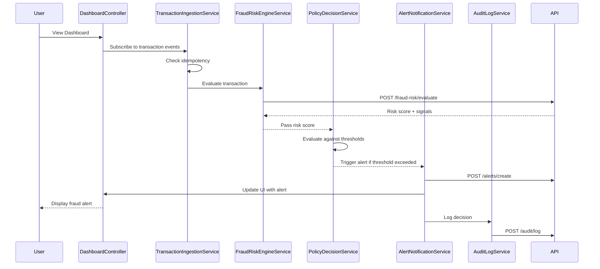

# Low-Level Design: QE-4775 - Real-Time Fraud Detection System

## a. Architecture Mapping

- **Transaction Event Ingestion** → AngularJS Module: `fraudDetection.ingestion` + Service: `TransactionIngestionService`
- **Fraud Risk Engine** → Service: `FraudRiskEngineService` (REST API client)
- **Policy Decision Engine** → Service: `PolicyDecisionService` + Controller: `FraudAlertController`
- **Alert Service** → Service: `AlertNotificationService` + Directive: `fraudAlertPanel`
- **Audit & Analytics** → Service: `AuditLogService` + Factory: `AnalyticsTrackerFactory`
- **UI Dashboard** → Module: `fraudDetection.dashboard` + Controller: `DashboardController` + Views

**Recommended Folder Structure:**
```
/app
  /modules
    /fraud-detection
      /controllers
      /services
      /directives
      /views
      /models
      fraud-detection.module.js
  /shared
    /services
    /interceptors
```

## b. Component Specifications

| Component Name | Artifact Type | Responsibility | Key Dependencies |
|----------------|---------------|----------------|------------------|
| TransactionIngestionService | Service | Receives transaction events, applies idempotency checks, enriches with context | $http, IdempotencyService, FraudRiskEngineService |
| FraudRiskEngineService | Service | Calls external fraud risk scoring API, returns risk score and signals | $http, $q, API_CONFIG |
| PolicyDecisionService | Service | Evaluates risk score against thresholds, determines risk level and action | ConfigService, RiskThresholdFactory |
| FraudAlertController | Controller | Manages fraud alert UI state, triggers alert actions | PolicyDecisionService, AlertNotificationService, $scope |
| AlertNotificationService | Service | Creates and dispatches alerts based on risk level | $http, WebSocketService, AuditLogService |
| AuditLogService | Service | Logs all risk decisions and scores for compliance | $http, AnalyticsTrackerFactory |
| AnalyticsTrackerFactory | Factory | Tracks model performance metrics and drift | $http, MetricsConfig |
| fraudAlertPanel | Directive | Displays real-time fraud alerts with risk indicators | AlertNotificationService, $timeout |
| DashboardController | Controller | Renders transaction monitoring dashboard with filters | TransactionIngestionService, AuditLogService, $scope |
| IdempotencyService | Service | Prevents duplicate transaction processing using transaction IDs | $cacheFactory, StorageService |

## c. Data Model

**TransactionEvent**
```javascript
{
  transactionId: String,
  cardNumber: String,
  amount: Number,
  currency: String,
  merchantId: String,
  merchantName: String,
  merchantCategory: String,
  location: {
    latitude: Number,
    longitude: Number,
    country: String,
    city: String
  },
  deviceId: String,
  deviceFingerprint: String,
  timestamp: Date,
  authorizationStatus: String
}
```

**FraudRiskScore**
```javascript
{
  transactionId: String,
  overallScore: Number,
  riskLevel: String, // 'low', 'medium', 'high', 'confirmed_fraud'
  signals: {
    amountAnomaly: Number,
    geographicRisk: Number,
    merchantRisk: Number,
    velocityRisk: Number,
    deviceRisk: Number
  },
  evaluatedAt: Date
}
```

**FraudAlert**
```javascript
{
  alertId: String,
  transactionId: String,
  riskLevel: String,
  riskScore: Number,
  actionTaken: String,
  createdAt: Date,
  status: String // 'pending', 'acknowledged', 'resolved'
}
```

## d. Data Flow

User views the fraud monitoring dashboard where DashboardController fetches recent transactions via TransactionIngestionService. When a new transaction event arrives, TransactionIngestionService validates idempotency and enriches the event, then calls FraudRiskEngineService which makes a REST API call to the external fraud risk engine. The returned risk score is passed to PolicyDecisionService which evaluates it against configured thresholds to determine the risk level. Based on the risk level, AlertNotificationService creates an alert and updates the UI via the fraudAlertPanel directive. Simultaneously, AuditLogService logs the decision to the backend audit system, and AnalyticsTrackerFactory tracks metrics for model performance monitoring.

## e. Primary Sequence Diagram



## f. Implementation Notes

- Use AngularJS dependency injection to inject services into controllers; register all modules with `angular.module('fraudDetection', [])`
- Implement ES6 classes for services and use arrow functions for promise chains to maintain `this` context
- Use `$http` interceptor for adding authentication tokens and handling global error responses
- Leverage `$q` promises for asynchronous API calls; chain `.then()` and `.catch()` for flow control
- Use WebSocket or Server-Sent Events via a dedicated service for real-time transaction event streaming to the dashboard

## g. Error Handling

HTTP interceptor-based error handling with user-facing toast notifications for API failures; try/catch blocks in service methods with fallback to fail-safe policy decisions.

## h. Security Notes

Requires token-based authentication via existing SSO; all API calls include authorization headers; sensitive card data masked in UI and logs.