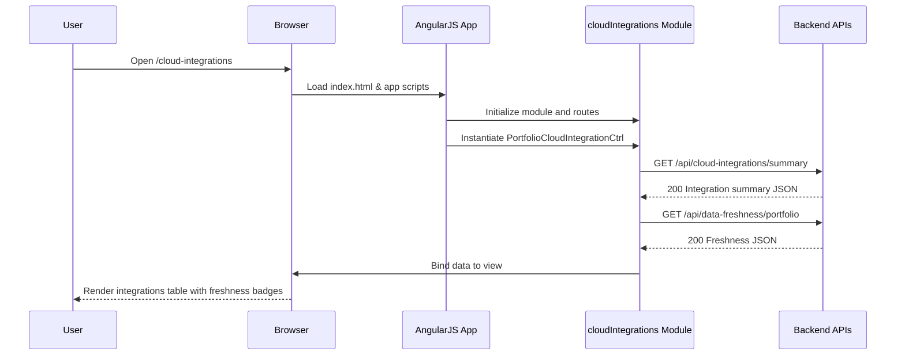
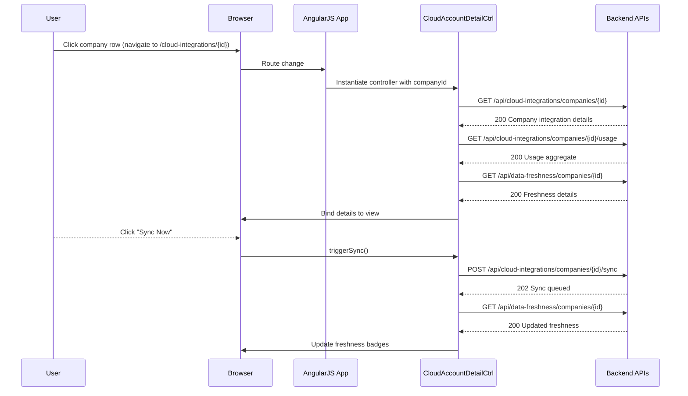
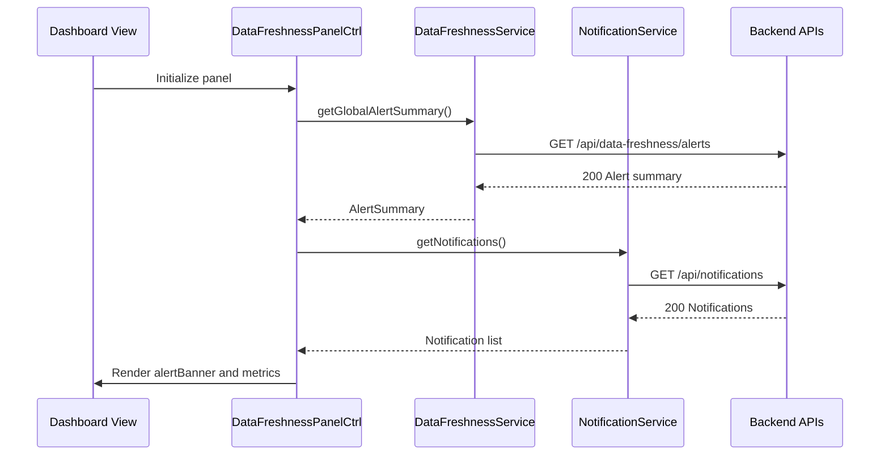
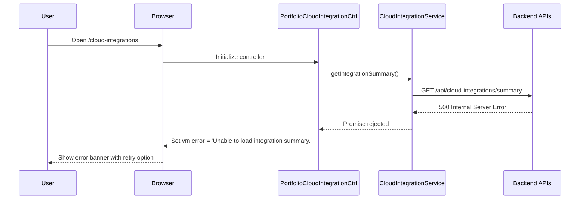

# Low-Level Design (LLD) – Epic QE-4785

## 1. Application Architecture

### 1.1 AngularJS MVC Architecture Mapping

This epic adds automated data integration capabilities into the existing AI Portfolio Management Dashboard front-end and connects it to a set of back-end REST APIs that integrate with AWS, Azure, and GCP.

#### High-level Mapping

- **Views (HTML5 + Bootstrap)**
  - `portfolio-cloud-integrations.html`
  - `portfolio-cloud-account-detail.html`
  - `portfolio-data-freshness-panel.html`
  - Shared partials for tables, cards, and alerts.

- **Controllers (AngularJS 1.x)**
  - `PortfolioCloudIntegrationCtrl` – manages portfolio-level view of cloud integrations.
  - `CloudAccountDetailCtrl` – manages per-company cloud account integrations and data freshness.
  - `DataFreshnessPanelCtrl` – controls the global data freshness panel and alerts.

- **Services / Factories**
  - `CloudIntegrationService` – orchestrates integration-related API calls (AWS/Azure/GCP usage, spend, and connection status).
  - `PortfolioCompanyService` – fetches portfolio company metadata and mappings.
  - `DataFreshnessService` – retrieves, calculates, and caches data freshness metrics.
  - `NotificationService` – surfaces alert/notification data to the UI.
  - `AuthInterceptor` – HTTP interceptor for secure API communication.

- **Directives / Components**
  - `cloudIntegrationSummary` – reusable widget showing per-company integration summary.
  - `dataFreshnessBadge` – reusable visual indicator for data staleness thresholds.
  - `alertBanner` – reusable banner for alerts when data exceeds 24-hour staleness.

- **Filters**
  - `ageColorClass` – derives CSS class from data freshness (e.g., green/yellow/red).
  - `providerLabel` – formats provider codes (AWS/AZURE/GCP) to human-readable labels.

- **Configuration**
  - AngularJS module: `apmDashboard.cloudIntegrations`.
  - Route configuration to add new states:
    - `/cloud-integrations` – portfolio integrations overview.
    - `/cloud-integrations/:companyId` – per-company cloud account integrations.

### 1.2 Project Folder Structure (Front-End)

```text
webapp/
  index.html
  app/
    app.module.js
    app.config.js
    core/
      services/
        portfolio-company.service.js
        cloud-integration.service.js
        data-freshness.service.js
        notification.service.js
        auth-interceptor.factory.js
      filters/
        age-color-class.filter.js
        provider-label.filter.js
      directives/
        data-freshness-badge.directive.js
        cloud-integration-summary.directive.js
        alert-banner.directive.js
    modules/
      cloud-integrations/
        cloud-integrations.module.js
        cloud-integrations.routes.js
        controllers/
          portfolio-cloud-integration.controller.js
          cloud-account-detail.controller.js
          data-freshness-panel.controller.js
        views/
          portfolio-cloud-integrations.html
          cloud-account-detail.html
          data-freshness-panel.html
        styles/
          cloud-integrations.css
```

Back-end and API-related implementation details are assumed to be provided by a separate service implemented in Java/Spring (or equivalent) and exposed via REST APIs. This LLD defines their interfaces and how the AngularJS application consumes them.


## 2. Component Specifications

### 2.1 AngularJS Module – `apmDashboard.cloudIntegrations`

- **Type**: AngularJS Module
- **File**: `app/modules/cloud-integrations/cloud-integrations.module.js`
- **Responsibility**:
  - Encapsulate all components related to cloud integrations, data aggregation status, and freshness monitoring.
  - Register controllers, services (where appropriate), directives, and filters related to this epic.
- **Public API**:
  - Module name: `apmDashboard.cloudIntegrations`.
- **Dependencies**:
  - `ngRoute` or `ui.router` (depending on existing app).
  - `apmDashboard.core`.

```js
(function() {
  'use strict';

  angular
    .module('apmDashboard.cloudIntegrations', [
      'ngRoute',
      'apmDashboard.core'
    ]);
})();
```

### 2.2 Route Configuration – `cloud-integrations.routes.js`

- **Type**: Config Block
- **File**: `app/modules/cloud-integrations/cloud-integrations.routes.js`
- **Responsibility**:
  - Define routes/states for portfolio-level and company-level integration views.
- **Public Functions**:
  - `configureRoutes($routeProvider / $stateProvider)`.
- **Inputs**:
  - `$routeProvider` or `$stateProvider`.
- **Outputs**:
  - Registered routes.
- **Dependencies**:
  - Angular routing module used by the application.

```js
(function() {
  'use strict';

  angular
    .module('apmDashboard.cloudIntegrations')
    .config(configureRoutes);

  configureRoutes.$inject = ['$routeProvider'];

  function configureRoutes($routeProvider) {
    $routeProvider
      .when('/cloud-integrations', {
        templateUrl: 'app/modules/cloud-integrations/views/portfolio-cloud-integrations.html',
        controller: 'PortfolioCloudIntegrationCtrl',
        controllerAs: 'vm'
      })
      .when('/cloud-integrations/:companyId', {
        templateUrl: 'app/modules/cloud-integrations/views/cloud-account-detail.html',
        controller: 'CloudAccountDetailCtrl',
        controllerAs: 'vm'
      });
  }
})();
```

### 2.3 Service – `CloudIntegrationService`

- **Type**: AngularJS Service (Factory)
- **File**: `app/core/services/cloud-integration.service.js`
- **Responsibility**:
  - Communicate with REST APIs responsible for:
    - Fetching cloud integration status for each portfolio company.
    - Retrieving aggregated AI usage and spend data.
    - Triggering manual resynchronization when needed.
    - Fetching provider-specific connection and credential status.
- **Public Methods**:
  - `getIntegrationSummary(params)` – fetch list of companies with integration status, last sync time, data freshness, and provider coverage.
  - `getCompanyIntegrationDetails(companyId)` – fetch detailed integration info for a single company (across AWS/Azure/GCP).
  - `triggerSync(companyId)` – trigger manual data sync.
  - `getAggregatedUsage(companyId, filters)` – retrieve aggregated AI usage/spend data.
- **Inputs**:
  - `companyId` (string/number), filter parameters (date range, provider, etc.).
- **Outputs**:
  - Promises resolving to JSON objects.
- **Dependencies**:
  - `$http`, `$q`, `ENV_CONFIG`.

```js
(function() {
  'use strict';

  angular
    .module('apmDashboard.core')
    .factory('CloudIntegrationService', CloudIntegrationService);

  CloudIntegrationService.$inject = ['$http', '$q', 'ENV_CONFIG'];

  function CloudIntegrationService($http, $q, ENV_CONFIG) {
    var baseUrl = ENV_CONFIG.apiBaseUrl + '/cloud-integrations';

    return {
      getIntegrationSummary: getIntegrationSummary,
      getCompanyIntegrationDetails: getCompanyIntegrationDetails,
      triggerSync: triggerSync,
      getAggregatedUsage: getAggregatedUsage
    };

    function getIntegrationSummary(params) {
      return $http.get(baseUrl + '/summary', { params: params })
        .then(handleSuccess)
        .catch(handleError);
    }

    function getCompanyIntegrationDetails(companyId) {
      return $http.get(baseUrl + '/companies/' + encodeURIComponent(companyId))
        .then(handleSuccess)
        .catch(handleError);
    }

    function triggerSync(companyId) {
      return $http.post(baseUrl + '/companies/' + encodeURIComponent(companyId) + '/sync')
        .then(handleSuccess)
        .catch(handleError);
    }

    function getAggregatedUsage(companyId, filters) {
      var params = angular.extend({}, filters);
      return $http.get(baseUrl + '/companies/' + encodeURIComponent(companyId) + '/usage', { params: params })
        .then(handleSuccess)
        .catch(handleError);
    }

    function handleSuccess(response) {
      return response.data;
    }

    function handleError(error) {
      return $q.reject(error);
    }
  }
})();
```

### 2.4 Service – `DataFreshnessService`

- **Type**: AngularJS Service (Factory)
- **File**: `app/core/services/data-freshness.service.js`
- **Responsibility**:
  - Provide data freshness metrics and thresholds.
  - Cache freshness information for improved performance.
- **Public Methods**:
  - `getPortfolioFreshness()` – fetch freshness metrics for all companies.
  - `getCompanyFreshness(companyId)` – fetch data freshness details for a single company.
  - `getGlobalAlertSummary()` – summary for companies violating the 24-hour SLA.
- **Inputs**:
  - Optional company ID.
- **Outputs**:
  - Promise of freshness data.
- **Dependencies**:
  - `$http`, `$q`, `ENV_CONFIG`.

```js
(function() {
  'use strict';

  angular
    .module('apmDashboard.core')
    .factory('DataFreshnessService', DataFreshnessService);

  DataFreshnessService.$inject = ['$http', '$q', 'ENV_CONFIG'];

  function DataFreshnessService($http, $q, ENV_CONFIG) {
    var baseUrl = ENV_CONFIG.apiBaseUrl + '/data-freshness';
    var cache = {
      portfolio: null,
      companies: {}
    };

    return {
      getPortfolioFreshness: getPortfolioFreshness,
      getCompanyFreshness: getCompanyFreshness,
      getGlobalAlertSummary: getGlobalAlertSummary
    };

    function getPortfolioFreshness(forceRefresh) {
      if (!forceRefresh && cache.portfolio) {
        return $q.when(cache.portfolio);
      }
      return $http.get(baseUrl + '/portfolio')
        .then(function(res) {
          cache.portfolio = res.data;
          return cache.portfolio;
        })
        .catch(handleError);
    }

    function getCompanyFreshness(companyId, forceRefresh) {
      if (!forceRefresh && cache.companies[companyId]) {
        return $q.when(cache.companies[companyId]);
      }
      return $http.get(baseUrl + '/companies/' + encodeURIComponent(companyId))
        .then(function(res) {
          cache.companies[companyId] = res.data;
          return cache.companies[companyId];
        })
        .catch(handleError);
    }

    function getGlobalAlertSummary() {
      return $http.get(baseUrl + '/alerts')
        .then(function(res) { return res.data; })
        .catch(handleError);
    }

    function handleError(err) {
      return $q.reject(err);
    }
  }
})();
```

### 2.5 Service – `NotificationService`

- **Type**: AngularJS Service (Factory)
- **File**: `app/core/services/notification.service.js`
- **Responsibility**:
  - Manage client-visible notifications related to data freshness and integration issues.
  - Provide a consistent way to display toasts, banners, and inline error messages.
- **Public Methods**:
  - `getNotifications()` – retrieve current notifications.
  - `clearNotification(id)` – remove a specific notification.
- **Dependencies**:
  - `$http`, `$q`, `ENV_CONFIG`.

```js
(function() {
  'use strict';

  angular
    .module('apmDashboard.core')
    .factory('NotificationService', NotificationService);

  NotificationService.$inject = ['$http', '$q', 'ENV_CONFIG'];

  function NotificationService($http, $q, ENV_CONFIG) {
    var baseUrl = ENV_CONFIG.apiBaseUrl + '/notifications';

    return {
      getNotifications: getNotifications,
      clearNotification: clearNotification
    };

    function getNotifications() {
      return $http.get(baseUrl)
        .then(function(res) { return res.data; })
        .catch(handleError);
    }

    function clearNotification(id) {
      return $http.delete(baseUrl + '/' + encodeURIComponent(id))
        .then(function(res) { return res.data; })
        .catch(handleError);
    }

    function handleError(err) {
      return $q.reject(err);
    }
  }
})();
```

### 2.6 Controller – `PortfolioCloudIntegrationCtrl`

- **Type**: Controller
- **File**: `app/modules/cloud-integrations/controllers/portfolio-cloud-integration.controller.js`
- **Responsibility**:
  - Manage portfolio-wide view of integrations and data freshness.
  - Load summary data and bind to `portfolio-cloud-integrations.html`.
- **Public Methods (exposed via `vm`)**:
  - `vm.refresh()` – reload integration summary.
  - `vm.filterByProvider(provider)` – filter table by provider.
  - `vm.viewCompany(company)` – navigate to company detail view.
- **Inputs**:
  - Route parameters, filter selections.
- **Outputs**:
  - View model with summary list, freshness statuses, and filters.
- **Dependencies**:
  - `CloudIntegrationService`, `DataFreshnessService`, `$location`, `$log`.

```js
(function() {
  'use strict';

  angular
    .module('apmDashboard.cloudIntegrations')
    .controller('PortfolioCloudIntegrationCtrl', PortfolioCloudIntegrationCtrl);

  PortfolioCloudIntegrationCtrl.$inject = ['CloudIntegrationService', 'DataFreshnessService', '$location', '$log'];

  function PortfolioCloudIntegrationCtrl(CloudIntegrationService, DataFreshnessService, $location, $log) {
    var vm = this;

    vm.integrations = [];
    vm.freshness = [];
    vm.providerFilter = 'ALL';
    vm.isLoading = false;
    vm.error = null;

    vm.refresh = refresh;
    vm.filterByProvider = filterByProvider;
    vm.viewCompany = viewCompany;

    activate();

    function activate() {
      refresh();
    }

    function refresh() {
      vm.isLoading = true;
      vm.error = null;

      CloudIntegrationService.getIntegrationSummary()
        .then(function(summary) {
          vm.integrations = summary;
          return DataFreshnessService.getPortfolioFreshness(true);
        })
        .then(function(freshness) {
          vm.freshness = freshness;
        })
        .catch(function(err) {
          vm.error = 'Unable to load integration summary.';
          $log.error('PortfolioCloudIntegrationCtrl.refresh error', err);
        })
        .finally(function() {
          vm.isLoading = false;
        });
    }

    function filterByProvider(provider) {
      vm.providerFilter = provider || 'ALL';
    }

    function viewCompany(company) {
      $location.path('/cloud-integrations/' + company.id);
    }
  }
})();
```

### 2.7 Controller – `CloudAccountDetailCtrl`

- **Type**: Controller
- **File**: `app/modules/cloud-integrations/controllers/cloud-account-detail.controller.js`
- **Responsibility**:
  - Manage per-company view of cloud account integrations, AI usage, and spend.
  - Handle manual sync actions.
- **Public Methods**:
  - `vm.load()` – load details.
  - `vm.triggerSync()` – trigger manual data synchronization.
- **Dependencies**:
  - `$routeParams`, `CloudIntegrationService`, `DataFreshnessService`, `$log`.

```js
(function() {
  'use strict';

  angular
    .module('apmDashboard.cloudIntegrations')
    .controller('CloudAccountDetailCtrl', CloudAccountDetailCtrl);

  CloudAccountDetailCtrl.$inject = ['$routeParams', 'CloudIntegrationService', 'DataFreshnessService', '$log'];

  function CloudAccountDetailCtrl($routeParams, CloudIntegrationService, DataFreshnessService, $log) {
    var vm = this;

    vm.companyId = $routeParams.companyId;
    vm.details = null;
    vm.usage = null;
    vm.freshness = null;
    vm.isSyncing = false;
    vm.isLoading = false;
    vm.error = null;

    vm.load = load;
    vm.triggerSync = triggerSync;

    activate();

    function activate() {
      load();
    }

    function load() {
      vm.isLoading = true;
      vm.error = null;

      CloudIntegrationService.getCompanyIntegrationDetails(vm.companyId)
        .then(function(details) {
          vm.details = details;
          return CloudIntegrationService.getAggregatedUsage(vm.companyId);
        })
        .then(function(usage) {
          vm.usage = usage;
          return DataFreshnessService.getCompanyFreshness(vm.companyId, true);
        })
        .then(function(freshness) {
          vm.freshness = freshness;
        })
        .catch(function(err) {
          vm.error = 'Unable to load company integration details.';
          $log.error('CloudAccountDetailCtrl.load error', err);
        })
        .finally(function() {
          vm.isLoading = false;
        });
    }

    function triggerSync() {
      vm.isSyncing = true;
      CloudIntegrationService.triggerSync(vm.companyId)
        .then(function() {
          return DataFreshnessService.getCompanyFreshness(vm.companyId, true);
        })
        .then(function(freshness) {
          vm.freshness = freshness;
        })
        .catch(function(err) {
          vm.error = 'Unable to trigger synchronization.';
          $log.error('CloudAccountDetailCtrl.triggerSync error', err);
        })
        .finally(function() {
          vm.isSyncing = false;
        });
    }
  }
})();
```

### 2.8 Controller – `DataFreshnessPanelCtrl`

- **Type**: Controller
- **File**: `app/modules/cloud-integrations/controllers/data-freshness-panel.controller.js`
- **Responsibility**:
  - Control a dashboard panel that highlights freshness across portfolio.
  - Show alerts when any company exceeds 24 hours since last successful sync.
- **Public Methods**:
  - `vm.refresh()` – reload alert summary.
- **Dependencies**:
  - `DataFreshnessService`, `NotificationService`, `$log`.

```js
(function() {
  'use strict';

  angular
    .module('apmDashboard.cloudIntegrations')
    .controller('DataFreshnessPanelCtrl', DataFreshnessPanelCtrl);

  DataFreshnessPanelCtrl.$inject = ['DataFreshnessService', 'NotificationService', '$log'];

  function DataFreshnessPanelCtrl(DataFreshnessService, NotificationService, $log) {
    var vm = this;

    vm.alertSummary = null;
    vm.notifications = [];
    vm.isLoading = false;

    vm.refresh = refresh;

    activate();

    function activate() {
      refresh();
    }

    function refresh() {
      vm.isLoading = true;

      DataFreshnessService.getGlobalAlertSummary()
        .then(function(alertSummary) {
          vm.alertSummary = alertSummary;
          return NotificationService.getNotifications();
        })
        .then(function(notifications) {
          vm.notifications = notifications;
        })
        .catch(function(err) {
          $log.error('DataFreshnessPanelCtrl.refresh error', err);
        })
        .finally(function() {
          vm.isLoading = false;
        });
    }
  }
})();
```

### 2.9 Directive – `dataFreshnessBadge`

- **Type**: Directive (Element/Attribute)
- **File**: `app/core/directives/data-freshness-badge.directive.js`
- **Responsibility**:
  - Display a colored badge reflecting data freshness age for a company or provider.
- **Scope Inputs**:
  - `ageHours` – number of hours since last successful sync.
- **Dependencies**:
  - `ageColorClass` filter.

```js
(function() {
  'use strict';

  angular
    .module('apmDashboard.core')
    .directive('dataFreshnessBadge', dataFreshnessBadge);

  function dataFreshnessBadge() {
    return {
      restrict: 'E',
      scope: {
        ageHours: '='
      },
      template:
        '<span class="label" ng-class="\'label-\' + (ageHours | ageColorClass)">' +
          '{{ ageHours | number:0 }}h' +
        '</span>'
    };
  }
})();
```

### 2.10 Directive – `cloudIntegrationSummary`

- **Type**: Directive (Element)
- **File**: `app/core/directives/cloud-integration-summary.directive.js`
- **Responsibility**:
  - Reusable widget showing integration status per company.
- **Scope Inputs**:
  - `company` – company data (name, id, status, providers, lastSyncAt, etc.).

```js
(function() {
  'use strict';

  angular
    .module('apmDashboard.core')
    .directive('cloudIntegrationSummary', cloudIntegrationSummary);

  function cloudIntegrationSummary() {
    return {
      restrict: 'E',
      scope: {
        company: '='
      },
      templateUrl: 'app/modules/cloud-integrations/views/_cloud-integration-summary.html'
    };
  }
})();
```

### 2.11 Directive – `alertBanner`

- **Type**: Directive
- **File**: `app/core/directives/alert-banner.directive.js`
- **Responsibility**:
  - Display alert messages (e.g., SLA breaches) consistently.
- **Scope Inputs**:
  - `alerts` – array of alert objects.

```js
(function() {
  'use strict';

  angular
    .module('apmDashboard.core')
    .directive('alertBanner', alertBanner);

  function alertBanner() {
    return {
      restrict: 'E',
      scope: {
        alerts: '='
      },
      templateUrl: 'app/shared/alert-banner.html'
    };
  }
})();
```

### 2.12 Filter – `ageColorClass`

- **Type**: AngularJS Filter
- **File**: `app/core/filters/age-color-class.filter.js`
- **Responsibility**:
  - Map hours-since-last-sync to a color class.
- **Logic**:
  - `<= 12h` → `success` (green).
  - `> 12h && <= 24h` → `warning` (yellow).
  - `> 24h` → `danger` (red).

```js
(function() {
  'use strict';

  angular
    .module('apmDashboard.core')
    .filter('ageColorClass', ageColorClass);

  function ageColorClass() {
    return function(ageHours) {
      if (ageHours == null) { return 'default'; }
      if (ageHours <= 12) { return 'success'; }
      if (ageHours <= 24) { return 'warning'; }
      return 'danger';
    };
  }
})();
```

### 2.13 Filter – `providerLabel`

- **Type**: AngularJS Filter
- **File**: `app/core/filters/provider-label.filter.js`
- **Responsibility**:
  - Convert provider codes to human-readable labels.

```js
(function() {
  'use strict';

  angular
    .module('apmDashboard.core')
    .filter('providerLabel', providerLabel);

  function providerLabel() {
    return function(providerCode) {
      switch (providerCode) {
        case 'AWS': return 'Amazon Web Services';
        case 'AZURE': return 'Microsoft Azure';
        case 'GCP': return 'Google Cloud Platform';
        default: return providerCode;
      }
    };
  }
})();
```

### 2.14 HTTP Interceptor – `AuthInterceptor`

- **Type**: Factory
- **File**: `app/core/services/auth-interceptor.factory.js`
- **Responsibility**:
  - Attach authentication headers to all API requests.
  - Handle 401/403 errors globally.

```js
(function() {
  'use strict';

  angular
    .module('apmDashboard.core')
    .factory('AuthInterceptor', AuthInterceptor);

  AuthInterceptor.$inject = ['$q', '$injector'];

  function AuthInterceptor($q, $injector) {
    return {
      request: function(config) {
        var AuthService = $injector.get('AuthService');
        var token = AuthService.getToken();
        if (token) {
          config.headers.Authorization = 'Bearer ' + token;
        }
        return config;
      },
      responseError: function(rejection) {
        if (rejection.status === 401 || rejection.status === 403) {
          var AuthService = $injector.get('AuthService');
          AuthService.handleUnauthorized();
        }
        return $q.reject(rejection);
      }
    };
  }
})();
```


## 3. Component Responsibilities

- **CloudIntegrationService** owns all client-side integration with back-end integration APIs, including usage/spend aggregation calls.
- **DataFreshnessService** owns the retrieval and caching of freshness metrics; it does not apply display formatting.
- **NotificationService** owns retrieval and dismissal of system-generated notifications/alerts.
- **PortfolioCloudIntegrationCtrl** owns portfolio summary state and orchestrates loading of integration summaries and freshness data.
- **CloudAccountDetailCtrl** owns the detailed per-company integration state and handles user actions such as manual data sync.
- **DataFreshnessPanelCtrl** owns the dashboard panel summarizing data freshness SLA adherence.
- **dataFreshnessBadge** directive owns visual indication of individual freshness values.
- **cloudIntegrationSummary** directive owns reusable markup for showing integration status per company.
- **alertBanner** directive owns display of alert messages in a consistent style.
- **Filters** own transformation of raw values into presentation formats.

Business logic such as staleness threshold comparison (24 hours) is implemented on the back-end (for canonical truth) and optionally duplicated in front-end filters for display rules.


## 4. Interface Specifications

### 4.1 REST API Interfaces – Cloud Integrations

All APIs are assumed to use JSON payloads, are served over HTTPS, and require an Authorization bearer token.

#### 4.1.1 Get Integration Summary

- **Endpoint**: `GET /api/cloud-integrations/summary`
- **Query Parameters** (optional):
  - `provider` – `AWS|AZURE|GCP` or omitted for all.
  - `page` – integer, default 1.
  - `pageSize` – integer, default 25.
- **Response (200)**:

```json
[
  {
    "companyId": "string",
    "companyName": "string",
    "providers": ["AWS", "AZURE", "GCP"],
    "status": "CONNECTED|PARTIAL|DISCONNECTED",
    "lastSyncAt": "2024-01-31T10:15:00Z",
    "lastSyncStatus": "SUCCESS|FAILED",
    "dataFreshnessHours": 12.5
  }
]
```

- **Error Responses**:
  - `401 Unauthorized` – missing/invalid token.
  - `500 Internal Server Error` – generic backend failure.

#### 4.1.2 Get Company Integration Details

- **Endpoint**: `GET /api/cloud-integrations/companies/{companyId}`
- **Path Parameters**:
  - `companyId` – portfolio company identifier.
- **Response (200)**:

```json
{
  "companyId": "string",
  "companyName": "string",
  "integrations": [
    {
      "provider": "AWS",
      "accountId": "123456789012",
      "status": "CONNECTED|DISCONNECTED",
      "lastSyncAt": "2024-01-31T10:15:00Z",
      "lastSyncStatus": "SUCCESS|FAILED",
      "scopes": ["AI_USAGE", "BILLING"]
    }
  ]
}
```

- **Errors**:
  - `404 Not Found` – unknown company.

#### 4.1.3 Trigger Manual Sync

- **Endpoint**: `POST /api/cloud-integrations/companies/{companyId}/sync`
- **Request Body**: none.
- **Response (202 Accepted)**:

```json
{
  "companyId": "string",
  "syncRequestId": "uuid",
  "status": "QUEUED"
}
```

- **Errors**:
  - `409 Conflict` – a sync is already in progress.

#### 4.1.4 Get Aggregated Usage/Spend

- **Endpoint**: `GET /api/cloud-integrations/companies/{companyId}/usage`
- **Query Parameters**:
  - `from` – ISO date.
  - `to` – ISO date.
  - `providers` – comma-separated list of providers.
- **Response (200)**:

```json
{
  "companyId": "string",
  "currency": "USD",
  "totalSpend": 12345.67,
  "byProvider": [
    {
      "provider": "AWS",
      "spend": 6789.01,
      "usageMetrics": {
        "modelsDeployed": 5,
        "requestsPerDay": 200000
      }
    }
  ]
}
```

### 4.2 REST API Interfaces – Data Freshness

#### 4.2.1 Portfolio Freshness

- **Endpoint**: `GET /api/data-freshness/portfolio`
- **Response (200)**:

```json
[
  {
    "companyId": "string",
    "lastSyncAt": "2024-01-31T10:15:00Z",
    "hoursSinceLastSync": 9.5,
    "slaBreached": false
  }
]
```

#### 4.2.2 Company Freshness

- **Endpoint**: `GET /api/data-freshness/companies/{companyId}`
- **Response (200)**:

```json
{
  "companyId": "string",
  "providers": [
    {
      "provider": "AWS",
      "lastSyncAt": "2024-01-31T10:15:00Z",
      "hoursSinceLastSync": 12.3,
      "slaBreached": false
    }
  ],
  "overallSlaBreached": false
}
```

#### 4.2.3 Global Alert Summary

- **Endpoint**: `GET /api/data-freshness/alerts`
- **Response (200)**:

```json
{
  "totalCompanies": 50,
  "companiesBreachingSla": 3,
  "alerts": [
    {
      "companyId": "string",
      "companyName": "string",
      "hoursSinceLastSync": 26.1
    }
  ]
}
```


## 5. Data Model Design

### 5.1 Front-End Models (JavaScript Objects)

#### 5.1.1 `IntegrationSummaryItem`

- **Attributes**:
  - `companyId` – `String`, required.
  - `companyName` – `String`, required.
  - `providers` – `Array<String>`; allowed values: `AWS`, `AZURE`, `GCP`.
  - `status` – `String`; `CONNECTED|PARTIAL|DISCONNECTED`; default `DISCONNECTED`.
  - `lastSyncAt` – `Date` (stored as ISO string from API, converted to `Date` in UI where needed).
  - `lastSyncStatus` – `String`; `SUCCESS|FAILED`.
  - `dataFreshnessHours` – `Number`; default `null`.

- **Validation Rules**:
  - `companyId` and `companyName` must be non-empty.
  - `dataFreshnessHours` >= 0 if not null.

#### 5.1.2 `CompanyIntegrationDetails`

- **Attributes**:
  - `companyId` – `String`.
  - `companyName` – `String`.
  - `integrations` – `Array<ProviderIntegration>`.

#### 5.1.3 `ProviderIntegration`

- **Attributes**:
  - `provider` – `String`; `AWS|AZURE|GCP`.
  - `accountId` – `String`.
  - `status` – `String`; `CONNECTED|DISCONNECTED`.
  - `lastSyncAt` – `String` (ISO timestamp).
  - `lastSyncStatus` – `String`.
  - `scopes` – `Array<String>`; e.g., `['AI_USAGE','BILLING']`.

#### 5.1.4 `FreshnessRecord`

- **Attributes**:
  - `companyId` – `String`.
  - `lastSyncAt` – `String`.
  - `hoursSinceLastSync` – `Number`.
  - `slaBreached` – `Boolean`.

#### 5.1.5 `AlertSummary`

- **Attributes**:
  - `totalCompanies` – `Number`.
  - `companiesBreachingSla` – `Number`.
  - `alerts` – `Array<AlertItem>`.

#### 5.1.6 `AlertItem`

- **Attributes**:
  - `companyId` – `String`.
  - `companyName` – `String`.
  - `hoursSinceLastSync` – `Number`.

#### 5.1.7 `UsageAggregate`

- **Attributes**:
  - `companyId` – `String`.
  - `currency` – `String`; default `USD`.
  - `totalSpend` – `Number`.
  - `byProvider` – `Array<ProviderUsage>`.

#### 5.1.8 `ProviderUsage`

- **Attributes**:
  - `provider` – `String`.
  - `spend` – `Number`.
  - `usageMetrics` – `Object` with dynamic keys such as `modelsDeployed`, `requestsPerDay`.


## 6. Data Flow

### 6.1 Portfolio Integrations View

1. **User Action**: User navigates to `/cloud-integrations`.
2. **Routing**: AngularJS loads `portfolio-cloud-integrations.html` and instantiates `PortfolioCloudIntegrationCtrl`.
3. **Controller → Services**:
   - `PortfolioCloudIntegrationCtrl.refresh()` calls:
     - `CloudIntegrationService.getIntegrationSummary()`.
     - On success, calls `DataFreshnessService.getPortfolioFreshness(true)`.
4. **Services → REST APIs**:
   - `CloudIntegrationService` issues `GET /api/cloud-integrations/summary`.
   - `DataFreshnessService` issues `GET /api/data-freshness/portfolio`.
5. **API → Services**:
   - Successful responses return JSON payloads.
   - Services map these to in-memory model structures.
6. **Controller → View**:
   - `vm.integrations` and `vm.freshness` bound to repeaters in the view.
7. **View → Directives**:
   - Each row uses `cloud-integration-summary` and `dataFreshnessBadge` to display status and freshness with color-coded badges.

### 6.2 Company Details View

1. **User Action**: User clicks a company row.
2. **Routing**: Navigation to `/cloud-integrations/:companyId`.
3. **Controller**: `CloudAccountDetailCtrl` loads:
   - Calls `CloudIntegrationService.getCompanyIntegrationDetails(companyId)`.
   - Calls `CloudIntegrationService.getAggregatedUsage(companyId)`.
   - Calls `DataFreshnessService.getCompanyFreshness(companyId, true)`.
4. **Responses**: Data is bound to details and charts.
5. **Manual Sync**:
   - User clicks "Sync Now".
   - `CloudAccountDetailCtrl.triggerSync()` calls `CloudIntegrationService.triggerSync(companyId)`.
   - On success, re-fetches freshness data.

### 6.3 Data Freshness Panel

1. **Initialization**: `DataFreshnessPanelCtrl` loads on dashboard.
2. **Service Calls**:
   - `DataFreshnessService.getGlobalAlertSummary()`.
   - `NotificationService.getNotifications()`.
3. **View**: Displays `alertBanner` and metrics such as number of companies breaching SLA.


## 7. Sequence Diagrams (Mermaid)

### 7.1 Application Initialization for Cloud Integrations Module



### 7.2 Primary Workflow – View Company Integration Details and Trigger Sync



### 7.3 Service/API Interactions – Data Freshness Panel



### 7.4 Error Handling Scenario – API Failure




## 8. Implementation Details

### 8.1 AngularJS Implementation Approach

- Use **controllerAs (vm)** syntax and avoid `$scope` where possible.
- Organize modules by feature (cloud-integrations) and core shared utilities (core services, directives).
- Use `$http` with centralized `AuthInterceptor` and error handling.

### 8.2 JavaScript ES6 Coding Patterns

- Use ES6 features (where compatible or transpiled):
  - `const`/`let` in build pipeline; compiled if necessary.
  - Arrow functions inside services/controllers where not breaking `this` context.
- Follow consistent linting rules (e.g., ESLint with Airbnb or company-standard config).

### 8.3 Dependency Injection

- Use `$inject` arrays to ensure minification safety.
- Do not rely on parameter name inference.

### 8.4 Business Logic Flow

- The back-end calculates SLA breaches and hours-since-last-sync; the front-end uses these values to apply formatting and display.
- The front-end may calculate simple thresholds (e.g., CSS class mapping) but does not own canonical SLA logic.

### 8.5 Validation Logic

- Validate route parameters (ensure `companyId` is defined) and show user-friendly errors if missing.
- For user-triggered sync, disable the button while a sync is in progress to prevent duplicate requests.

### 8.6 State Management Approach

- Use controller-local state for view-specific data.
- Share state only where needed via services (e.g., caches in `DataFreshnessService`).

### 8.7 DOM Interaction

- Avoid direct DOM manipulation in controllers; use directives and data binding.
- Use Bootstrap tables, cards, and labels for visual layout; override styles via `cloud-integrations.css`.

### 8.8 API Integration

- All API calls use `ENV_CONFIG.apiBaseUrl` for environment-specific base URL.
- `AuthInterceptor` ensures consistent inclusion of auth headers.
- Handle network errors by displaying generic messages with retry options.


## 9. Configuration

### 9.1 AngularJS Configuration Files

- **File**: `app/app.config.js`
  - Register `AuthInterceptor` with `$httpProvider.interceptors`.
- **File**: `app/env.config.js`
  - Define `ENV_CONFIG` constant.

```js
(function() {
  'use strict';

  angular
    .module('apmDashboard.core')
    .config(configureHttp);

  configureHttp.$inject = ['$httpProvider'];

  function configureHttp($httpProvider) {
    $httpProvider.interceptors.push('AuthInterceptor');
  }
})();
```

```js
(function() {
  'use strict';

  angular
    .module('apmDashboard.core')
    .constant('ENV_CONFIG', {
      apiBaseUrl: 'https://api.example.com',
      logLevel: 'INFO',
      featureFlags: {
        enableCloudIntegrations: true
      }
    });
})();
```

### 9.2 Environment-Specific Properties

- Use separate `env.config.js` files per environment (dev, test, prod) with different `apiBaseUrl` values and log levels.

### 9.3 Feature Flags

- `enableCloudIntegrations` used to hide the module behind a toggle if needed.

### 9.4 Logging and Telemetry

- Use `$log` for client-side logging.
- Optionally integrate with a telemetry service by wrapping `$log` or adding a `TelemetryService` to capture usage and errors.


## 10. Error Handling and Resiliency

### 10.1 Client-Side Exception Handling

- Controllers catch promise rejections and:
  - Set user-friendly error messages (`vm.error`).
  - Log details via `$log.error`.
- Global handler (`$exceptionHandler`) can be extended to report exceptions to logging backend.

### 10.2 REST API Error Handling

- For 4xx/5xx errors, services reject promises with standard error objects.
- Controllers determine whether to show generic or specific messages.

### 10.3 Retry Mechanisms

- Non-critical read operations (summary, freshness) may be retried from the UI by user clicking "Retry" button; automatic retries should be limited to avoid overload.

### 10.4 Logging Strategy

- All failures in service calls logged with context (endpoint, companyId, etc.).
- Use correlation IDs from response headers if available.

### 10.5 Recovery and Fallback Behavior

- In case of partial failures (e.g., freshness loads but summary fails), display what data is available and show warnings where data is missing.


## 11. Security Considerations

### 11.1 Input Validation and Sanitization

- Validate `companyId` and filter parameters on both client and server.
- Use AngularJS built-in escaping in templates; avoid `ng-bind-html` unless sanitized.

### 11.2 XSS Prevention

- Do not inject raw HTML from backend into views.
- Encode all user and company names via standard AngularJS bindings.

### 11.3 CSRF Protection

- Ensure CSRF tokens (if used) are included by `$http` in POST requests (framework-specific; may reuse existing pattern in app).

### 11.4 Secure API Communication

- All REST calls use HTTPS (TLS 1.2+).
- `ENV_CONFIG.apiBaseUrl` must be `https://`.

### 11.5 Authentication and Authorization

- `AuthInterceptor` attaches JWT or session token; unauthorized responses trigger redirect to login via `AuthService.handleUnauthorized()`.
- Back-end enforces per-user and per-portfolio access control.

### 11.6 Sensitive Data Handling

- Do not display raw cloud account IDs where unnecessary; mask or truncate if required.
- Never surface secrets (API keys, tokens) to front-end; only statuses.

### 11.7 Audit Logging

- Back-end logs sync trigger requests and key operations.
- Front-end can optionally send telemetry events when user triggers manual sync or views integration details.
