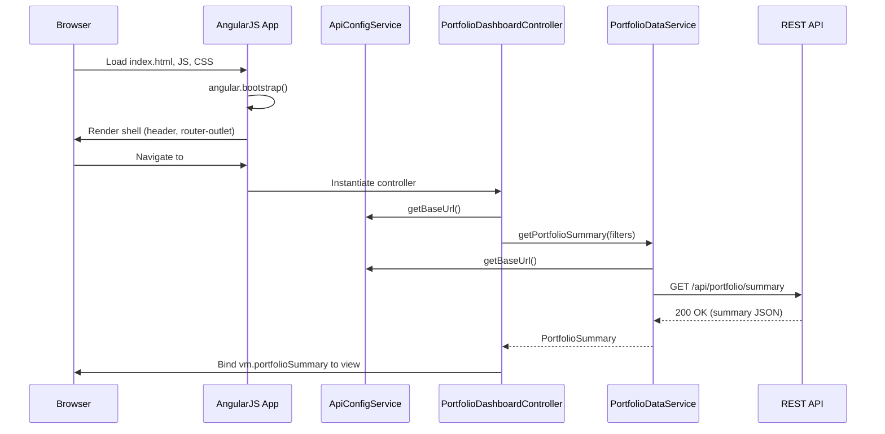
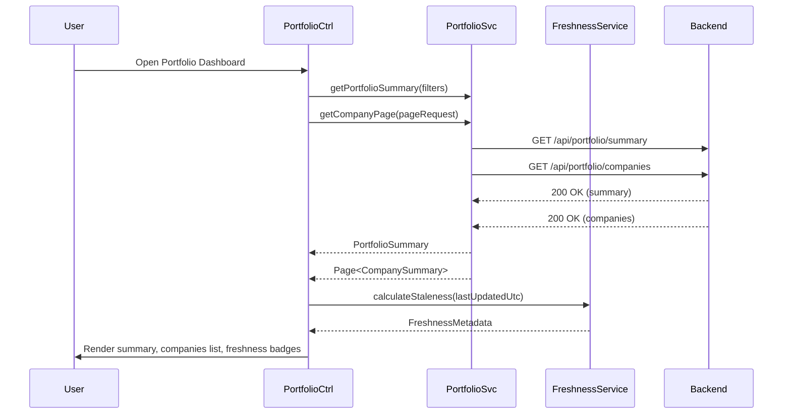
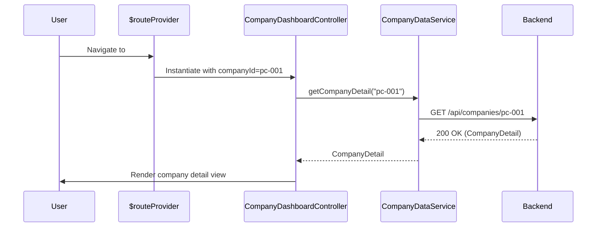
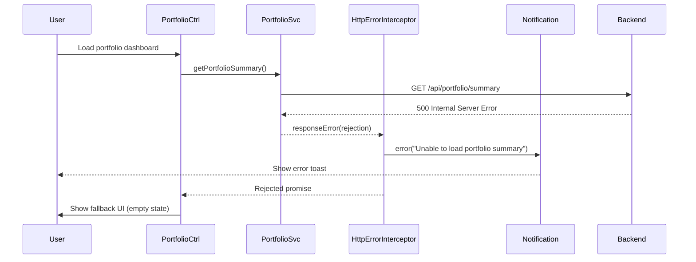

# Low-Level Design (LLD) – QE-4785

AI Portfolio Management Dashboard – Cloud Data Integration

---

## 1. Application Architecture

### 1.1 Overall AngularJS MVC Mapping

This LLD covers the front-end and client-side integration logic for connecting the AI Portfolio Management Dashboard to backend REST APIs that expose aggregated AI usage and spend data from AWS, Azure, and GCP. The backend integration to cloud providers is abstracted behind REST endpoints; the UI is responsible for visualization, data freshness display, and alert configuration/exposure.

**AngularJS application namespace:** `apmDashboard`

**Key concerns:**
- Display portfolio-level and company-level AI usage & spend metrics.
- Show data freshness indicators at portfolio and company levels.
- Enable manual refresh triggers (where allowed) and show status.
- Expose notifications/alerts when data is stale (>24 hours).
- Provide performant views for up to 50–200 portfolio companies.

#### 1.1.1 AngularJS Modules

- `apmDashboard` (root module)
  - Depends on: `ngRoute`, `ngAnimate`, `ui.bootstrap`, `ngSanitize`, `apmDashboard.core`, `apmDashboard.portfolio`, `apmDashboard.company`, `apmDashboard.alerts`.

- `apmDashboard.core`
  - Shared services, interceptors, configuration, constants, filters.

- `apmDashboard.portfolio`
  - Portfolio-level dashboards (aggregations across all companies).

- `apmDashboard.company`
  - Company-level detail dashboards, including provider breakdown.

- `apmDashboard.alerts`
  - Data freshness indicators, alert lists, and alert configuration views.

#### 1.1.2 AngularJS Artifacts

- **Controllers**
  - `PortfolioDashboardController`
  - `CompanyDashboardController`
  - `AlertsController`
  - `HeaderController` (global nav and global freshness banner)

- **Services / Factories**
  - `ApiConfigService` – centralizes API base URLs and environment config.
  - `PortfolioDataService` – gets aggregated portfolio metrics.
  - `CompanyDataService` – gets per-company metrics and provider details.
  - `FreshnessService` – computes and stores data freshness metadata.
  - `AlertsService` – retrieves alert data, acknowledges/read statuses.
  - `NotificationService` – wraps toast/banner notifications.
  - `HttpErrorInterceptor` – HTTP interceptor for error handling.
  - `LoggingService` – client-side telemetry and logging.

- **Directives / Components** (Angular 1.x custom directives)
  - `apmPortfolioSummary` – reusable portfolio summary card.
  - `apmCompanyList` – paginated list of portfolio companies.
  - `apmCompanyDetail` – company details and provider breakdown.
  - `apmFreshnessBadge` – visual indicator for data freshness.
  - `apmStalenessBanner` – global banner when data is stale.
  - `apmLoadingSpinner` – standard loading indicator.

- **Filters**
  - `currencyShort` – formats large currency values with suffixes (K, M, B).
  - `durationFromNow` – converts timestamps to "x hours ago".

- **Configuration files**
  - Route configuration: `app.routes.js`.
  - HTTP interceptor registration: `app.http.config.js`.
  - Environment configuration: `app.config.env.js` (per environment overrides).

### 1.2 Recommended Project Folder Structure

```text
/webapp
  /app
    app.module.js
    app.routes.js
    app.http.config.js
    app.config.env.js

    /core
      core.module.js
      services
        api-config.service.js
        portfolio-data.service.js
        company-data.service.js
        freshness.service.js
        alerts.service.js
        notification.service.js
        logging.service.js
      interceptors
        http-error.interceptor.js
      filters
        currency-short.filter.js
        duration-from-now.filter.js

    /layout
      header
        header.controller.js
        header.template.html

    /portfolio
      portfolio.module.js
      portfolio-dashboard.controller.js
      portfolio-dashboard.template.html
      directives
        portfolio-summary.directive.js
        portfolio-summary.template.html
        company-list.directive.js
        company-list.template.html

    /company
      company.module.js
      company-dashboard.controller.js
      company-dashboard.template.html
      directives
        company-detail.directive.js
        company-detail.template.html

    /alerts
      alerts.module.js
      alerts.controller.js
      alerts.template.html
      directives
        freshness-badge.directive.js
        freshness-badge.template.html
        staleness-banner.directive.js
        staleness-banner.template.html

    /shared
      directives
        loading-spinner.directive.js
        loading-spinner.template.html
      styles
        dashboard.css

  /assets
    /css
      bootstrap.min.css
      main.css
    /js
      angular.js
      angular-route.js
      angular-animate.js
      ui-bootstrap.js
    /img

  index.html
```

---

## 2. Component Specifications

### 2.1 Modules

#### 2.1.1 `apmDashboard` (root module)

- **Type:** AngularJS Module
- **File:** `app/app.module.js`
- **Responsibilities:**
  - Bootstrap AngularJS application.
  - Declare dependencies on feature modules and third-party modules.
- **Public API:** N/A (module declaration only).
- **Dependencies:** `ngRoute`, `ngAnimate`, `ui.bootstrap`, `ngSanitize`, `apmDashboard.core`, `apmDashboard.portfolio`, `apmDashboard.company`, `apmDashboard.alerts`.

```javascript
angular.module('apmDashboard', [
  'ngRoute',
  'ngAnimate',
  'ui.bootstrap',
  'ngSanitize',
  'apmDashboard.core',
  'apmDashboard.portfolio',
  'apmDashboard.company',
  'apmDashboard.alerts'
]);
```

#### 2.1.2 `apmDashboard.core`

- **Type:** AngularJS Module
- **File:** `app/core/core.module.js`
- **Responsibilities:**
  - Group core services, filters, interceptors, and shared utilities.
- **Public API:** Module registration.
- **Dependencies:** `ng`.

### 2.2 Controllers

#### 2.2.1 `PortfolioDashboardController`

- **Type:** Controller
- **File:** `app/portfolio/portfolio-dashboard.controller.js`
- **View:** `app/portfolio/portfolio-dashboard.template.html`
- **Responsibilities:**
  - Load portfolio-level AI usage and spend metrics.
  - Display aggregate metrics summarizing usage across all companies.
  - Coordinate pagination/filtering of portfolio company list.
  - Display portfolio-level freshness summary and highlight stale data.
  - Trigger manual refresh requests (where supported) for portfolio data.
- **Public Methods:**
  - `init()` – initialize controller state, load initial data.
  - `loadPortfolioSummary()` – fetch portfolio-level metrics.
  - `loadCompanyList()` – load paginated company list.
  - `applyFilters(filterModel)` – update filters and reload data.
  - `refreshData()` – trigger data refresh via backend API.
  - `isPortfolioStale()` – returns boolean if portfolio-level data stale.
- **Inputs:**
  - Route parameters: optional query params for view mode (e.g., `viewMode`).
  - Filter model: date ranges, provider filters, company segments.
- **Outputs:**
  - View model (`vm`) containing:
    - `vm.portfolioSummary`
    - `vm.companyPage`
    - `vm.filters`
    - `vm.freshness` (portfolio-level freshness metrics)
    - `vm.loadingState` flags
- **Dependencies (DI):**
  - `PortfolioDataService`
  - `FreshnessService`
  - `NotificationService`
  - `$log`
  - `$q`

#### 2.2.2 `CompanyDashboardController`

- **Type:** Controller
- **File:** `app/company/company-dashboard.controller.js`
- **View:** `app/company/company-dashboard.template.html`
- **Responsibilities:**
  - Load detailed metrics for a single portfolio company.
  - Display provider-level breakdown (AWS, Azure, GCP) for AI usage/spend.
  - Present company-specific freshness statuses and staleness indicators.
  - Coordinate view tabs (overview, provider details, timeline trends).
  - Allow user-triggered refresh for a specific company.
- **Public Methods:**
  - `init()` – load company data using route param `companyId`.
  - `loadCompanyDetail(companyId)` – fetch metrics and provider breakdown.
  - `refreshCompany(companyId)` – call backend to refresh this company’s data.
  - `getProviderIcon(provider)` – helper for UI icons.
  - `isCompanyStale()` – check staleness.
- **Inputs:**
  - Route parameter `companyId`.
- **Outputs:**
  - `vm.company` – company-level metrics model.
  - `vm.providers` – list of provider-specific metrics.
  - `vm.freshness` – freshness metadata.
  - `vm.loadingState`.
- **Dependencies:**
  - `CompanyDataService`
  - `FreshnessService`
  - `NotificationService`
  - `$routeParams`
  - `$log`

#### 2.2.3 `AlertsController`

- **Type:** Controller
- **File:** `app/alerts/alerts.controller.js`
- **View:** `app/alerts/alerts.template.html`
- **Responsibilities:**
  - Display list of data freshness alerts.
  - Provide filters (e.g., all alerts, only active, only resolved).
  - Allow marking alerts as acknowledged/read.
- **Public Methods:**
  - `init()` – load alerts list.
  - `loadAlerts()` – fetch alerts.
  - `acknowledgeAlert(alertId)` – mark as acknowledged.
  - `applyFilter(filter)` – filter view.
- **Inputs:** Filter selection, user interactions.
- **Outputs:** Alerts list & filter state.
- **Dependencies:** `AlertsService`, `NotificationService`, `$log`.

#### 2.2.4 `HeaderController`

- **Type:** Controller
- **File:** `app/layout/header/header.controller.js`
- **View:** `app/layout/header/header.template.html`
- **Responsibilities:**
  - Control global navigation and show high-level freshness banner.
  - Reflect any global alerts or system status.
- **Public Methods:**
  - `init()` – load global metadata (e.g., last sync time portfolio-wide).
- **Dependencies:** `FreshnessService`, `AlertsService`, `$log`.

### 2.3 Services / Factories

#### 2.3.1 `ApiConfigService`

- **Type:** Service
- **File:** `app/core/services/api-config.service.js`
- **Responsibilities:**
  - Provide configured API base URLs and endpoints per environment.
  - Centralize construction of endpoint URLs.
- **Public Methods:**
  - `getBaseUrl()` – returns current API base URL.
  - `getEndpoint(key)` – returns path for pre-defined endpoints.
  - `getEnv()` – returns current environment metadata.
- **Outputs:** Config object consumed by other services.
- **Dependencies:** `$window` (for env variables injected at runtime).

#### 2.3.2 `PortfolioDataService`

- **Type:** Service
- **File:** `app/core/services/portfolio-data.service.js`
- **Responsibilities:**
  - Communicate with backend portfolio endpoints.
  - Abstract REST API calls for portfolio metrics & company list.
- **Public Methods (returning `$q` promises):**
  - `getPortfolioSummary(filterModel)` -> `Promise<PortfolioSummary>`
  - `getCompanyPage(pageRequest)` -> `Promise<Page<CompanySummary>>`
  - `refreshPortfolio(filterModel)` -> `Promise<RefreshStatus>`
- **Inputs:** Filter and paging models.
- **Outputs:** Strongly structured JSON mapped to JS models (see section 4).
- **Dependencies:** `$http`, `ApiConfigService`, `LoggingService`.

#### 2.3.3 `CompanyDataService`

- **Type:** Service
- **File:** `app/core/services/company-data.service.js`
- **Responsibilities:**
  - Communicate with backend endpoints for a specific company.
- **Public Methods:**
  - `getCompanyDetail(companyId)` -> `Promise<CompanyDetail>`
  - `refreshCompany(companyId)` -> `Promise<RefreshStatus>`
- **Dependencies:** `$http`, `ApiConfigService`, `LoggingService`.

#### 2.3.4 `FreshnessService`

- **Type:** Service
- **File:** `app/core/services/freshness.service.js`
- **Responsibilities:**
  - Compute staleness based on timestamps (e.g., >24 hours).
  - Provide helper methods for UI to classify freshness levels.
  - Maintain in-memory cache of last-refresh metadata.
- **Public Methods:**
  - `calculateStaleness(lastUpdatedUtc)` -> `{ hoursDiff, isStale, level }`
  - `getFreshnessClass(level)` -> CSS class string.
  - `updateCache(scopeKey, lastUpdatedUtc)` -> `void`.
  - `getCached(scopeKey)` -> `FreshnessMetadata | null`.
- **Dependencies:** `$window`, `$log`.

#### 2.3.5 `AlertsService`

- **Type:** Service
- **File:** `app/core/services/alerts.service.js`
- **Responsibilities:**
  - Communicate with backend alerts endpoints.
  - Provide typed access to data freshness alerts.
- **Public Methods:**
  - `getAlerts(filter)` -> `Promise<Array<Alert>>`
  - `acknowledgeAlert(alertId)` -> `Promise<Alert>`
- **Dependencies:** `$http`, `ApiConfigService`, `LoggingService`.

#### 2.3.6 `NotificationService`

- **Type:** Service
- **File:** `app/core/services/notification.service.js`
- **Responsibilities:**
  - Provide uniform way to show toast messages and banners.
- **Public Methods:**
  - `success(message, options)`
  - `error(message, options)`
  - `info(message, options)`
  - `warning(message, options)`
- **Dependencies:** `$window`, `$log`.

#### 2.3.7 `HttpErrorInterceptor`

- **Type:** Factory (interceptor)
- **File:** `app/core/interceptors/http-error.interceptor.js`
- **Responsibilities:**
  - Intercept HTTP responses and handle common errors.
  - Map API error codes to user-friendly messages.
  - Log errors via `LoggingService`.
- **Public Methods:**
  - `responseError(rejection)` – AngularJS interceptor hook.
- **Dependencies:** `$q`, `NotificationService`, `LoggingService`.

#### 2.3.8 `LoggingService`

- **Type:** Service
- **File:** `app/core/services/logging.service.js`
- **Responsibilities:**
  - Wrap `$log` and optionally send logs to remote telemetry.
  - Include correlation IDs (if provided via headers).
- **Public Methods:**
  - `debug(message, context)`
  - `info(message, context)`
  - `warn(message, context)`
  - `error(message, context)`
- **Dependencies:** `$log`, `$http`, `ApiConfigService` (for telemetry endpoint).

### 2.4 Directives / Components

#### 2.4.1 `apmPortfolioSummary`

- **Type:** Directive (element)
- **File:** `app/portfolio/directives/portfolio-summary.directive.js`
- **Template:** `app/portfolio/directives/portfolio-summary.template.html`
- **Responsibilities:**
  - Render aggregate portfolio metrics (total spend, total usage, etc.).
  - Show global last updated time and staleness.
- **Scope Bindings:**
  - `summary` – `=` two-way binding of `PortfolioSummary`.
  - `freshness` – `=` freshness metadata.
- **Dependencies:** `FreshnessService` (in directive controller).

#### 2.4.2 `apmCompanyList`

- **Type:** Directive (element)
- **File:** `app/portfolio/directives/company-list.directive.js`
- **Template:** `app/portfolio/directives/company-list.template.html`
- **Responsibilities:**
  - Render a paginated list of portfolio companies.
  - For each, show AI spend, last updated, and staleness badge.
- **Scope Bindings:**
  - `companies` – `=` list of `CompanySummary`.
  - `page` – `=` page metadata.
  - `onPageChange(pageNumber)` – `&` callback.
- **Dependencies:** `FreshnessService` (for per-row freshness badges).

#### 2.4.3 `apmCompanyDetail`

- **Type:** Directive (element)
- **File:** `app/company/directives/company-detail.directive.js`
- **Template:** `app/company/directives/company-detail.template.html`
- **Responsibilities:**
  - Render detailed view of a single company with provider breakdown.
  - Show provider cards for AWS, Azure, GCP.
- **Scope Bindings:**
  - `company` – `=` `CompanyDetail`.
  - `providers` – `=` provider metrics.
  - `freshness` – `=` freshness metadata.

#### 2.4.4 `apmFreshnessBadge`

- **Type:** Directive (attribute/element)
- **File:** `app/alerts/directives/freshness-badge.directive.js`
- **Template:** `app/alerts/directives/freshness-badge.template.html`
- **Responsibilities:**
  - Show color-coded freshness (e.g., green < 12h, amber 12–24h, red >24h).
- **Scope Bindings:**
  - `lastUpdatedUtc` – `@` string timestamp.
- **Dependencies:** `FreshnessService`.

#### 2.4.5 `apmStalenessBanner`

- **Type:** Directive (element)
- **File:** `app/alerts/directives/staleness-banner.directive.js`
- **Template:** `app/alerts/directives/staleness-banner.template.html`
- **Responsibilities:**
  - Display high-visibility banner when global data staleness exceeds threshold.
- **Scope Bindings:**
  - `freshness` – `=` portfolio freshness.

#### 2.4.6 `apmLoadingSpinner`

- **Type:** Directive (element)
- **File:** `app/shared/directives/loading-spinner.directive.js`
- **Template:** `app/shared/directives/loading-spinner.template.html`
- **Responsibilities:**
  - Standard loading spinner for all views.
- **Scope Bindings:**
  - `isLoading` – `=` boolean.

### 2.5 Filters

#### 2.5.1 `currencyShort`

- **Type:** Filter
- **File:** `app/core/filters/currency-short.filter.js`
- **Responsibility:** Shorten large numeric currency values (e.g., 1,234,000 -> 1.23M).

#### 2.5.2 `durationFromNow`

- **Type:** Filter
- **File:** `app/core/filters/duration-from-now.filter.js`
- **Responsibility:** Transform UTC timestamp into human-readable duration from now.

---

## 3. Component Responsibilities

### 3.1 Business Logic Ownership

- **Controllers**
  - Own view orchestration, user interaction handling, and coordination between services and directives.
  - Controllers never embed HTTP logic directly; they call services.

- **Services**
  - Own business rules related to fetching and transforming data before it reaches the UI.
  - `FreshnessService` encapsulates the rules for determining staleness (>24h) per requirement.

- **Directives**
  - Own UI composition and DOM-level responsibilities (e.g., layouts, applying Bootstrap classes, conditional markup for freshness badges).

- **Models**
  - Represent domain entities such as PortfolioSummary, CompanySummary, CompanyDetail, ProviderMetrics, Alert, etc., as plain JS objects.

- **Validation**
  - Form-level validations for filters (date ranges, etc.) implemented via AngularJS form validation in templates and minimal controller logic.

### 3.2 State Management

- Controllers maintain local view state (selected filters, loading flags) via `vm` pattern.
- No global mutable singletons except for services; services are stateless or maintain only cache where required (FreshnessService caches last known timestamps).
- UI state resets on route change; no implicit coupling between portfolio and company views beyond route navigation.

---

## 4. Interface Specifications

### 4.1 REST API Interfaces

The UI will integrate with backend REST APIs that abstract cloud provider data aggregation. Endpoints follow REST principles and use JSON payloads. All requests must include authentication headers (e.g., bearer token) configured via HTTP interceptors.

#### 4.1.1 Get Portfolio Summary

- **Endpoint:** `/api/portfolio/summary`
- **Method:** `GET`
- **Query Parameters:**
  - `fromDate` (optional, ISO-8601)
  - `toDate` (optional, ISO-8601)
  - `providers` (optional, CSV: `aws,azure,gcp`)
- **Request Headers:**
  - `Authorization: Bearer <token>`
  - `X-Correlation-Id: <uuid>`
- **Response 200 (application/json):**

```json
{
  "totalSpendUsd": 1578900.25,
  "totalUsageHours": 48302,
  "companiesCount": 120,
  "lastUpdatedUtc": "2024-05-16T10:15:00Z",
  "providerBreakdown": {
    "aws": { "spendUsd": 900000.5, "usageHours": 29000 },
    "azure": { "spendUsd": 450000.0, "usageHours": 15000 },
    "gcp": { "spendUsd": 228900.75, "usageHours": 4302 }
  }
}
```

- **Error Responses:**
  - `401 Unauthorized` – missing/invalid token.
  - `500 Internal Server Error` – generic server error; UI shows toast "Unable to load portfolio summary. Try again later".

#### 4.1.2 Get Portfolio Company Page

- **Endpoint:** `/api/portfolio/companies`
- **Method:** `GET`
- **Query Parameters:**
  - `page` (1-based int)
  - `pageSize`
  - `sortBy` (e.g., `name`, `spend`, `lastUpdated`)
  - `sortDir` (`asc` | `desc`)
  - `filterText` (optional search)
- **Response 200:**

```json
{
  "items": [
    {
      "id": "pc-001",
      "name": "Acme AI Labs",
      "segment": "Enterprise",
      "totalSpendUsd": 120000.5,
      "lastUpdatedUtc": "2024-05-16T09:15:00Z",
      "providers": ["aws", "azure"]
    }
  ],
  "page": 1,
  "pageSize": 25,
  "totalItems": 120,
  "totalPages": 5
}
```

- **Errors:**
  - `400 Bad Request` – invalid paging parameters.

#### 4.1.3 Refresh Portfolio Data

- **Endpoint:** `/api/portfolio/refresh`
- **Method:** `POST`
- **Request Body (optional filters):**

```json
{
  "fromDate": "2024-05-01",
  "toDate": "2024-05-16",
  "providers": ["aws", "azure", "gcp"]
}
```

- **Response 202 (Accepted):**

```json
{
  "status": "IN_PROGRESS",
  "jobId": "refresh-job-20240516-001"
}
```

- **Errors:**
  - `409 Conflict` – refresh already in progress.

#### 4.1.4 Get Company Detail

- **Endpoint:** `/api/companies/{companyId}`
- **Method:** `GET`
- **Response 200:**

```json
{
  "id": "pc-001",
  "name": "Acme AI Labs",
  "segment": "Enterprise",
  "lastUpdatedUtc": "2024-05-16T09:15:00Z",
  "providers": [
    {
      "provider": "aws",
      "spendUsd": 80000.5,
      "usageHours": 20000,
      "lastUpdatedUtc": "2024-05-16T09:00:00Z"
    },
    {
      "provider": "azure",
      "spendUsd": 40000,
      "usageHours": 10000,
      "lastUpdatedUtc": "2024-05-15T20:00:00Z"
    }
  ]
}
```

#### 4.1.5 Refresh Company Data

- **Endpoint:** `/api/companies/{companyId}/refresh`
- **Method:** `POST`
- **Response 202:**

```json
{
  "status": "IN_PROGRESS",
  "jobId": "company-001-refresh-job-20240516-001"
}
```

#### 4.1.6 Get Alerts

- **Endpoint:** `/api/alerts`
- **Method:** `GET`
- **Query Parameters:**
  - `status` (optional: `ACTIVE`, `ACKNOWLEDGED`)
- **Response 200:**

```json
[
  {
    "id": "alert-001",
    "type": "DATA_STALENESS",
    "scope": "COMPANY",
    "companyId": "pc-001",
    "thresholdHours": 24,
    "actualHours": 36,
    "createdUtc": "2024-05-16T11:15:00Z",
    "status": "ACTIVE"
  }
]
```

#### 4.1.7 Acknowledge Alert

- **Endpoint:** `/api/alerts/{alertId}/acknowledge`
- **Method:** `POST`
- **Response 200:**

```json
{
  "id": "alert-001",
  "status": "ACKNOWLEDGED",
  "acknowledgedBy": "user@company.com",
  "acknowledgedUtc": "2024-05-16T12:00:00Z"
}
```

---

## 5. Data Model Design

### 5.1 PortfolioSummary

- **Object Name:** `PortfolioSummary`
- **Type:** JS object

```javascript
{
  totalSpendUsd: Number,       // >= 0
  totalUsageHours: Number,     // >= 0
  companiesCount: Number,      // integer >= 0
  lastUpdatedUtc: String,      // ISO-8601
  providerBreakdown: {
    aws: ProviderAggregate,
    azure: ProviderAggregate,
    gcp: ProviderAggregate
  }
}
```

- **Validation:**
  - `totalSpendUsd >= 0`, `totalUsageHours >= 0`.
  - `lastUpdatedUtc` must be a valid date; invalid => treated as stale.

### 5.2 ProviderAggregate

```javascript
{
  spendUsd: Number,     // >= 0
  usageHours: Number    // >= 0
}
```

### 5.3 CompanySummary

```javascript
{
  id: String,                       // non-empty
  name: String,                     // non-empty
  segment: String,                  // optional classification
  totalSpendUsd: Number,            // >= 0
  lastUpdatedUtc: String,           // ISO-8601
  providers: Array<String>          // subset of ['aws', 'azure', 'gcp']
}
```

### 5.4 CompanyDetail

```javascript
{
  id: String,
  name: String,
  segment: String,
  lastUpdatedUtc: String,
  providers: Array<ProviderMetrics>
}
```

### 5.5 ProviderMetrics

```javascript
{
  provider: String,          // 'aws' | 'azure' | 'gcp'
  spendUsd: Number,
  usageHours: Number,
  lastUpdatedUtc: String
}
```

### 5.6 Alert

```javascript
{
  id: String,
  type: String,          // 'DATA_STALENESS', extendable
  scope: String,         // 'PORTFOLIO' | 'COMPANY'
  companyId: String | null,
  thresholdHours: Number,
  actualHours: Number,
  createdUtc: String,
  status: String         // 'ACTIVE' | 'ACKNOWLEDGED'
}
```

### 5.7 Page<T>

```javascript
{
  items: Array<any>,
  page: Number,
  pageSize: Number,
  totalItems: Number,
  totalPages: Number
}
```

### 5.8 State Transitions

- **Alert.status**
  - `ACTIVE` -> `ACKNOWLEDGED` (user action via AlertsController).

- **RefreshStatus.status**

```javascript
{
  status: String,    // 'IN_PROGRESS' | 'COMPLETED' | 'FAILED'
  jobId: String
}
```

---

## 6. Data Flow

### 6.1 Portfolio Dashboard Load

**Flow:**

1. User navigates to `/#/portfolio`.
2. `$routeProvider` resolves route to `PortfolioDashboardController`.
3. `PortfolioDashboardController.init()` is invoked.
4. Controller sets `vm.loadingState.summary = true`, `vm.loadingState.companyList = true`.
5. Controller calls `PortfolioDataService.getPortfolioSummary(vm.filters)`.
6. Service builds URL with `ApiConfigService.getBaseUrl()` and invokes `$http.get`.
7. HTTP response is returned; interceptor checks for errors.
8. On `200`, `PortfolioDataService` maps JSON to `PortfolioSummary` model and resolves promise.
9. Controller stores response in `vm.portfolioSummary`.
10. Controller calls `FreshnessService.calculateStaleness(portfolioSummary.lastUpdatedUtc)`.
11. Result is assigned to `vm.freshness.portfolio`, `FreshnessService.updateCache('portfolio', lastUpdatedUtc)`.
12. `vm.loadingState.summary` set to `false`.
13. In parallel, `PortfolioDataService.getCompanyPage(vm.pageRequest)` is called.
14. Response mapped into `vm.companyPage`; each company’s `lastUpdatedUtc` used for `apmFreshnessBadge` with `FreshnessService`.
15. View templates update via bindings; `apmPortfolioSummary`, `apmCompanyList`, and `apmFreshnessBadge` render data.

### 6.2 Company Detail Load

1. User clicks company row, router navigates to `/#/companies/:companyId`.
2. `CompanyDashboardController` initialized with `$routeParams.companyId`.
3. `init()` sets loading flags and calls `CompanyDataService.getCompanyDetail(companyId)`.
4. `$http.get` to `/api/companies/{companyId}`.
5. On success, data mapped to `CompanyDetail` model.
6. `FreshnessService.calculateStaleness(company.lastUpdatedUtc)`; stored in `vm.freshness.company`.
7. View uses `apmCompanyDetail` directive to display provider cards, each with `apmFreshnessBadge`.

### 6.3 Alert List Load

1. User navigates to `/#/alerts`.
2. `AlertsController.init()` calls `AlertsService.getAlerts(vm.filter)`.
3. `$http.get` to `/api/alerts?status=ACTIVE`.
4. Response mapped to `Alert[]` and assigned to `vm.alerts`.
5. Template displays list with sorting and status indicators.

### 6.4 Manual Refresh

1. User clicks "Refresh Portfolio Data".
2. Controller calls `PortfolioDataService.refreshPortfolio(vm.filters)`.
3. `$http.post` to `/api/portfolio/refresh`.
4. On `202`, UI shows informational toast via `NotificationService.info`.
5. Optional: Polling via `setInterval`/`$timeout` or SSE/WebSockets not handled here; controllers rely on periodic manual reload or backend-driven UI update triggers.

---

## 7. Sequence Diagrams (Mermaid)

### 7.1 Application Initialization



### 7.2 Primary Workflow – Portfolio Dashboard Load



### 7.3 Service/API Interaction – Company Detail



### 7.4 Error Handling Scenario – API Failure



---

## 8. Implementation Details

### 8.1 AngularJS Implementation Approach

- Use AngularJS 1.x with component-style directives to structure UI.
- Follow `controllerAs vm` pattern to avoid `$scope` where possible.
- Use `$routeProvider` for route-based view composition.
- Use services to encapsulate REST calls, with `$http` returning promises.

### 8.2 JavaScript ES6 Patterns

- Use `const` and `let` instead of `var` in all new JS files (transpilation if necessary).
- Use arrow functions for short callbacks (e.g., `.then(response => ...)`).
- Use template literals for string interpolation when building log messages.
- Avoid ES6 class syntax inside AngularJS services for compatibility with older tooling unless transpiled.

### 8.3 Dependency Injection

- Use explicit annotation for minification safety:

```javascript
PortfolioDashboardController.$inject = ['PortfolioDataService', 'FreshnessService', 'NotificationService', '$log', '$q'];
```

- For services/interceptors, follow same pattern.

### 8.4 Business Logic Flow

- `FreshnessService` decides if data is stale:
  - Convert `lastUpdatedUtc` to Date, compare to current UTC time.
  - If `diffHours > 24` -> `isStale = true`, `level = 'CRITICAL'`.
  - 12 < `diffHours <= 24` -> `level = 'WARNING'`.
  - `diffHours <= 12` -> `level = 'OK'`.

- Controllers use this metadata to:
  - Display banners.
  - Add CSS classes to rows/cards (e.g., `stale`, `warning`).

### 8.5 Validation Logic

- Client-side validation of filter date ranges:
  - `fromDate <= toDate`.
  - Dates must be valid; invalid => show error message and disable Apply.

- Paging inputs validated to positive integers; fallback to default page size.

### 8.6 State Management Approach

- `vm.loadingState = { summary: false, companyList: false, detail: false }` used in controllers.
- `apmLoadingSpinner` bound to these flags to show/hide spinners.
- Staleness state not persisted across sessions; computed from returned timestamps.

### 8.7 DOM Interaction Approach

- Avoid direct DOM manipulation in controllers.
- If needed (for charts), wrap JS libraries (e.g., D3, Chart.js) in dedicated directives.
- Use Bootstrap grid and components for responsive layout.

### 8.8 API Integration Approach

- All `$http` calls pass through the error interceptor.
- Base URL and paths defined in `ApiConfigService` and/or environment config.
- Use consistent header injection for authentication via another interceptor (not detailed here, but hook exists).

---

## 9. Configuration

### 9.1 AngularJS Configuration Files

- **`app.routes.js`**
  - Defines routes:

```javascript
angular
  .module('apmDashboard')
  .config(['$routeProvider', function($routeProvider) {
    $routeProvider
      .when('/portfolio', {
        templateUrl: 'app/portfolio/portfolio-dashboard.template.html',
        controller: 'PortfolioDashboardController',
        controllerAs: 'vm'
      })
      .when('/companies/:companyId', {
        templateUrl: 'app/company/company-dashboard.template.html',
        controller: 'CompanyDashboardController',
        controllerAs: 'vm'
      })
      .when('/alerts', {
        templateUrl: 'app/alerts/alerts.template.html',
        controller: 'AlertsController',
        controllerAs: 'vm'
      })
      .otherwise({ redirectTo: '/portfolio' });
  }]);
```

- **`app.http.config.js`**
  - Registers `HttpErrorInterceptor`.

```javascript
angular
  .module('apmDashboard.core')
  .config(['$httpProvider', function($httpProvider) {
    $httpProvider.interceptors.push('HttpErrorInterceptor');
  }]);
```

### 9.2 Environment-Specific Properties

- File: `app/app.config.env.js` per environment (dev, test, prod) loaded via server-side templating or build-time replacement.

```javascript
angular
  .module('apmDashboard.core')
  .constant('ENV_CONFIG', {
    name: 'dev',
    apiBaseUrl: 'https://dev-api.apm.example.com',
    loggingLevel: 'DEBUG'
  });
```

- `ApiConfigService` reads `ENV_CONFIG.apiBaseUrl`.

### 9.3 API Base URLs

- `ApiConfigService.getBaseUrl()` must always return HTTPS URLs.

### 9.4 Feature Flags

- Supported flags via `ENV_CONFIG.featureFlags` object:

```javascript
featureFlags: {
  enableManualRefresh: true,
  showExperimentalCharts: false
}
```

- Controllers check flags before rendering certain UI elements.

### 9.5 Logging and Telemetry

- `LoggingService` sends error-level events to `/api/telemetry/logs` if enabled.
- Include correlation IDs from server responses (`X-Correlation-Id` header) when present.

---

## 10. Error Handling and Resiliency

### 10.1 Client-Side Exception Handling

- Global `$exceptionHandler` override (not detailed in components) to log unhandled errors via `LoggingService` and show generic error message.
- Controllers use `.catch()` on all promises to handle local errors.

### 10.2 REST API Error Handling

- `HttpErrorInterceptor` handles common status codes:
  - `401` – redirect to login page or show session timeout message.
  - `403` – show "access denied" toast.
  - `404` – show "data not found" message for relevant view.
  - `500` – show generic error toast.
- Errors include structured messages where backend provides them.

### 10.3 Retry Mechanisms

- Non-idempotent operations (e.g., refresh) are not automatically retried.
- Idempotent GET requests may be retried once for transient network failures (e.g., status codes 502/503/504), implemented in `HttpErrorInterceptor` with exponential backoff (simple 1s, 2s delays).

### 10.4 Logging Strategy

- Log levels:
  - `debug` – only in non-production environments.
  - `info` – view loads, refresh initiation.
  - `warn` – near-stale states (e.g., >20h).
  - `error` – HTTP errors, exceptions.

### 10.5 Recovery and Fallback

- On API failure, display last known data (if cached) and mark as potentially outdated.
- UI clearly marks data as "Not available" or "Failed to load" when no data exists.

---

## 11. Security Considerations

### 11.1 Input Validation and Sanitization

- All user inputs (filters, search text) validated on client before sending to server.
- Use AngularJS built-in input validation directives (`ng-pattern`, `ng-required`).
- Use `ngSanitize` for any HTML bindings; avoid `ng-bind-html` with untrusted content.

### 11.2 XSS Prevention

- Escape all user-facing values in templates (default AngularJS behavior).
- Do not use `ng-bind-html` unless content is sanitized.

### 11.3 CSRF Protection

- Configure `$http` to include CSRF token header (e.g., `X-XSRF-TOKEN`) from cookie.
- Backend must issue CSRF token cookie on authenticated sessions.

### 11.4 Secure API Communication

- All API calls must use HTTPS; `ApiConfigService` disallows non-HTTPS base URLs in production.
- HSTS is enforced at server-level (outside scope of UI).

### 11.5 Authentication and Authorization

- Authentication handled via tokens (e.g., JWT) stored in HTTP-only cookies or secure storage.
- Authorization enforced server-side; UI hides navigation elements for which user lacks permissions where possible (requires roles metadata in a user profile service, not detailed here).

### 11.6 Sensitive Data Handling

- UI does not log raw sensitive identifiers in browser console (e.g., avoid logging full tokens or internal IDs in `LoggingService`).
- Use masked IDs in logs where necessary.

### 11.7 Audit Logging

- Important user actions (acknowledging alerts, manual refresh) send audit events to backend audit endpoint if exposed.
- Include `userId`, `timestamp`, `action`, `targetId` in payload.
