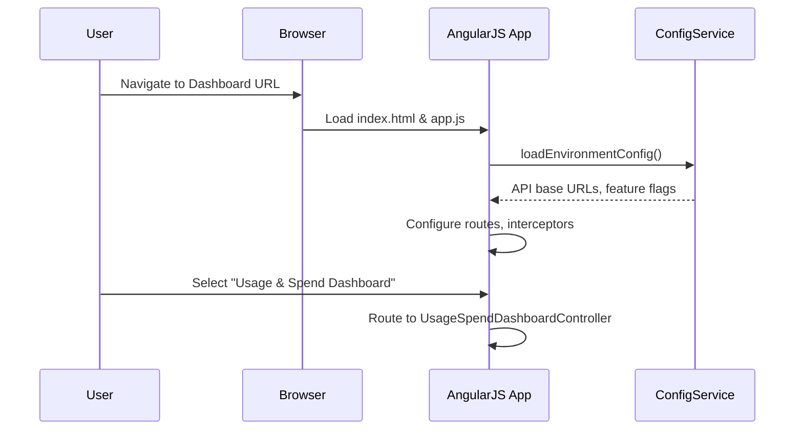
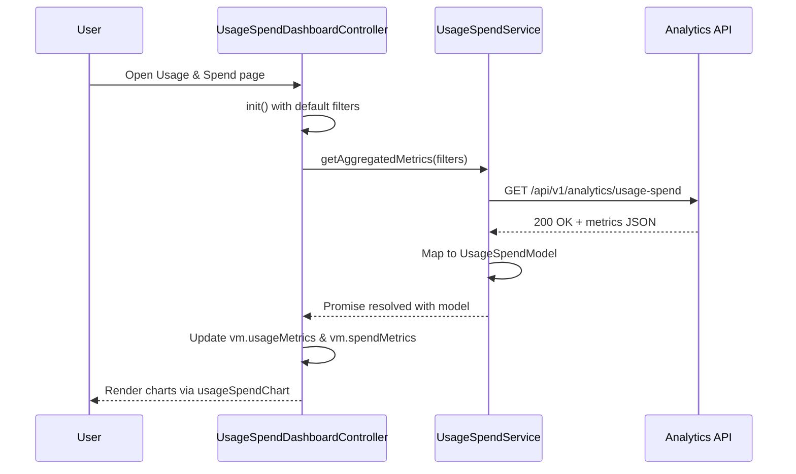
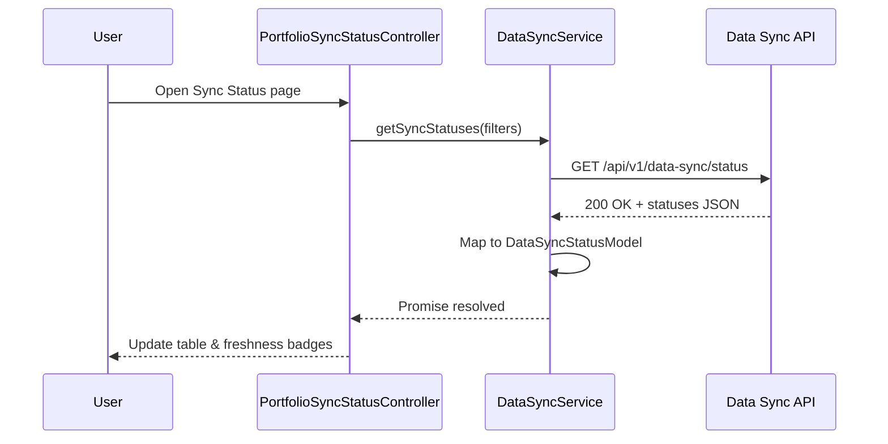
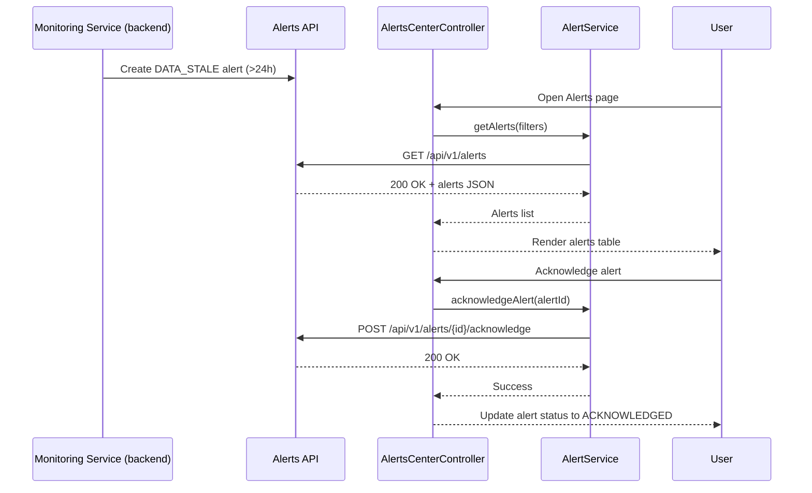

# Low-Level Design (LLD) – Epic QE-4785

## 1. Application Architecture

### 1.1 AngularJS MVC Architecture Mapping

This LLD describes the front-end and client-side integration layer of the AI Portfolio Management Dashboard for automated data integration from AWS, Azure, and GCP. The existing backend REST APIs (Integration Layer, Aggregation Service, Monitoring and Alerting Service, and Data Storage) are exposed as REST endpoints consumed by the AngularJS (1.x) web application.

**High-level mapping:**

- **Views (HTML5 + Bootstrap)**
  - `cloud-integrations.html` – Cloud provider connection management, credentials configuration, and status overview.
  - `portfolio-sync-status.html` – Data freshness monitoring, sync history, and per-company status.
  - `usage-spend-dashboard.html` – Aggregated AI usage and spend visualization for portfolio companies.
  - `alerts-center.html` – Listing of data-freshness alerts and notification status.

- **Controllers**
  - `CloudIntegrationsController` – Manages cloud account connections per portfolio company.
  - `PortfolioSyncStatusController` – Displays and filters data freshness, sync status, and last updated timestamps.
  - `UsageSpendDashboardController` – Orchestrates aggregated usage/spend visualization.
  - `AlertsCenterController` – Manages alert listing, acknowledgment, and filtering.

- **Services / Factories**
  - `CloudAccountService` – CRUD operations for cloud account configurations and credentials (front-end façade for Integration Layer APIs).
  - `DataSyncService` – Initiates manual sync requests, retrieves sync status, and integrates with the Data Aggregation Service APIs.
  - `UsageSpendService` – Fetches aggregated AI usage and spend metrics for various filters.
  - `AlertService` – Manages retrieval and acknowledgment of alerts (e.g., stale data > 24h).
  - `NotificationService` – Wraps notification APIs (email trigger status, preferences) where exposed.
  - `ErrorHandlingService` – Centralized error translation, logging proxy, and user-friendly messaging.
  - `ConfigService` – Provides environment-dependent configuration (API base URLs, feature flags, etc.).

- **Directives / Components**
  - `cloudConnectionCard` – Reusable widget showing a portfolio company’s cloud connection status across AWS/Azure/GCP.
  - `dataFreshnessBadge` – Displays freshness indicator (e.g., green/yellow/red with last-updated timestamp).
  - `usageSpendChart` – Visualization wrapper for usage/spend charts.
  - `spinnerOverlay` – Loading overlay for async operations.

- **Filters**
  - `durationAgo` – Formats timestamps into “x minutes/hours/days ago”.
  - `currencyFormat` – Standardized currency formatting (e.g., USD with 2 decimal places).
  - `providerLabel` – Converts provider codes (`AWS`, `AZURE`, `GCP`) to human-friendly labels.

- **Configuration Files**
  - `app.js` – AngularJS module declaration, routing, and configuration.
  - `app.config.js` – Environment configuration, constants, and HTTP interceptors.
  - `app.routes.js` – Route definitions for integration, status, dashboard, and alerts views.

### 1.2 Project Folder Structure

```text
/webapp
  /app
    app.js
    app.config.js
    app.routes.js

    /core
      /services
        cloud-account.service.js
        data-sync.service.js
        usage-spend.service.js
        alert.service.js
        notification.service.js
        error-handling.service.js
        config.service.js

      /interceptors
        http-error.interceptor.js
        auth-token.interceptor.js

      /models
        cloud-account.model.js
        portfolio-company.model.js
        data-sync-status.model.js
        usage-spend.model.js
        alert.model.js

      /filters
        duration-ago.filter.js
        currency-format.filter.js
        provider-label.filter.js

      /directives
        cloud-connection-card.directive.js
        data-freshness-badge.directive.js
        usage-spend-chart.directive.js
        spinner-overlay.directive.js

    /features
      /cloud-integrations
        cloud-integrations.controller.js
        cloud-integrations.html

      /sync-status
        portfolio-sync-status.controller.js
        portfolio-sync-status.html

      /usage-spend
        usage-spend-dashboard.controller.js
        usage-spend-dashboard.html

      /alerts
        alerts-center.controller.js
        alerts-center.html

  /assets
    /css
      main.css
      dashboard.css
      integrations.css
      alerts.css

    /img
      provider-icons.png
      logo.png

  /config
    env.dev.json
    env.qa.json
    env.prod.json

  index.html
```

## 2. Component Specifications

### 2.1 AngularJS Module – `apmDashboard` (root module)

- **Type:** AngularJS Module
- **File:** `app/app.js`
- **Responsibility:**
  - Declare root module `apmDashboard`.
  - Register global dependencies: `ngRoute`, `ngAnimate`, `ngSanitize`, `ui.bootstrap`, custom modules.
- **Public API:** N/A (module configuration only).
- **Dependencies:** AngularJS core, route module, third-party libs (e.g., UI Bootstrap).

```javascript
angular.module('apmDashboard', [
  'ngRoute',
  'ngAnimate',
  'ngSanitize',
  'ui.bootstrap',
  'apm.core',
  'apm.features.cloudIntegrations',
  'apm.features.syncStatus',
  'apm.features.usageSpend',
  'apm.features.alerts'
]);
```

### 2.2 Core Module – `apm.core`

- **Type:** AngularJS Module
- **File:** `app/core/core.module.js`
- **Responsibility:**
  - Encapsulate shared services, models, filters, directives.
- **Dependencies:** `ngResource` (if used), `$http`, `$q`.

```javascript
angular.module('apm.core', ['ngResource']);
```

### 2.3 Feature Modules

#### 2.3.1 `apm.features.cloudIntegrations`

- **Type:** AngularJS Module
- **File:** `app/features/cloud-integrations/cloud-integrations.module.js`
- **Responsibility:**
  - Define scope for cloud integration screens.
- **Dependencies:** `apm.core`.

#### 2.3.2 `apm.features.syncStatus`

- **Type:** AngularJS Module
- **File:** `app/features/sync-status/sync-status.module.js`

#### 2.3.3 `apm.features.usageSpend`

- **Type:** AngularJS Module
- **File:** `app/features/usage-spend/usage-spend.module.js`

#### 2.3.4 `apm.features.alerts`

- **Type:** AngularJS Module
- **File:** `app/features/alerts/alerts.module.js`

Each feature module declares its controller and depends on `apm.core` for shared services.

### 2.4 Controllers

#### 2.4.1 `CloudIntegrationsController`

- **Type:** Controller
- **File:** `app/features/cloud-integrations/cloud-integrations.controller.js`
- **Responsibility:**
  - Manage configuration and display of AWS/Azure/GCP integrations for each portfolio company.
  - Handle connect, disconnect, and update actions for cloud accounts.
  - Display connection status and last successful sync.
- **Public Methods:**
  - `vm.loadCompanies()` – Loads list of portfolio companies and their integration status.
  - `vm.connectProvider(provider, company)` – Starts OAuth/API key setup for the selected provider.
  - `vm.disconnectProvider(provider, company)` – Revokes or disables integration.
  - `vm.testConnection(provider, company)` – Tests connectivity and reports results.
  - `vm.saveCredentials(provider, company)` – Submits credentials/configurations to backend.
- **Inputs:**
  - Route params: optional `companyId`.
  - User form inputs (API keys, tenant IDs, role ARNs, etc.).
- **Outputs:**
  - Updates UI state: connection statuses, validation messages.
  - Invokes `CloudAccountService` methods.
- **Dependencies (DI):**
  - `CloudAccountService`, `PortfolioCompanyModel`, `$routeParams`, `$uibModal`, `ErrorHandlingService`, `$log`.

#### 2.4.2 `PortfolioSyncStatusController`

- **Type:** Controller
- **File:** `app/features/sync-status/portfolio-sync-status.controller.js`
- **Responsibility:**
  - Display per-company data freshness, sync status, last sync timestamp, and errors.
  - Support filters by provider, company, and staleness threshold.
  - Allow manual sync trigger (if permitted by backend).
- **Public Methods:**
  - `vm.loadSyncStatuses()` – Fetch sync status list.
  - `vm.filterByProvider(provider)` – Filter by AWS/Azure/GCP.
  - `vm.filterByStaleness(stalenessBucket)` – Filter for data older than specific durations.
  - `vm.triggerSync(companyId)` – Request immediate sync.
- **Inputs:**
  - Filter settings from UI.
- **Outputs:**
  - `syncStatuses` collection bound to `portfolio-sync-status.html`.
- **Dependencies:**
  - `DataSyncService`, `DataSyncStatusModel`, `ErrorHandlingService`, `$log`.

#### 2.4.3 `UsageSpendDashboardController`

- **Type:** Controller
- **File:** `app/features/usage-spend/usage-spend-dashboard.controller.js`
- **Responsibility:**
  - Orchestrate retrieval of aggregated AI usage and spend data.
  - Apply filters by company, provider, time range, and AI service type.
  - Populate charts via `usageSpendChart` directive.
- **Public Methods:**
  - `vm.init()` – Initialize default filters and load data.
  - `vm.onFilterChange()` – Re-query data when filters change.
  - `vm.refresh()` – Manual refresh.
- **Inputs:**
  - Filter model: `vm.filters = { companyId, provider, dateFrom, dateTo, metricType }`.
- **Outputs:**
  - `vm.usageMetrics`, `vm.spendMetrics` collections.
- **Dependencies:**
  - `UsageSpendService`, `UsageSpendModel`, `ErrorHandlingService`, `$log`.

#### 2.4.4 `AlertsCenterController`

- **Type:** Controller
- **File:** `app/features/alerts/alerts-center.controller.js`
- **Responsibility:**
  - Display alerts about data staleness, integration failures, and SLA breaches.
  - Allow filtering, pagination, and acknowledgment of alerts.
- **Public Methods:**
  - `vm.loadAlerts()` – Fetch alerts.
  - `vm.filterAlerts(filter)` – Apply filter (provider, company, severity, status).
  - `vm.acknowledgeAlert(alertId)` – Mark alert as acknowledged.
- **Inputs:**
  - Filter settings.
- **Outputs:**
  - `vm.alerts` list.
- **Dependencies:**
  - `AlertService`, `NotificationService`, `AlertModel`, `ErrorHandlingService`, `$log`.

### 2.5 Services / Factories

#### 2.5.1 `CloudAccountService`

- **Type:** Service (factory)
- **File:** `app/core/services/cloud-account.service.js`
- **Responsibility:**
  - Communicate with backend Integration Layer for CRUD of cloud account configurations.
- **Public Methods:**
  - `getCompaniesWithIntegrations()` – GET `/api/v1/portfolio/companies/integrations`.
  - `getCompanyIntegrations(companyId)` – GET `/api/v1/portfolio/companies/{companyId}/integrations`.
  - `saveIntegration(companyId, provider, payload)` – POST `/api/v1/portfolio/companies/{companyId}/integrations/{provider}`.
  - `deleteIntegration(companyId, provider)` – DELETE `/api/v1/portfolio/companies/{companyId}/integrations/{provider}`.
  - `testConnection(companyId, provider)` – POST `/api/v1/portfolio/companies/{companyId}/integrations/{provider}/test`.
- **Inputs:**
  - API payloads with authentication details and metadata.
- **Outputs:**
  - Promise resolving to normalized `CloudAccountModel` objects.
- **Dependencies:**
  - `$http`, `$q`, `ConfigService`, `CloudAccountModel`.

#### 2.5.2 `DataSyncService`

- **Type:** Service
- **File:** `app/core/services/data-sync.service.js`
- **Responsibility:**
  - Interact with Data Aggregation Service for sync status and manual sync.
- **Public Methods:**
  - `getSyncStatuses(filters)` – GET `/api/v1/data-sync/status` with query params.
  - `triggerSync(companyId)` – POST `/api/v1/data-sync/companies/{companyId}/trigger`.
  - `getSyncHistory(companyId)` – GET `/api/v1/data-sync/companies/{companyId}/history`.
- **Dependencies:**
  - `$http`, `$q`, `ConfigService`, `DataSyncStatusModel`.

#### 2.5.3 `UsageSpendService`

- **Type:** Service
- **File:** `app/core/services/usage-spend.service.js`
- **Responsibility:**
  - Retrieve aggregated AI usage and spend metrics.
- **Public Methods:**
  - `getAggregatedMetrics(filters)` – GET `/api/v1/analytics/usage-spend`.
- **Dependencies:**
  - `$http`, `$q`, `ConfigService`, `UsageSpendModel`.

#### 2.5.4 `AlertService`

- **Type:** Service
- **File:** `app/core/services/alert.service.js`
- **Responsibility:**
  - Retrieve and manage alerts (e.g., stale data, integration failures).
- **Public Methods:**
  - `getAlerts(filters)` – GET `/api/v1/alerts`.
  - `acknowledgeAlert(alertId)` – POST `/api/v1/alerts/{alertId}/acknowledge`.
- **Dependencies:**
  - `$http`, `$q`, `ConfigService`, `AlertModel`.

#### 2.5.5 `NotificationService`

- **Type:** Service
- **File:** `app/core/services/notification.service.js`
- **Responsibility:**
  - Provide access to notification preferences and status of email alerts.
- **Public Methods:**
  - `getNotificationSettings(userId)` – GET `/api/v1/notifications/settings/{userId}`.
  - `updateNotificationSettings(userId, payload)` – PUT `/api/v1/notifications/settings/{userId}`.
- **Dependencies:**
  - `$http`, `$q`, `ConfigService`.

#### 2.5.6 `ErrorHandlingService`

- **Type:** Service
- **File:** `app/core/services/error-handling.service.js`
- **Responsibility:**
  - Centralize handling of REST and client-side errors.
- **Public Methods:**
  - `handleHttpError(response)` – Converts HTTP error responses into user-facing messages and logs.
  - `logClientError(error)` – Sends client-side errors to server logging endpoint.
- **Dependencies:**
  - `$log`, `$injector` (to lazy-get `$http` for logging), `ConfigService`.

#### 2.5.7 `ConfigService`

- **Type:** Service
- **File:** `app/core/services/config.service.js`
- **Responsibility:**
  - Provide environment-specific configurations: API base URL, feature flags, logging.
- **Public Methods:**
  - `getApiBaseUrl()` – Returns base URL per environment.
  - `getFeatureFlag(flagName)` – Returns feature flag state.
- **Dependencies:**
  - `$http`, `$q`, `$window` (for global config injected on page load).

### 2.6 Directives

#### 2.6.1 `cloudConnectionCard`

- **Type:** Directive (component-style)
- **File:** `app/core/directives/cloud-connection-card.directive.js`
- **Responsibility:**
  - Display and manage a single portfolio company’s integration state per provider.
- **Bindings:**
  - `company` (object, one-way binding).
  - `onConnect` (callback).
  - `onDisconnect` (callback).
  - `onTestConnection` (callback).
- **Template:** `cloud-connection-card.html` (inline or separate partial).

#### 2.6.2 `dataFreshnessBadge`

- **File:** `app/core/directives/data-freshness-badge.directive.js`
- **Responsibility:**
  - Visual representation of data freshness based on timestamp.
- **Bindings:**
  - `lastUpdated` (Date/string).
- **Behavior:**
  - Applies color coding: green (< 6h), yellow (6–24h), red (>24h).

#### 2.6.3 `usageSpendChart`

- **File:** `app/core/directives/usage-spend-chart.directive.js`
- **Responsibility:**
  - Wrap chart library (e.g., Chart.js) for usage/spend graphs.
- **Bindings:**
  - `metrics` (array), `type` (string), `onPointClick` (callback).

#### 2.6.4 `spinnerOverlay`

- **File:** `app/core/directives/spinner-overlay.directive.js`
- **Responsibility:**
  - Show overlay with spinner during async operations.
- **Bindings:**
  - `isLoading` (bool).

### 2.7 Filters

#### 2.7.1 `durationAgo`

- **File:** `app/core/filters/duration-ago.filter.js`
- **Responsibility:**
  - Convert timestamps to human-readable relative durations.

#### 2.7.2 `currencyFormat`

- **File:** `app/core/filters/currency-format.filter.js`

#### 2.7.3 `providerLabel`

- **File:** `app/core/filters/provider-label.filter.js`

## 3. Component Responsibilities

### 3.1 Business Logic Ownership

- **Controllers**
  - Own orchestration of user interactions, calling services, preparing view models.
  - Do not contain low-level API details or transformation logic; delegate to services and models.

- **Services**
  - Own communication with REST APIs and transformation into domain models.
  - Enforce business rules like staleness thresholds (24h), provider-specific normalizations, and default filters.

- **Models**
  - Own representation and validation of data structures: cloud account configs, sync statuses, usage metrics, alerts.

- **Directives**
  - Own UI presentation, DOM interactions, and component-level event handling.

- **Filters**
  - Own formatting for display; no mutation of underlying data.

### 3.2 UI Handling

- View templates use Bootstrap for responsive layouts.
- Controllers expose `vm` objects to templates using `controllerAs` syntax.
- Directives encapsulate reusable components (cards, charts, badges).

### 3.3 State Management

- State is managed at controller level using plain JavaScript objects.
- Persistent user preferences (filters, view modes) stored in `localStorage` via a small utility (within `ConfigService` or dedicated `UserPreferenceService` if needed).
- URL query parameters used for bookmarkable filters and states (e.g., selected company, provider).

### 3.4 API Communication

- All HTTP communication goes via `$http` with base URLs from `ConfigService`.
- HTTP interceptors add auth tokens, trace IDs, and handle generic errors.
- Retry logic for transient errors implemented in services or interceptors.

## 4. Interface Specifications

### 4.1 REST API Interfaces

> Note: Exact backend implementation is not in scope; this section defines contracts expected by the AngularJS application.

#### 4.1.1 Cloud Account Integration APIs

- **GET** `/api/v1/portfolio/companies/integrations`
  - **Description:** Returns list of portfolio companies with summarized integration status.
  - **Response 200:**
    ```json
    [
      {
        "companyId": "PCO-001",
        "companyName": "Example Portfolio Co 1",
        "integrations": {
          "AWS": { "status": "CONNECTED", "lastSync": "2024-08-23T12:00:00Z" },
          "AZURE": { "status": "DISCONNECTED", "lastSync": null },
          "GCP": { "status": "CONNECTED", "lastSync": "2024-08-23T11:30:00Z" }
        }
      }
    ]
    ```
  - **Error Responses:**
    - `401 Unauthorized` – Missing/invalid token.
    - `500 Internal Server Error` – Unexpected errors.

- **GET** `/api/v1/portfolio/companies/{companyId}/integrations`
  - Returns detailed integration configuration for the company.

- **POST** `/api/v1/portfolio/companies/{companyId}/integrations/{provider}`
  - **Description:** Create or update integration configuration for provider.
  - **Request Payload:**
    ```json
    {
      "authType": "API_KEY|ROLE|OAUTH",
      "credentials": {
        "accessKeyId": "...",
        "secretAccessKey": "...",
        "roleArn": "...",
        "tenantId": "...",
        "subscriptionId": "..."
      },
      "metadata": {
        "region": "us-east-1",
        "description": "Primary AWS account"
      }
    }
    ```
  - **Response 200/201:** Normalized `CloudAccountModel`.
  - **Error Responses:** `400` (validation failures), `403` (insufficient rights).

- **DELETE** `/api/v1/portfolio/companies/{companyId}/integrations/{provider}`

- **POST** `/api/v1/portfolio/companies/{companyId}/integrations/{provider}/test`
  - Tests connectivity and permissions.

#### 4.1.2 Data Sync & Freshness APIs

- **GET** `/api/v1/data-sync/status`
  - **Query Params:**
    - `provider` (optional)
    - `companyId` (optional)
    - `stalenessGtHours` (optional)
  - **Response 200:**
    ```json
    [
      {
        "companyId": "PCO-001",
        "provider": "AWS",
        "lastSync": "2024-08-23T12:00:00Z",
        "status": "SUCCESS",
        "stalenessHours": 2.5,
        "errorCode": null,
        "errorMessage": null
      }
    ]
    ```

- **POST** `/api/v1/data-sync/companies/{companyId}/trigger`
  - **Description:** Initiates on-demand sync for a company.

- **GET** `/api/v1/data-sync/companies/{companyId}/history`
  - **Description:** Returns last N sync attempts, their outcome, and durations.

#### 4.1.3 Usage & Spend Analytics APIs

- **GET** `/api/v1/analytics/usage-spend`
  - **Query Params:**
    - `companyId` (optional)
    - `provider` (optional)
    - `dateFrom`, `dateTo`
    - `metricType` (`USAGE`, `SPEND`)
  - **Response 200:**
    ```json
    {
      "timeGranularity": "DAY",
      "currency": "USD",
      "points": [
        { "timestamp": "2024-08-22", "usageHours": 120, "spendAmount": 450.25 },
        { "timestamp": "2024-08-23", "usageHours": 135, "spendAmount": 470.75 }
      ],
      "totals": {
        "usageHours": 255,
        "spendAmount": 921.00
      }
    }
    ```

#### 4.1.4 Alerts & Notifications APIs

- **GET** `/api/v1/alerts`
  - **Query Params:** `companyId`, `provider`, `severity`, `status` (NEW, ACKNOWLEDGED).
  - **Response 200:**
    ```json
    [
      {
        "alertId": "AL-1001",
        "type": "DATA_STALE",
        "companyId": "PCO-001",
        "provider": "AWS",
        "createdAt": "2024-08-23T14:00:00Z",
        "severity": "HIGH",
        "status": "NEW",
        "details": {
          "lastSync": "2024-08-22T10:00:00Z",
          "stalenessHours": 28
        }
      }
    ]
    ```

- **POST** `/api/v1/alerts/{alertId}/acknowledge`
  - **Description:** Marks alert as acknowledged and records user & timestamp.

- **GET** `/api/v1/notifications/settings/{userId}`

- **PUT** `/api/v1/notifications/settings/{userId}`

### 4.2 External System Interfaces

- **Cloud Providers:** AWS, Azure, GCP APIs are accessed by backend; UI only sees normalized data via REST APIs above.
- **Email Notification Service:** UI receives derived alert data; may show whether email was sent successfully via `AlertService` if backend exposes fields like `notificationStatus`.

## 5. Data Model Design

### 5.1 `CloudAccountModel`

- **File:** `app/core/models/cloud-account.model.js`
- **Structure (JS Object):**
  ```javascript
  function CloudAccountModel(data) {
    this.companyId = data.companyId || null;
    this.companyName = data.companyName || '';
    this.provider = data.provider || null; // 'AWS' | 'AZURE' | 'GCP'
    this.status = data.status || 'DISCONNECTED'; // CONNECTED, DISCONNECTED, ERROR
    this.lastSync = data.lastSync ? new Date(data.lastSync) : null;
    this.metadata = data.metadata || {};
  }
  ```
- **Attributes:**
  - `companyId` (string)
  - `companyName` (string)
  - `provider` (enum)
  - `status` (enum)
  - `lastSync` (Date|null)
  - `metadata` (object – region, tags).
- **Validation Rules:**
  - `provider` must be one of allowed enum.
  - `status` must be one of `CONNECTED`, `DISCONNECTED`, `ERROR`.
- **State Transitions:**
  - `DISCONNECTED` → `CONNECTED` (upon successful save & test).
  - `CONNECTED` → `ERROR` (if repeated failures detected).
  - `CONNECTED` → `DISCONNECTED` (user disconnect).

### 5.2 `PortfolioCompanyModel`

- **Attributes:** `companyId`, `companyName`, `industry`, `region`.
- **Usage:**
  - Provide metadata for grouping/filters.

### 5.3 `DataSyncStatusModel`

- **Structure:**
  ```javascript
  function DataSyncStatusModel(data) {
    this.companyId = data.companyId;
    this.provider = data.provider;
    this.lastSync = data.lastSync ? new Date(data.lastSync) : null;
    this.status = data.status; // SUCCESS, FAILED, IN_PROGRESS
    this.stalenessHours = data.stalenessHours || 0;
    this.errorCode = data.errorCode || null;
    this.errorMessage = data.errorMessage || null;
  }
  ```
- **Validation:**
  - `stalenessHours` ≥ 0.
  - `status` in allowed values.
- **State Transitions:**
  - `IN_PROGRESS` → `SUCCESS` or `FAILED`.

### 5.4 `UsageSpendModel`

- **Structure:**
  ```javascript
  function UsageSpendModel(data) {
    this.timeGranularity = data.timeGranularity || 'DAY';
    this.currency = data.currency || 'USD';
    this.points = data.points || [];
    this.totals = data.totals || { usageHours: 0, spendAmount: 0 };
  }
  ```
- **Validation:**
  - `points` must be an array with `timestamp`, `usageHours`, `spendAmount`.

### 5.5 `AlertModel`

- **Structure:**
  ```javascript
  function AlertModel(data) {
    this.alertId = data.alertId;
    this.type = data.type; // e.g., DATA_STALE, SYNC_FAILURE
    this.companyId = data.companyId;
    this.provider = data.provider;
    this.createdAt = new Date(data.createdAt);
    this.severity = data.severity; // LOW, MEDIUM, HIGH, CRITICAL
    this.status = data.status; // NEW, ACKNOWLEDGED
    this.details = data.details || {};
  }
  ```

## 6. Data Flow

### 6.1 End-to-End Data Flow (Typical Scenario)

1. **User Action** – User opens `Usage & Spend Dashboard`.
2. **View → Controller** – `usage-spend-dashboard.html` is loaded, initializing `UsageSpendDashboardController`.
3. **Controller → Service** – `vm.init()` calls `UsageSpendService.getAggregatedMetrics(filters)`.
4. **Service → REST API** – Service composes query parameters, uses `$http.get` with base URL from `ConfigService`.
5. **REST API → Backend** – Backend Aggregation Service reads encrypted data from storage.
6. **Backend → Service** – Response is returned in unified schema.
7. **Service → Model** – `UsageSpendModel` instantiated.
8. **Service → Controller** – Promise resolves with model, controller assigns to `vm.usageMetrics` and `vm.spendMetrics`.
9. **Controller → View** – Data bound to `usageSpendChart` directive.
10. **Directive → UI** – Chart library renders UI elements.

### 6.2 Data Freshness Monitoring Flow

1. User navigates to `Sync Status` screen.
2. `PortfolioSyncStatusController` calls `DataSyncService.getSyncStatuses(...)`.
3. API returns list of `DataSyncStatusModel` objects including `stalenessHours`.
4. Each row includes `dataFreshnessBadge` directive that decides color state.
5. For statuses where `stalenessHours > 24`, UI highlights row and optionally links to corresponding alert in `Alerts` page.

### 6.3 Manual Sync Trigger Flow

1. From `Sync Status` page, user clicks “Sync Now” for a company.
2. Controller calls `DataSyncService.triggerSync(companyId)`.
3. On success, UI shows toast and optionally polls `getSyncStatuses` until status changes from `IN_PROGRESS`.

## 7. Sequence Diagrams (Mermaid)

### 7.1 Application Initialization



### 7.2 Primary User Workflow – Viewing Usage & Spend



### 7.3 Service/API Interaction – Viewing Sync Status



### 7.4 Error Handling Scenario – Stale Data Alert



## 8. Implementation Details

### 8.1 AngularJS Implementation Approach

- Use **controllerAs** syntax.
- Modularize by feature and core shared modules.
- Use promises and `$q` for async chaining.
- Use `$routeProvider` for navigation.

### 8.2 JavaScript ES6 Patterns

- Use ES6 features where compatible (transpiling optional):
  - `const` and `let` for variable declarations.
  - Arrow functions for callbacks (caution with `this` in AngularJS).
  - Template literals for logging and URL composition.
- Use factory functions and prototypes for models;
  optionally use ES6 classes compiled with Babel if project supports.

### 8.3 Dependency Injection

- All controllers/services explicitly list dependencies for minification compatibility:

```javascript
CloudIntegrationsController.$inject = ['CloudAccountService', 'PortfolioCompanyModel', '$routeParams', '$uibModal', 'ErrorHandlingService', '$log'];
```

- Use AngularJS DI to inject `$http`, `$q`, `$log`, etc.

### 8.4 Business Logic Flow

- Business rules mainly reside in services:
  - `DataSyncService` interprets staleness thresholds and may flag warnings.
  - `UsageSpendService` normalizes metrics into unified time-series structures.
  - `AlertService` ensures correct ordering (e.g., newest first, severity grouping).

### 8.5 Validation Logic

- **Form-level:** Use AngularJS form validation to ensure required credential fields and valid patterns (e.g., AWS account IDs, Azure subscription IDs).
- **Client-side:** Basic checks (non-empty strings, lengths) before sending API requests.
- **Server-side:** Enforced by backend; client displays error messages from backend using `ErrorHandlingService`.

### 8.6 State Management Approach

- Use simple controller-level state; avoid `$rootScope` global variables.
- Use `$routeParams` and query strings for context (e.g., selected companyId).

### 8.7 DOM Interaction Approach

- No direct DOM manipulation via `document` or jQuery; use directives and AngularJS bindings.
- `spinnerOverlay` directive watches `isLoading` to show/hide overlay.

### 8.8 API Integration Approach

- `$http` configured with base URL and default headers (auth token, content-type JSON).
- HTTP interceptors handle global error codes (401, 403, 500) and redirect to login or show generic errors.

## 9. Configuration

### 9.1 AngularJS Configuration Files

- `app.config.js` – Registers:
  - `$httpProvider` interceptors.
  - Route-level resolves for pre-fetching configuration.

- `app.routes.js` – Defines routes:

```javascript
$routeProvider
  .when('/integrations', {
    templateUrl: 'app/features/cloud-integrations/cloud-integrations.html',
    controller: 'CloudIntegrationsController',
    controllerAs: 'vm'
  })
  .when('/sync-status', {
    templateUrl: 'app/features/sync-status/portfolio-sync-status.html',
    controller: 'PortfolioSyncStatusController',
    controllerAs: 'vm'
  })
  .when('/usage-spend', {
    templateUrl: 'app/features/usage-spend/usage-spend-dashboard.html',
    controller: 'UsageSpendDashboardController',
    controllerAs: 'vm'
  })
  .when('/alerts', {
    templateUrl: 'app/features/alerts/alerts-center.html',
    controller: 'AlertsCenterController',
    controllerAs: 'vm'
  })
  .otherwise('/usage-spend');
```

### 9.2 Environment-Specific Properties

- JSON configs (`env.dev.json`, etc.) loaded at startup.
- Structure:

```json
{
  "apiBaseUrl": "https://dev-api.apm.example.com",
  "loggingLevel": "DEBUG",
  "featureFlags": {
    "manualSyncEnabled": true,
    "advancedAnalytics": false
  }
}
```

- `ConfigService` reads from these configs and exposes typed getters.

### 9.3 API Base URLs

- Derived from environment config.
- All services compose URLs using `ConfigService.getApiBaseUrl()`.

### 9.4 Feature Flags

- Example flags:
  - `manualSyncEnabled` – Show/hide “Sync Now” button.
  - `advancedAnalytics` – Toggle advanced usage/spend graphs.

### 9.5 Logging & Telemetry

- Client-side logging via `$log` and `ErrorHandlingService.logClientError`.
- Optional integration with external telemetry (e.g., Azure App Insights) via an additional `TelemetryService`.

## 10. Error Handling and Resiliency

### 10.1 Client-Side Exception Handling

- Global `$exceptionHandler` override logs unexpected errors to server.
- Controllers/services catch specific errors and provide fallback messages.

### 10.2 REST API Error Handling

- `http-error.interceptor.js` intercepts responses:
  - On `401`, redirect to login.
  - On `403`, show “access denied”.
  - On `5xx`, show “temporary issue; please try again.”
- `ErrorHandlingService.handleHttpError` further refines messages per endpoint.

### 10.3 Retry Mechanisms

- Implement simple retry for transient network issues:
  - For idempotent GET requests (status or metrics), retry up to 2 times with exponential backoff.
  - Implemented within services using `$q` and `$timeout`.

### 10.4 Logging Strategy

- Log key events:
  - Integration connect/disconnect success/failure.
  - Manual sync triggers and outcomes.
  - Alert acknowledgement actions.
- Logs include user ID, company ID, provider, timestamp, and correlation IDs.

### 10.5 Recovery and Fallback Behavior

- If metrics fetch fails, show previous successful data if available (cached in memory for session duration or via localStorage).
- If sync status fetch fails, show last known statuses with banner indicating they may be outdated.

## 11. Security Considerations

### 11.1 Input Validation & Sanitization

- AngularJS form validation for all user inputs.
- Client-side regex checks for IDs and keys.
- Backend validation is authoritative; client surfaces error messages.

### 11.2 XSS Prevention

- Use `ng-bind` instead of interpolation in sensitive areas.
- Sanitize any HTML content using `ngSanitize`.
- No untrusted HTML inserted into DOM.

### 11.3 CSRF Protection

- AngularJS `$http` includes XSRF token support; configure token cookie (`XSRF-TOKEN`) and header (`X-XSRF-TOKEN`).

### 11.4 Secure API Communication

- Enforce HTTPS for all API calls.
- `ConfigService` ensures all base URLs are `https://`.

### 11.5 Authentication and Authorization

- Auth token (e.g., JWT) injected into headers by `auth-token.interceptor.js`.
- UI elements like manual sync or integration configuration visible only if user has required roles (provided via claims or user role service on frontend).

### 11.6 Sensitive Data Handling

- API keys and secrets are never logged or stored on client side beyond input fields.
- Credential fields use masked input controls and cleared from scope after submission.

### 11.7 Audit Logging

- For actions like connect/disconnect, manual sync, alert acknowledgment:
  - Frontend sends `X-Audit-Action` header with action name.
  - Backend persists audit trail; UI can display audit info if relevant APIs exist.
