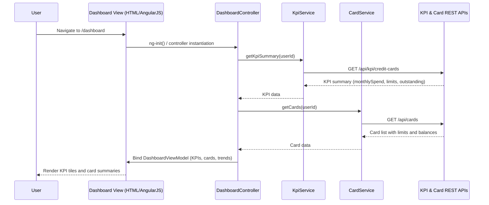

# LLD: Credit Card Analysis Dashboard (Epic QE-4805)

## a. Architecture Mapping (brief)

- Dashboard UI (KPIs for multiple cards) → AngularJS module `creditDashboard`, controller `DashboardController`, service `KpiService`.
- KPI Aggregation Service (HLD) → AngularJS service `KpiService` + REST API `/api/kpi/credit-cards`.
- Card & Transaction Data Store (HLD) → REST APIs `/api/cards`, `/api/transactions` consumed by `CardService`.
- Auth / Access Control → AngularJS `AuthService` + HTTP interceptor `AuthInterceptor`.

**Recommended folder structure**
- `/app/modules/credit-dashboard/` (controllers, views)
- `/app/services/` (kpi.service.js, card.service.js, auth.service.js)
- `/app/directives/` (card-summary-tile.directive.js, kpi-tile.directive.js)
- `/app/assets/css/` (dashboard.css)
- `/app/app.js` (root module & routing)

## b. Component Specifications

| Name                      | Artifact Type | Responsibility (1 line)                                                       | Key Dependencies                          |
|---------------------------|--------------|-------------------------------------------------------------------------------|-------------------------------------------|
| creditDashboard           | Module       | Bootstraps dashboard feature, wires routes, and registers controllers/services | `ngRoute`, `DashboardController`, services |
| DashboardController       | Controller   | Orchestrates loading KPIs and card data, binds models to dashboard view       | `KpiService`, `CardService`, `$q`, `$scope`|
| KpiService                | Service      | Fetches and aggregates KPI metrics (monthly spend, limits, outstanding) via APIs | `$http`, `API_CONFIG`, `AuthService`      |
| CardService               | Service      | Retrieves card list and basic card attributes for the current user            | `$http`, `API_CONFIG`, `AuthService`      |
| AuthService               | Service      | Provides user context (token, userId) and login state for dashboard requests  | `$window`, `$http`, `API_CONFIG`          |
| HttpErrorInterceptor      | Factory      | Intercepts HTTP errors and normalizes error responses for UI notifications    | `$q`, `$injector`, `$rootScope`           |
| AuthInterceptor           | Factory      | Attaches auth headers to outbound API calls                                   | `$q`, `AuthService`                       |
| kpiTile                   | Directive    | Renders a responsive KPI tile (label, value, trend) using Bootstrap grid      | `DashboardController` scope, Bootstrap    |
| cardSummaryTile           | Directive    | Displays per-card metrics (limit, available, outstanding) in card layout      | `DashboardController` scope               |
| monthlySpendChart         | Directive    | Hosts monthly spend trend chart (e.g., using charting library wrapper)        | `DashboardController`, chart lib wrapper  |
| apiConfig                 | Constant     | Holds base API URLs and endpoints for KPI, cards, transactions                | None                                      |

## c. Data Model (brief)

**JS Models (ES6-style objects)**

- `UserContext`
  - `userId: string`
  - `displayName: string`
  - `authToken: string`

- `Card`
  - `cardId: string`
  - `cardName: string`
  - `issuer: string`
  - `lastFourDigits: string`
  - `creditLimit: number`
  - `availableCredit: number`
  - `outstandingAmount: number`

- `KpiSummary`
  - `monthlySpend: number`
  - `totalCreditLimit: number`
  - `totalAvailableCredit: number`
  - `totalOutstandingAmount: number`
  - `currency: string`

- `CategorySpend`
  - `category: string` (e.g., "Food & Dining", "Fuel")
  - `amount: number`

- `MonthlyTrendPoint`
  - `monthLabel: string` (e.g., "Jan 2025")
  - `amount: number`

- `DashboardViewModel`
  - `cards: Card[]`
  - `kpiSummary: KpiSummary`
  - `categorySpends: CategorySpend[]`
  - `monthlyTrends: MonthlyTrendPoint[]`

## d. Data Flow (one paragraph)

When the user navigates to the Credit Card Analysis Dashboard, the view is initialized via the `creditDashboard` route which instantiates `DashboardController`, triggering calls to `KpiService` and `CardService` that use `$http` with `AuthInterceptor` to invoke REST APIs for cards, transactions, and KPI aggregates; the controller aggregates responses into `DashboardViewModel`, and the view updates via bound directives (`kpiTile`, `cardSummaryTile`, `monthlySpendChart`) to display up-to-date KPIs, card metrics, and trends.

## e. Primary Sequence Diagram (ONE only)

## f. Implementation Notes (brief)

- Use a dedicated AngularJS module `creditDashboard` with dependency injection for services (`KpiService`, `CardService`, `AuthService`).
- Implement services as ES6-style factory functions or classes wrapped for AngularJS, returning promises via `$http`.
- Configure `$httpProvider.interceptors` with `AuthInterceptor` and `HttpErrorInterceptor` for centralized auth and error handling.
- Use Bootstrap grid and responsive utility classes to keep KPI tiles and charts adaptive across web and mobile.
- External chart libraries (if any) should be wrapped in AngularJS directives to isolate DOM manipulation.

## g. Error Handling (ONE line)

HTTP errors are managed via an `$http` interceptor (`HttpErrorInterceptor`) that normalizes errors and exposes user-friendly messages through a shared notification service.

## h. Security Notes (ONE line)

Standard input validation and secure API calls with auth token headers assumed for all KPI and card endpoints.
