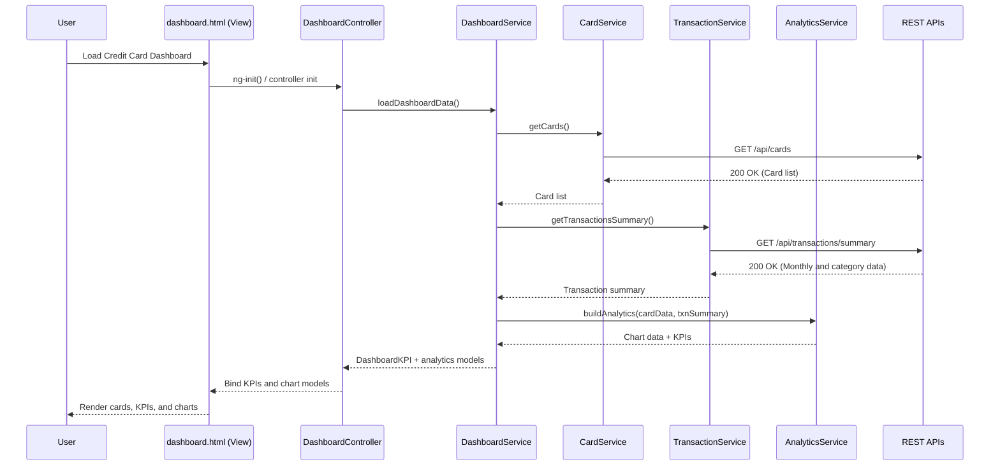

# Credit Card Analysis Dashboard - LLD (Epic QE-4808)

## a. Architecture Mapping (brief)
- Dashboard KPIs → AngularJS Module `ccDashboard` with Controller `DashboardController` and Service `DashboardService`.
- Multiple Credit Cards Management → Controller `CardListController`, Service `CardService`.
- Monthly Spend Trends Visualization → Directive `monthlyTrendsChart`, Service `AnalyticsService`.
- Card-wise Spend Analysis → Directive `cardSpendChart`, Service `AnalyticsService`.
- Transactions Listing → Controller `TransactionController`, Service `TransactionService`.
- Category-wise Spending Analytics → Directive `categorySpendChart`, Service `AnalyticsService`.

**Recommended Folder Structure**
- `/app/modules/dashboard/` (dashboard module, controllers, views)
- `/app/services/` (card, transaction, analytics services)
- `/app/directives/` (chart directives)
- `/app/assets/css/` (CSS, Bootstrap overrides)
- `/app/assets/templates/` (HTML partials for views)

## b. Component Specifications

| Name                   | Artifact Type  | Responsibility (1 line)                                           | Key Dependencies                          |
|------------------------|----------------|--------------------------------------------------------------------|--------------------------------------------|
| ccDashboard            | AngularJS Module | Root module wiring dashboard controllers, services, and routes.   | AngularJS, `ui.router`/`ngRoute`          |
| DashboardController    | Controller     | Aggregate KPIs (monthly spend, limits, outstanding) for dashboard. | `DashboardService`, `$scope`, `$q`        |
| CardListController     | Controller     | Manage list of credit cards and selected card state.              | `CardService`, `$scope`                   |
| TransactionController  | Controller     | Fetch and display transaction list with filters and pagination.   | `TransactionService`, `$scope`            |
| DashboardService       | Service        | Orchestrate dashboard API calls and map responses to KPI model.   | `$http`, `CardService`, `TransactionService` |
| CardService            | Service        | CRUD-style operations for cards and card metadata.                | `$http`                                   |
| TransactionService     | Service        | Retrieve transactions by card, date range, and category.          | `$http`                                   |
| AnalyticsService       | Service        | Transform raw spend data into chart-ready series by month/card.   | `$http`, `$q`                             |
| monthlyTrendsChart     | Directive      | Render monthly spend trends using a chart library.                | `AnalyticsService`, chart library         |
| cardSpendChart         | Directive      | Render per-card spend comparison chart.                           | `AnalyticsService`, chart library         |
| categorySpendChart     | Directive      | Render category-wise spending chart.                              | `AnalyticsService`, chart library         |
| cardSummaryPanel.html  | HTML Template  | Present card KPIs (limit, available, outstanding) per card.       | `DashboardController`, Bootstrap CSS      |
| dashboard.html         | HTML Template  | Main dashboard view with KPIs and charts layout.                  | `DashboardController`, directives         |
| card-list.html         | HTML Template  | Card listing and selection UI.                                    | `CardListController`                      |
| transactions.html      | HTML Template  | Transactions table with filters and responsive layout.            | `TransactionController`, Bootstrap table  |

## c. Data Model (brief)

- `Card` (Object)
  - `id`: String
  - `cardNumberMasked`: String
  - `issuer`: String
  - `cardType`: String
  - `creditLimit`: Number
  - `availableCredit`: Number
  - `outstandingAmount`: Number
  - `billingCycleDay`: Number

- `Transaction` (Object)
  - `id`: String
  - `cardId`: String
  - `date`: String (ISO-8601)
  - `amount`: Number
  - `category`: String
  - `merchant`: String
  - `description`: String

- `MonthlySpend` (Object)
  - `month`: String (e.g., `2025-01`)
  - `totalSpend`: Number
  - `cardId`: String (optional for card-wise trends)

- `CategorySpend` (Object)
  - `category`: String
  - `totalAmount`: Number
  - `cardId`: String (optional)
  - `month`: String (optional)

- `DashboardKPI` (Object)
  - `monthlySpend`: Number
  - `totalCreditLimit`: Number
  - `availableCredit`: Number
  - `outstandingAmount`: Number

## d. Data Flow (one paragraph)

User selects or views the dashboard, which loads the `dashboard.html` view bound to `DashboardController`; the controller invokes `DashboardService` and related services (`CardService`, `TransactionService`, `AnalyticsService`) to call REST APIs for cards, transactions, and analytics, and once the promises resolve, the controller updates scoped models that drive KPIs and chart directives, causing the AngularJS bindings to update the UI with refreshed metrics, tables, and charts in a single-page flow.

## e. Primary Sequence Diagram (ONE only)

## f. Implementation Notes (brief)

- Use a single AngularJS module `ccDashboard` with dependency injection for all controllers and services.
- Implement services as ES6 classes wrapped in AngularJS services/factories to keep logic modular.
- Use `$http` with a centralized configuration service for base URLs and headers to call REST APIs.
- Leverage promises (`$q`) or `$http` directly in controllers, keeping controllers thin and delegating logic to services.
- Integrate chart library (e.g., Chart.js) via lightweight directives that accept data via isolated scope bindings.

## g. Error Handling (ONE line)

Use an `$http` interceptor to catch API errors globally and surface concise user notifications via a shared alert component.

## h. Security Notes (ONE line)

Standard input validation and secure API calls assumed.
