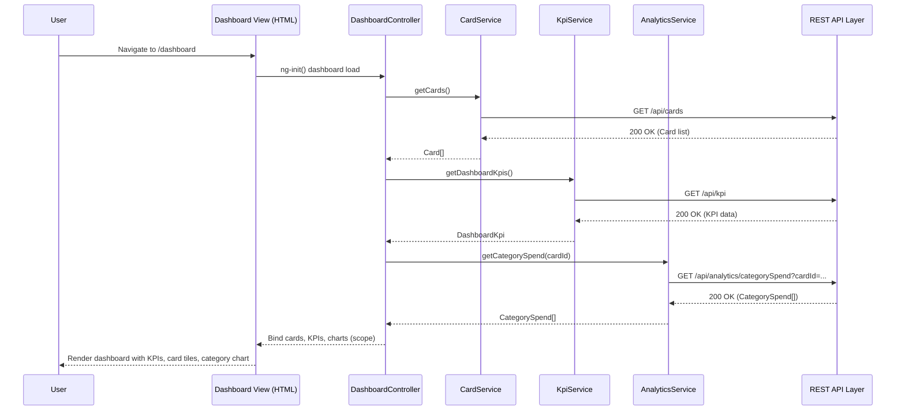

# LLD – Credit Card Analysis Dashboard (Epic QE-4808)

## a. Architecture Mapping (brief)
- Dashboard Overview → AngularJS Module `ccDashboard` with root Controller `DashboardController`.
- Cards List View → Controller `CardsController` and directive `ccCardList` for card tiles.
- Transactions View → Controller `TransactionsController` with directive `ccTransactionTable`.
- KPI Widgets (Monthly Spend, Limits) → Directive `ccKpiWidget` with Service `KpiService`.
- Analytics Charts (Category-wise Spend, Trends) → Directive `ccAnalyticsChart` using Service `AnalyticsService`.
- Card Data Management → Service `CardService` (REST integration) and Factory `CardModelFactory`.
- Transaction Data Management → Service `TransactionService` (REST integration).
- Layout & Navigation → Directive `ccLayout` using Bootstrap grid and routing config in `appRoutes`.

Recommended folder structure:
- `app/`
  - `app.module.js`
  - `app.routes.js`
  - `dashboard/` (controllers, views, directives for dashboard)
  - `cards/` (card list, details components)
  - `transactions/` (transaction list components)
  - `services/` (`card.service.js`, `transaction.service.js`, `kpi.service.js`, `analytics.service.js`)
  - `models/` (`card.model.js`, `transaction.model.js`)
  - `assets/css/` (custom styles over Bootstrap)

## b. Component Specifications (table)

| Name                   | Artifact Type | Responsibility (1 line)                                                 | Key Dependencies                            |
|------------------------|--------------|---------------------------------------------------------------------------|---------------------------------------------|
| ccDashboard            | Module       | Root module wiring dashboard, cards, transactions, analytics features.   | AngularJS, ui-router/ngRoute                |
| DashboardController    | Controller   | Orchestrates loading KPIs, cards, and charts for main dashboard view.    | KpiService, CardService, AnalyticsService   |
| CardsController        | Controller   | Manages list of credit cards, selection, and card-level metrics.         | CardService, CardModelFactory               |
| TransactionsController | Controller   | Loads and filters transactions by card, date, and category.              | TransactionService, CardService             |
| ccCardList             | Directive    | Renders responsive card tiles showing key card metrics.                  | CardsController, Bootstrap grid             |
| ccTransactionTable     | Directive    | Displays paginated, filterable transaction table.                        | TransactionsController, Bootstrap table     |
| ccKpiWidget            | Directive    | Renders KPI widgets (spend, limits, outstanding) as responsive tiles.    | KpiService                                  |
| ccAnalyticsChart       | Directive    | Renders category-wise and trend charts using chart library.              | AnalyticsService, external chart lib        |
| ccLayout               | Directive    | Provides common layout shell with navbar and responsive containers.      | Bootstrap, AngularJS templates              |
| CardService            | Service      | Fetches card list, limits, and balances via REST APIs.                   | $http, REST endpoints `/api/cards`          |
| TransactionService     | Service      | Fetches transactions, supports filters by card and date.                 | $http, REST endpoints `/api/transactions`   |
| KpiService             | Service      | Aggregates KPIs like monthly spend, available credit, outstanding.       | $http, REST endpoints `/api/kpi`            |
| AnalyticsService       | Service      | Provides data series for category spend and monthly trends.              | $http, REST endpoints `/api/analytics`      |
| CardModelFactory       | Factory      | Normalizes raw card API responses into Card model objects.               | None (pure JS)                              |
| appRoutes              | Config       | Defines routes/states for dashboard, cards, and transactions views.      | $routeProvider or $stateProvider            |

## c. Data Model (brief)

- `Card` (object)
  - `id: string`
  - `cardNumberMasked: string`
  - `cardName: string`
  - `issuer: string`
  - `totalCreditLimit: number`
  - `availableCredit: number`
  - `outstandingAmount: number`
  - `billingCycleStart: string` (ISO date)
  - `billingCycleEnd: string` (ISO date)

- `Transaction` (object)
  - `id: string`
  - `cardId: string`
  - `date: string` (ISO date)
  - `description: string`
  - `category: string` (e.g., Food, Fuel, Shopping)
  - `amount: number`
  - `currency: string`
  - `merchant: string`

- `DashboardKpi` (object)
  - `monthlySpend: number`
  - `totalCreditLimit: number`
  - `availableCredit: number`
  - `outstandingAmount: number`
  - `month: string` (YYYY-MM)

- `CategorySpend` (object)
  - `category: string`
  - `totalAmount: number`

- `MonthlyTrendPoint` (object)
  - `month: string` (YYYY-MM)
  - `totalSpend: number`

## d. Data Flow (one paragraph)

User opens the dashboard route, the view initializes `DashboardController`, which invokes `CardService`, `KpiService`, and `AnalyticsService` to fetch cards, KPIs, and analytics via REST APIs; responses are mapped into `Card`, `DashboardKpi`, and chart-ready series, then bound to directives (`ccCardList`, `ccKpiWidget`, `ccAnalyticsChart`) that update the UI, while user interactions such as selecting a card or filtering transactions trigger controller methods that call `TransactionService`/`AnalyticsService` and refresh the view models for immediate UI updates.

## e. Primary Sequence Diagram (one workflow – user views dashboard and card-wise spend)

## f. Implementation Notes (brief)

- Use AngularJS 1.x module `ccDashboard` with dependency injection for all services and controllers.
- Implement controllers using ES6 classes transpiled/bundled where needed, keeping logic thin and delegating to services.
- Configure `$http` defaults and a base URL service for consistent REST API integration.
- Use reusable directives for KPIs and charts, isolating scope and passing data via attributes.
- Apply Bootstrap grid and responsive utilities to ensure dashboard adapts to different screen sizes.

## g. Error Handling (ONE line)

Use a centralized `$http` interceptor for API errors combined with controller-level fallbacks to show non-blocking user notifications.

## h. Security Notes (ONE line)

Standard input validation and secure API calls assumed, with no storage of full card numbers or sensitive data on the client.
