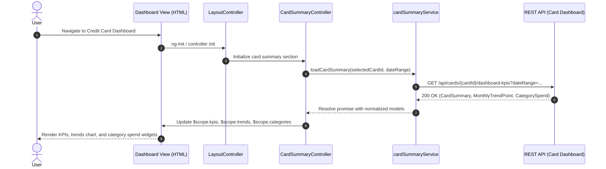

# QE-4816 – Credit Card Analysis Dashboard LLD

## a. Architecture Mapping (brief)
- Dashboard Overview → `creditDashboardModule` (AngularJS module)
- Card Summary Widget → `CardSummaryController` & `cardSummaryService`
- Monthly Spend Trends → `MonthlyTrendsController` & `monthlyTrendsService`
- Category-wise Spend Charts → `CategorySpendController` & `categorySpendService`
- Transaction List View → `TransactionListController` & `transactionService`
- Shared Layout & Navigation → `LayoutController` & `navDirective`
- REST Integration Layer → `apiClientFactory` (wrapper over `$http`)

**Recommended folder structure**
- `/app/credit-dashboard/app.module.js`
- `/app/credit-dashboard/controllers/*.controller.js`
- `/app/credit-dashboard/services/*.service.js`
- `/app/credit-dashboard/factories/api-client.factory.js`
- `/app/credit-dashboard/directives/*.directive.js`
- `/app/credit-dashboard/views/*.html`
- `/app/credit-dashboard/assets/css/dashboard.css`

## b. Component Specifications (table format)

| Name                     | Artifact Type | Responsibility (1 line)                                                       | Key Dependencies                               |
|--------------------------|--------------|-------------------------------------------------------------------------------|-----------------------------------------------|
| creditDashboardModule    | Module       | Root AngularJS module for the Credit Card Analysis Dashboard feature         | angular, ui.router/ngRoute, Bootstrap CSS     |
| LayoutController         | Controller   | Manages global layout, navbar, and active section state                      | $scope, $state/$route, userContextService     |
| CardSummaryController    | Controller   | Fetches and displays per-card KPIs (limit, available, outstanding, monthly)  | $scope, cardSummaryService                    |
| MonthlyTrendsController  | Controller   | Controls monthly spend trend charts and selected time range                  | $scope, monthlyTrendsService                  |
| CategorySpendController  | Controller   | Manages category-wise spend visualization and filter selection               | $scope, categorySpendService                  |
| TransactionListController| Controller   | Handles paginated list of card transactions and basic filters                | $scope, transactionService                    |
| cardSummaryService       | Service      | Provides aggregated dashboard KPIs across all cards from REST APIs           | $http/apiClientFactory, $q                    |
| monthlyTrendsService     | Service      | Fetches monthly spend trend data and normalizes for chart components         | apiClientFactory, $q                          |
| categorySpendService     | Service      | Retrieves category-wise spending data for charts                             | apiClientFactory, $q                          |
| transactionService       | Service      | Fetches transaction list per card with basic search/sort parameters          | apiClientFactory, $q                          |
| userContextService       | Service      | Maintains selected user/cards context (selected card, date range)            | $window/localStorage                          |
| apiClientFactory         | Factory      | Wraps $http for REST calls with base URL, headers, and common error handling | $http, $q, $log                                |
| navDirective             | Directive    | Renders responsive top navigation / tabs for dashboard sections              | LayoutController, Bootstrap classes           |
| kpiTileDirective         | Directive    | Reusable KPI tile component for monthly spend, limits, and balances          | CardSummaryController, Bootstrap grid         |
| trendsChartDirective     | Directive    | Reusable chart wrapper for monthly trend visualization                       | MonthlyTrendsController, charting library     |
| categoryChartDirective   | Directive    | Category-wise spend chart using configured charting library                  | CategorySpendController, charting library     |
| dashboardView            | HTML View    | Main dashboard layout with cards, KPIs, charts, and transactions sections    | LayoutController, Bootstrap, CSS              |
| cardSummaryView          | HTML View    | Card summary section with responsive card tiles                              | CardSummaryController, kpiTileDirective       |
| monthlyTrendsView        | HTML View    | Section showing monthly trend graph and time filters                         | MonthlyTrendsController, trendsChartDirective |
| categorySpendView        | HTML View    | Section showing category-wise spend charts and legends                       | CategorySpendController, categoryChartDirective |
| transactionListView      | HTML View    | Transaction table with sorting, filtering, and pagination                    | TransactionListController, Bootstrap table    |

## c. Data Model (brief)

- `CardSummary` (JS object)
  - `cardId: string`
  - `cardName: string`
  - `issuer: string`
  - `last4Digits: string`
  - `creditLimit: number`
  - `availableCredit: number`
  - `outstandingAmount: number`
  - `monthlySpend: number`

- `MonthlyTrendPoint` (JS object)
  - `month: string`          // e.g., '2025-01'
  - `label: string`          // display label like 'Jan 2025'
  - `totalSpend: number`

- `CategorySpend` (JS object)
  - `category: string`       // Food & Dining, Fuel, Shopping, etc.
  - `amount: number`
  - `percentage: number`

- `Transaction` (JS object)
  - `transactionId: string`
  - `cardId: string`
  - `date: string`           // ISO date
  - `merchantName: string`
  - `category: string`
  - `amount: number`
  - `currency: string`
  - `status: string`         // e.g., 'POSTED', 'PENDING'

- `DashboardState` (JS object)
  - `selectedCardId: string`
  - `dateRange: string`      // e.g., 'LAST_3_MONTHS'
  - `selectedCategories: Array<string>`

## d. Data Flow (one paragraph)

The user opens the Credit Card Analysis Dashboard view, which loads `dashboardView.html` where AngularJS binds controllers to sections; user actions such as selecting a card or changing the date range trigger controller functions (e.g., `CardSummaryController.loadCardSummary`) that call corresponding services, the services use `apiClientFactory` to invoke REST APIs for cards, KPIs, trends, categories, and transactions, the responses are normalized into JS models (`CardSummary`, `MonthlyTrendPoint`, `CategorySpend`, `Transaction`) and assigned to `$scope` properties, and AngularJS two-way binding updates the UI widgets, charts, and tables in real time as data changes.

## e. Primary Sequence Diagram (ONE only)

## f. Implementation Notes (brief)

- Use a single AngularJS module (`creditDashboardModule`) with feature-specific subfolders for controllers, services, directives, and views.
- Configure routes/states so `/dashboard/credit-cards` loads `dashboardView.html` with `LayoutController` and nested child views.
- Implement services using ES6 arrow functions where compatible and return `$q` promises for async REST calls.
- Centralize REST calls in `apiClientFactory` to handle base URL, common headers, and logging of responses.
- Integrate a charting library (e.g., Chart.js) via directives (`trendsChartDirective`, `categoryChartDirective`) that accept normalized data via isolated scope bindings.

## g. Error Handling (ONE line)

Use an `$http` interceptor in `apiClientFactory` to catch REST errors, log them, and surface user-friendly toasts/alerts via a shared notification service.

## h. Security Notes (ONE line)

Standard input validation and secure API calls (HTTPS, auth headers) are assumed, with no additional security concerns called out in the HLD.
