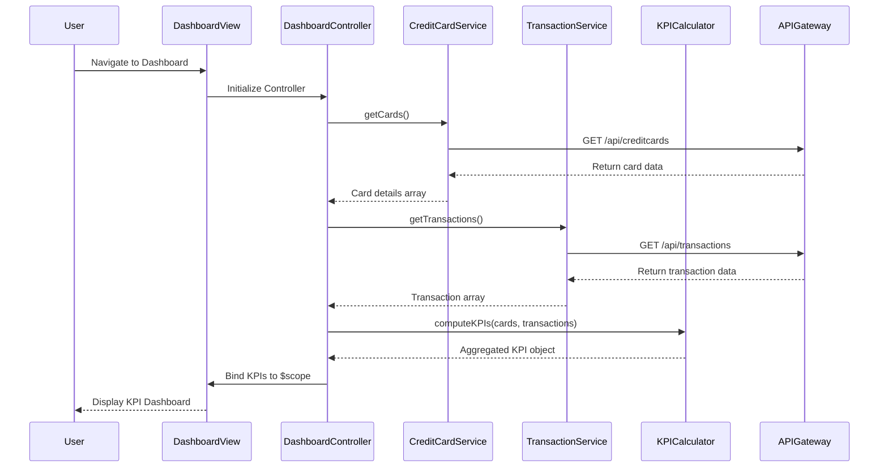

# Low-Level Design: Credit Card Analysis Dashboard

## Epic ID: QE-4824

---

## a. Architecture Mapping

- **Dashboard Module** → AngularJS Module (`creditCardDashboardModule`)
- **Dashboard View** → HTML5 template with Bootstrap grid (`dashboard.html`)
- **Dashboard Controller** → AngularJS Controller (`DashboardController`)
- **Credit Card Service** → AngularJS Service (`CreditCardService`) - fetches card data via REST API
- **Transaction Service** → AngularJS Service (`TransactionService`) - fetches transaction data via REST API
- **KPI Calculation** → AngularJS Factory (`KPICalculator`) - aggregates and computes metrics
- **API Interceptor** → AngularJS HTTP Interceptor for authentication and error handling

**Recommended Folder Structure:**
```
app/
├── modules/
│   └── dashboard/
│       ├── controllers/
│       │   └── DashboardController.js
│       ├── services/
│       │   ├── CreditCardService.js
│       │   ├── TransactionService.js
│       │   └── KPICalculator.js
│       ├── views/
│       │   └── dashboard.html
│       └── dashboard.module.js
├── common/
│   └── interceptors/
│       └── AuthInterceptor.js
└── app.js
```

---

## b. Component Specifications

| Component Name | Artifact Type | Responsibility | Key Dependencies |
|----------------|---------------|----------------|------------------|
| `creditCardDashboardModule` | Module | Root module for dashboard feature | `ngRoute`, `ngResource` |
| `DashboardController` | Controller | Orchestrates dashboard view, fetches data, binds KPIs to scope | `CreditCardService`, `TransactionService`, `KPICalculator`, `$scope` |
| `CreditCardService` | Service | Fetches credit card details and balances from API Gateway | `$http`, API endpoint `/api/creditcards` |
| `TransactionService` | Service | Fetches transaction history for monthly spend calculation | `$http`, API endpoint `/api/transactions` |
| `KPICalculator` | Factory | Aggregates card data and transactions to compute KPIs (monthly spend, available credit, outstanding) | None |
| `AuthInterceptor` | HTTP Interceptor | Injects authentication tokens and handles HTTP errors globally | `$q`, `$window` |
| `dashboard.html` | View Template | Responsive UI displaying KPI cards using Bootstrap grid | Bootstrap CSS, AngularJS directives |

---

## c. Data Model

**CreditCard Object:**
```javascript
{
  cardId: String,
  cardNumber: String,
  cardHolderName: String,
  creditLimit: Number,
  currentBalance: Number,
  availableCredit: Number,
  outstandingAmount: Number
}
```

**Transaction Object:**
```javascript
{
  transactionId: String,
  cardId: String,
  amount: Number,
  transactionDate: Date,
  description: String,
  category: String
}
```

**KPI Model:**
```javascript
{
  totalCreditLimit: Number,
  totalAvailableCredit: Number,
  totalOutstanding: Number,
  monthlySpend: Number,
  cardCount: Number
}
```

---

## d. Data Flow

User navigates to the dashboard view → `DashboardController` initializes and invokes `CreditCardService.getCards()` and `TransactionService.getTransactions()` concurrently → Both services make HTTP GET requests to API Gateway endpoints (`/api/creditcards` and `/api/transactions`) → API responses return card details and transaction data → `KPICalculator.computeKPIs()` aggregates data to calculate total credit limit, available credit, outstanding amounts, and monthly spend for the current calendar month → Computed KPIs are bound to `$scope.kpis` → View (`dashboard.html`) renders KPI cards using Bootstrap responsive grid with two-way data binding → User sees real-time financial metrics displayed in a mobile-friendly layout.

---

## e. Primary Sequence Diagram



---

## f. Implementation Notes

- Use AngularJS dependency injection to inject services into `DashboardController` for testability and modularity
- Leverage ES6 arrow functions and `const`/`let` for cleaner service and factory implementations
- Implement promise chaining with `$q.all()` to fetch card and transaction data concurrently for optimal load time (<2s)
- Use Bootstrap responsive grid (`col-xs-12 col-md-6 col-lg-3`) for KPI card layout to ensure mobile and desktop compatibility
- Integrate `AuthInterceptor` with `$httpProvider.interceptors` to automatically attach JWT tokens to all API requests

---

## g. Error Handling

HTTP interceptor-based error handling with user-friendly notifications via toast/alert service for API failures and network errors.

---

## h. Security Notes

Requires token-based authentication via existing SSO; JWT token passed in Authorization header for all API Gateway requests.