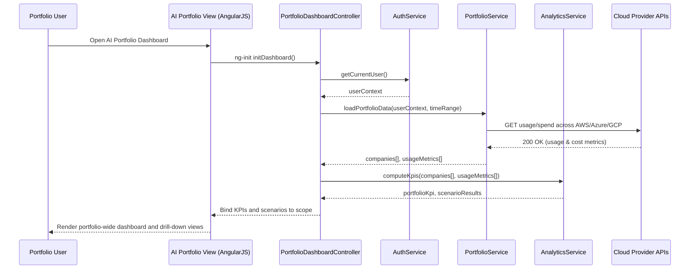

## 1. Architecture Mapping (brief)

- AI Portfolio Dashboard Web App → AngularJS module `aiPortfolioApp`, controllers `PortfolioDashboardController`, directives `companyKpiPanel`, service `PortfolioService`.
- Analytics & Aggregation Engine → AngularJS service `AnalyticsService` and factory `AggregationConfigFactory` to configure metrics and refresh cadence.
- Cloud Provider Data APIs (AWS/Azure/GCP) → AngularJS services `AwsDataService`, `AzureDataService`, `GcpDataService` acting as REST clients.
- SSO Authentication Service → AngularJS service `AuthService` integrating with SSO and exposing current user/session details.

**Recommended folder structure**
- `app/modules/ai-portfolio/`
- `app/modules/ai-portfolio/controllers/`
- `app/modules/ai-portfolio/services/`
- `app/modules/ai-portfolio/directives/`
- `app/modules/ai-portfolio/views/`
- `app/assets/css/`

---

## 2. Component Specifications

| Name | Artifact Type | Responsibility | Key Dependencies |
|------|---------------|----------------|------------------|
| aiPortfolioApp | AngularJS Module | Root module for AI portfolio dashboard and route configuration | `ngRoute`, `PortfolioDashboardController`, `AuthService` |
| PortfolioDashboardController | Controller | Coordinates loading of portfolio KPIs, drill-down data, and scenario simulations | `PortfolioService`, `AnalyticsService`, `$scope`, `$q` |
| AuthService | Service | Manages SSO session state and provides user context to the dashboard | `$http`, SSO endpoints, `ApiConfigFactory` |
| PortfolioService | Service | Retrieves portfolio company list, AI usage, and spend data | `$http`, `AwsDataService`, `AzureDataService`, `GcpDataService` |
| AnalyticsService | Service | Aggregates raw cloud data into KPIs, benchmarks, and scenario simulation outputs | `PortfolioService`, `AggregationConfigFactory` |
| AwsDataService | Service | Wraps REST calls to AWS AI usage/spend APIs | `$http`, `ApiConfigFactory` |
| AzureDataService | Service | Wraps REST calls to Azure AI usage/spend APIs | `$http`, `ApiConfigFactory` |
| GcpDataService | Service | Wraps REST calls to GCP AI usage/spend APIs | `$http`, `ApiConfigFactory` |
| AggregationConfigFactory | Factory | Provides configuration for KPI definitions, refresh intervals, and thresholds | environment config, `$window` |
| companyKpiPanel | Directive | Renders per-company AI usage and spend KPIs in dashboard tiles | `PortfolioDashboardController` scope |
| portfolioSummaryWidget | Directive | Displays portfolio-wide KPIs, benchmarks, and scenario summaries | `PortfolioDashboardController` scope |
| ai-portfolio-dashboard.html | View (HTML5) | Main dashboard layout with filters, charts, and tables | `PortfolioDashboardController`, directives |
| ai-portfolio-dashboard.css | CSS | Styles portfolio dashboard grids, charts containers, and responsive layout | Bootstrap, base app styles |

---

## 3. Data Model (brief)

```js
PortfolioCompany = {
  id: String,
  name: String,
  cloudProviderAccounts: Array<CloudAccount>,
  industry: String
};

CloudAccount = {
  id: String,
  provider: String,         // "AWS" | "Azure" | "GCP"
  accountId: String,
  credentialsRef: String    // reference to secure store entry
};

UsageMetric = {
  companyId: String,
  provider: String,
  serviceName: String,
  timeBucket: String,       // e.g., "2025-02-01T00:00Z"
  usageUnits: Number,
  costAmount: Number,
  currency: String
};

PortfolioKpi = {
  totalAiSpend: Number,
  totalUsageUnits: Number,
  companiesCount: Number,
  avgCostPerUnit: Number,
  benchmarkScore: Number
};

ScenarioResult = {
  scenarioId: String,
  description: String,
  projectedSavings: Number,
  affectedProviders: Array<String>
};

UserDashboardState = {
  userId: String,
  selectedTimeRange: String,
  selectedScenarioId: String | null,
  companies: Array<PortfolioCompany>,
  usageMetrics: Array<UsageMetric>,
  portfolioKpi: PortfolioKpi,
  scenarioResults: Array<ScenarioResult>
};
```

---

## 4. Data Flow (one paragraph)

Authenticated users reach the AngularJS AI portfolio dashboard view, where `PortfolioDashboardController` obtains user context from `AuthService` and invokes `PortfolioService` to fetch companies and raw usage/spend data via `AwsDataService`, `AzureDataService`, and `GcpDataService`; `AnalyticsService` then aggregates this data into portfolio KPIs, benchmarks, and scenario outputs, which are bound to the scope and rendered by HTML5/Bootstrap views through `companyKpiPanel` and `portfolioSummaryWidget` directives.

---

## 5. Primary Sequence Diagram (ONE only)



---

## 6. Implementation Notes (brief)

- Configure AngularJS module `aiPortfolioApp` with routes for the main dashboard and optional company drill-down views using `ngRoute`.
- Use DI for all services and factories with explicit `$inject` arrays, and organize REST client services per cloud provider.
- Implement REST calls with `$http` and ES6-style promise chaining, decoupling data retrieval (`PortfolioService`) from aggregation (`AnalyticsService`).
- Utilize Bootstrap components (grid, cards, modals) for responsive dashboards and chart containers, integrating chart libraries via directives if needed.
- Externalize KPI thresholds and scenario parameters in `AggregationConfigFactory` to avoid hard-coding business rules in controllers.

---

## 7. Error Handling (ONE line)

Client-side error handling uses a global `$http` interceptor to capture API failures and display concise, non-technical alerts while logging details for monitoring.

---

## 8. Security Notes (ONE line)

Standard input validation and secure API calls assumed with enforced SSO-based authentication and least-privilege access to cloud provider credentials.
