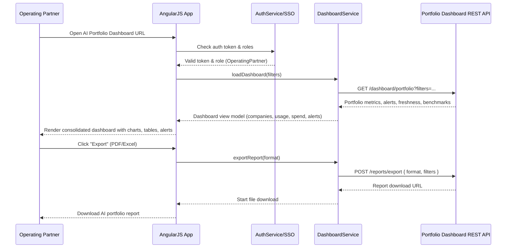

# AI Portfolio Management Dashboard – Low-Level Design (LLD)

## a. Architecture Mapping (brief)

- Cloud Usage Aggregation Service (AWS/Azure/GCP APIs) → `aiPortfolioApp` AngularJS module + `AggregationService` (service) for API calls + `AggregationController` (controller) to trigger sync and show status.
- Portfolio Analytics & Dashboard Service → `DashboardModule` (AngularJS module) with `DashboardController` (controller) and `DashboardService` (service) for portfolio views, widgets, drill-down and exports.
- SSO & RBAC → `AuthModule` (AngularJS module) with `AuthService` (service) handling tokens, SSO redirects, roles; `AuthInterceptor` (factory) for attaching auth headers and handling 401/403.
- AI Portfolio Data Store → REST API endpoints consumed via `DataService` (service) encapsulating company, usage, benchmark and alert data operations.
- Alerts & Notifications → `AlertService` (service) and lightweight `alertBanner` directive for displaying budget threshold and data freshness alerts.
- Reporting & Export → `ReportService` (service) to request PDF/Excel exports and manage download flows, used by `DashboardController`.

**Recommended folder structure**
- `app/`
  - `app.module.js`
  - `core/`
    - `services/auth.service.js`
    - `services/auth-interceptor.factory.js`
    - `services/data.service.js`
    - `services/aggregation.service.js`
    - `services/dashboard.service.js`
    - `services/alert.service.js`
    - `services/report.service.js`
  - `dashboard/`
    - `dashboard.module.js`
    - `dashboard.controller.js`
    - `dashboard.html`
  - `company-detail/`
    - `company-detail.module.js`
    - `company-detail.controller.js`
    - `company-detail.html`
  - `auth/`
    - `login.controller.js`
    - `login.html`
  - `directives/`
    - `alert-banner.directive.js`
    - `data-freshness-indicator.directive.js`
  - `assets/css/`
    - `styles.css`

---

## b. Component Specifications (table format)

| Name | Artifact Type | Responsibility | Key Dependencies |
|------|--------------|----------------|------------------|
| `aiPortfolioApp` | AngularJS Module | Root module wiring submodules, routes, and global config | AngularJS, `DashboardModule`, `AuthModule`, `ngRoute` |
| `DashboardModule` | AngularJS Module | Encapsulate main portfolio dashboard features and views | `DashboardController`, `DashboardService`, `AlertService` |
| `companyDetailModule` | AngularJS Module | Provide drill-down views for company, department, and project analytics | `CompanyDetailController`, `DataService`, `DashboardService` |
| `AuthModule` | AngularJS Module | Configure auth-related services, interceptor, and login routes | `AuthService`, `AuthInterceptor`, `$httpProvider` |
| `AggregationService` | Service | Trigger and monitor cloud aggregation jobs, expose status to UI | REST APIs `/aggregation/*`, `$http`, `AuthService` |
| `DashboardService` | Service | Fetch consolidated portfolio metrics, widgets, benchmarks, alerts for dashboard | REST APIs `/dashboard/*`, `DataService`, `$http` |
| `DataService` | Service | Generic data access layer for companies, usage, benchmarks, alerts | `$http`, `AuthService`, backend REST APIs |
| `AuthService` | Service | Handle SSO login, logout, token storage, RBAC role checks | SSO endpoint, `$http`, `$window.localStorage` |
| `AuthInterceptor` | Factory | Attach auth tokens to requests, handle 401/403 globally | `$q`, `AuthService`, `$injector` |
| `AlertService` | Service | Manage AI budget threshold alerts and data freshness notifications | REST APIs `/alerts/*`, `$http`, `DataService` |
| `ReportService` | Service | Request and download PDF/Excel reports for portfolio and company views | REST APIs `/reports/*`, `$http`, browser download APIs |
| `DashboardController` | Controller | Control main dashboard page, load widgets, handle filters, export and navigation | `DashboardService`, `AlertService`, `ReportService`, `$scope` |
| `CompanyDetailController` | Controller | Manage company drill-down view with department/project usage and spend | `DataService`, `DashboardService`, `$routeParams`, `$scope` |
| `LoginController` | Controller | Start SSO/OIDC flow or credential-based login and route to dashboard | `AuthService`, `$location`, `$scope` |
| `alertBanner` | Directive | Reusable Bootstrap-styled alert banner for budget and data freshness warnings | `AlertService`, `DashboardController` |
| `dataFreshnessIndicator` | Directive | Display freshness state (OK/warning) for each company card | `DashboardService`, `CompanyDetailController` |

---

## c. Data Model (brief)

**Core JS models (ES6 classes or plain objects):**

- `User`:
  - `id: String`
  - `name: String`
  - `email: String`
  - `role: String` // e.g., `EnterpriseAdmin`, `OperatingPartner`, `DealPartner`, `GeneralPartner`
  - `assignedCompanies: Array<String>`

- `Company`:
  - `id: String`
  - `name: String`
  - `industry: String`
  - `currency: String` // default `USD`
  - `cloudProviders: Array<String>` // e.g., `['AWS','Azure','GCP']`

- `UsageMetric`:
  - `companyId: String`
  - `provider: String` // `AWS` | `Azure` | `GCP`
  - `serviceName: String`
  - `usageAmount: Number`
  - `usageUnit: String`
  - `costAmount: Number`
  - `costCurrency: String`
  - `department: String`
  - `project: String`
  - `timestamp: String` // ISO date-time

- `BudgetThreshold`:
  - `companyId: String`
  - `monthlyBudget: Number`
  - `currency: String`

- `Alert`:
  - `id: String`
  - `companyId: String`
  - `type: String` // e.g., `BUDGET_EXCEEDED`, `DATA_OUTDATED`
  - `severity: String` // e.g., `INFO`, `WARN`, `CRITICAL`
  - `message: String`
  - `createdAt: String` // ISO date-time

- `BenchmarkMetric`:
  - `industry: String`
  - `metricName: String`
  - `value: Number`
  - `unit: String`

- `DataFreshness`:
  - `companyId: String`
  - `lastUpdatedAt: String` // ISO date-time
  - `status: String` // `FRESH` | `STALE`

---

## d. Data Flow (one paragraph)

An authorized user authenticates via the login view, which invokes `AuthService` and SSO to obtain a token and roles; upon success, the AngularJS router loads the dashboard HTML view controlled by `DashboardController`, which calls `DashboardService` and `DataService` to retrieve consolidated portfolio metrics, alerts, data freshness, and benchmarking data through REST APIs; any user filters, drill-down actions, or export requests are handled by the controller, which invokes `CompanyDetailController` (for specific company views), `AlertService`, and `ReportService` as needed; responses from services update the scoped models, triggering AngularJS two-way binding to refresh charts, tables, alerts, and indicators in the Bootstrap-styled UI.

---

## e. Primary Sequence Diagram (ONE only)

---

## f. Implementation Notes (brief)

- Use AngularJS 1.x modules to separate concerns (`aiPortfolioApp`, `DashboardModule`, `AuthModule`) and configure routes with `ngRoute` or `ui-router`.
- Implement dependency injection for all services and controllers using explicit `$inject` arrays to avoid minification issues.
- Use ES6 features (const/let, arrow functions, classes for models) with a transpilation step if older browsers must be supported.
- Integrate REST APIs via `$http` or `$resource`, centralizing base URLs and error handling in `DataService` and `AuthInterceptor`.
- Style views with Bootstrap grid and components, keeping dashboard widgets responsive and accessible (WCAG 2.1 AA).

---

## g. Error Handling (ONE line)

Client-side error handling will use an `$http` interceptor (`AuthInterceptor`) plus lightweight try/catch in services to surface errors via `AlertService` and non-blocking Bootstrap alerts.

---

## h. Security Notes (ONE line)

Standard input validation and secure API calls assumed, with SSO-based authentication, role-based access control, TLS 1.2+ transport security, and token storage in secure browser mechanisms.
