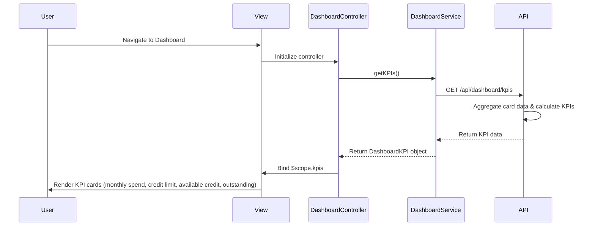

# Low-Level Design: Dashboard KPIs

**Epic ID**: QE-4860

## a. Architecture Mapping

**HLD Component → AngularJS Artifact Mapping:**
- Dashboard UI Layer → `DashboardController` + `views/dashboard.html`
- API Gateway interaction → `DashboardService` (handles REST API calls)
- KPI Display Components → Custom directives: `appKpiCard`, `appCreditSummary`
- Dashboard Module → `app.dashboard` module with routing via `ui-router`

**Recommended Folder Structure:**
```
app/
  dashboard/
    dashboard.module.js
    dashboard.controller.js
    dashboard.service.js
    dashboard.routes.js
    views/dashboard.html
  shared/
    directives/kpi-card.directive.js
    directives/credit-summary.directive.js
    services/api.service.js
```

## b. Component Specifications

| Component Name | Artifact Type | Responsibility | Key Dependencies |
|---|---|---|---|
| DashboardController | Controller | Orchestrates dashboard view, fetches KPI data, handles user interactions | DashboardService, $scope |
| DashboardService | Service | Fetches aggregated KPI data from API Gateway endpoint `/api/dashboard/kpis` | $http, ApiService |
| appKpiCard | Directive | Renders individual KPI metric card (monthly spend, credit limit, etc.) with label and value | None |
| appCreditSummary | Directive | Displays consolidated credit summary (available credit, outstanding amount) with visual indicators | None |
| dashboard.html | View | Main dashboard template displaying KPI cards in responsive grid layout | Bootstrap grid system |
| ApiService | Service | Centralizes API configuration, base URL, and common headers | $http |

## c. Data Model

```javascript
DashboardKPI = {
  monthlySpend: Number,
  totalCreditLimit: Number,
  availableCredit: Number,
  outstandingAmount: Number,
  lastUpdated: String
}

CreditCard = {
  cardId: String,
  cardNumber: String,
  cardType: String,
  creditLimit: Number,
  availableCredit: Number,
  outstandingBalance: Number
}
```

## d. Data Flow

User navigates to dashboard → View (`dashboard.html`) loads and triggers `DashboardController` initialization → Controller calls `DashboardService.getKPIs()` → Service makes GET request to `/api/dashboard/kpis` via API Gateway → API Gateway routes to Dashboard Service which aggregates data from Credit Card Data Service and Database → Response returns aggregated KPI object → Controller binds data to `$scope.kpis` → View renders KPI cards using `appKpiCard` and `appCreditSummary` directives in responsive Bootstrap grid → User sees monthly spend, total credit limit, available credit, and outstanding amount displayed in real-time.

## e. Primary Sequence Diagram



## f. Implementation Notes

- Use AngularJS component-based architecture with `DashboardController` managing view state and delegating API calls to `DashboardService`
- Implement dependency injection using `$inject` array annotation for minification safety: `DashboardController.$inject = ['$scope', 'DashboardService']`
- Centralize all API calls in `DashboardService` using `$http` with promise-based error handling; never call API directly from controller
- Use ES6 arrow functions, `const`/`let`, and template literals throughout (transpile via Babel)
- Implement responsive layout using Bootstrap grid classes (`col-md-3`, `col-sm-6`, `col-xs-12`) for KPI cards to support desktop, tablet, and mobile views

## g. Error Handling

Implement HTTP interceptor (`$httpProvider.interceptors`) for global error handling with user-friendly notifications via toast/alert service on API failures.

## h. Security Notes

Requires token-based authentication via existing SSO; API Gateway validates session tokens before routing dashboard KPI requests.