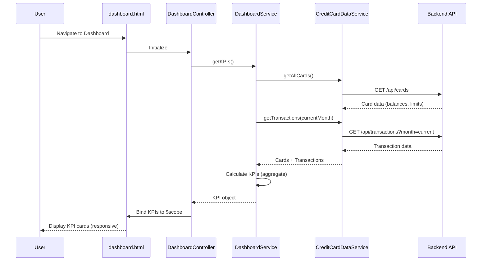

# Low-Level Design: Dashboard KPIs

**Epic ID:** QE-4860  
**Application:** Credit Card Analysis Dashboard  
**Tech Stack:** AngularJS 1.x, JavaScript ES6, HTML5, CSS3, Bootstrap, REST APIs, MVC Architecture

---

## a. Architecture Mapping

| HLD Component | AngularJS Artifact |
|---|---|
| Dashboard UI Layer | `DashboardController` + `views/dashboard.html` |
| API Gateway / Dashboard Service | `DashboardService` (Factory wrapping `$http` calls) |
| Credit Card Data Service | `CreditCardDataService` (Factory for card/transaction API calls) |
| KPI Calculation Logic | `DashboardService` (aggregates data from API responses) |
| Responsive Layout | Bootstrap grid + custom CSS in `dashboard.html` |

**Recommended Folder Structure:**
```
app/
  dashboard/
    dashboard.module.js
    dashboard.controller.js
    dashboard.service.js
    dashboard.routes.js
    views/dashboard.html
  shared/
    services/creditCardData.service.js
    interceptors/auth.interceptor.js
```

---

## b. Component Specifications

| Component Name | Artifact Type | Responsibility | Key Dependencies |
|---|---|---|---|
| `DashboardController` | Controller | Manages dashboard view state, fetches KPI data, binds to UI | `DashboardService`, `$scope` |
| `DashboardService` | Factory | Aggregates card data, calculates KPIs (monthly spend, available credit, outstanding), exposes API methods | `CreditCardDataService`, `$http`, `$q` |
| `CreditCardDataService` | Factory | Fetches card balances and transaction data from backend APIs | `$http`, `$q` |
| `dashboard.html` | View | Renders KPI cards (monthly spend, total credit limit, available credit, outstanding amount) using Bootstrap responsive grid | None (bound to `DashboardController`) |
| `AuthInterceptor` | Interceptor | Attaches authentication token to outgoing API requests | `$httpProvider` |

---

## c. Data Model

```js
DashboardKPI = {
  monthlySpend: Number,
  totalCreditLimit: Number,
  availableCredit: Number,
  outstandingAmount: Number
}

CreditCard = {
  cardId: String,
  cardNumber: String,
  creditLimit: Number,
  currentBalance: Number,
  availableCredit: Number
}

Transaction = {
  transactionId: String,
  cardId: String,
  amount: Number,
  category: String,
  date: Date,
  description: String
}
```

---

## d. Data Flow

User navigates to dashboard → `dashboard.html` loads and `DashboardController` initializes → Controller calls `DashboardService.getKPIs()` → `DashboardService` invokes `CreditCardDataService.getAllCards()` and `CreditCardDataService.getTransactions()` → Services make REST API calls via `$http` to backend (API Gateway → Dashboard Service → Credit Card Data Service → Database) → Backend returns card balances and transaction data → `DashboardService` aggregates data client-side (sums credit limits, calculates available credit, filters current month transactions for monthly spend, sums outstanding balances) → Calculated KPIs are returned to `DashboardController` → Controller binds KPI object to `$scope` → View updates with monthly spend, total credit limit, available credit, and outstanding amount displayed in responsive Bootstrap cards.

---

## e. Primary Sequence Diagram



---

## f. Implementation Notes

- Use AngularJS Factory pattern for `DashboardService` and `CreditCardDataService` to ensure singleton behavior and centralized API logic.
- Apply ES6 arrow functions and `const`/`let` for cleaner service methods; use template literals for dynamic API endpoint construction.
- Implement constructor-based dependency injection with `$inject` annotation for minification safety (e.g., `DashboardController.$inject = ['$scope', 'DashboardService'];`).
- Leverage `$q.all()` to parallelize API calls for cards and transactions, reducing total load time.
- Use Bootstrap responsive grid classes (`col-xs-*`, `col-sm-*`, `col-md-*`, `col-lg-*`) in `dashboard.html` to ensure KPI cards adapt to desktop, tablet, and mobile viewports.

---

## g. Error Handling

HTTP interceptor captures API errors (4xx/5xx), displays user-friendly toast notifications via a shared `NotificationService`, and logs errors to console for debugging.

---

## h. Security Notes

Requires token-based authentication via existing SSO; `AuthInterceptor` attaches JWT to all API requests, and backend validates token before serving card/transaction data.