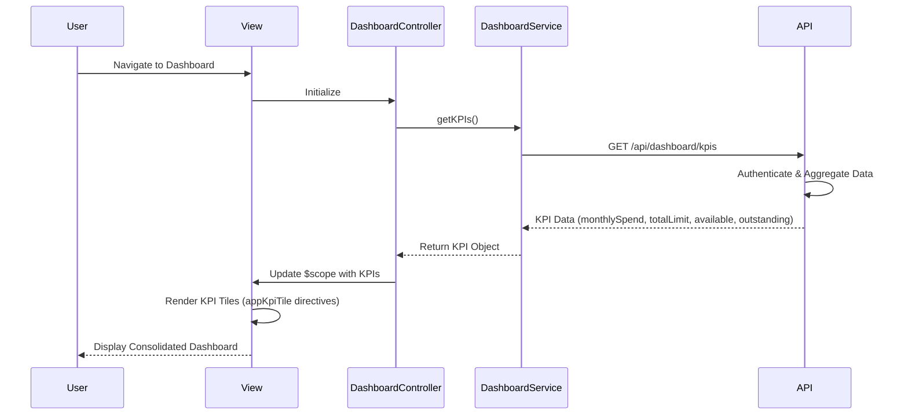

# Low-Level Design: Dashboard KPIs and Financial Overview

## a. Architecture Mapping

- **Dashboard UI Layer** → AngularJS Module (`app.dashboard`) + Controller (`DashboardController`) + View (`dashboard.html`)
- **KPI Display Components** → Directives (`appKpiTile`, `appSummaryCard`)
- **Dashboard Service** → Service (`DashboardService`) for API calls and KPI aggregation
- **Credit Card Data Service Integration** → Factory (`CreditCardDataFactory`) for shared card data access
- **API Gateway Communication** → HTTP Interceptor for authentication and error handling

**Recommended Folder Structure**:
```
app/
  dashboard/
    dashboard.module.js
    dashboard.controller.js
    dashboard.service.js
    dashboard.routes.js
    views/dashboard.html
  shared/
    services/creditCardData.factory.js
    directives/kpiTile.directive.js
    directives/summaryCard.directive.js
    interceptors/auth.interceptor.js
```

## b. Component Specifications

| Name | Artifact Type | Responsibility | Key Dependencies |
|------|---------------|----------------|------------------|
| DashboardController | Controller | Orchestrates dashboard view, fetches KPI data, handles user interactions | DashboardService, $scope |
| DashboardService | Service | Fetches aggregated KPI data from API Gateway, calculates client-side metrics if needed | $http, CreditCardDataFactory |
| CreditCardDataFactory | Factory | Singleton for shared credit card data access and caching | $http |
| appKpiTile | Directive | Reusable UI component for displaying individual KPI metrics (monthly spend, credit limit, etc.) | None |
| appSummaryCard | Directive | Reusable UI component for card-level summary display | None |
| AuthInterceptor | Interceptor | Handles authentication token injection and error responses | $q, $injector |
| app.dashboard | Module | Groups dashboard-related controllers, services, directives, and routes | ui.router, app.shared |

## c. Data Model

```javascript
DashboardKPI = {
  monthlySpend: Number,
  totalCreditLimit: Number,
  availableCredit: Number,
  outstandingAmount: Number,
  lastUpdated: Date
}

CreditCard = {
  id: String,
  cardName: String,
  creditLimit: Number,
  availableCredit: Number,
  outstandingAmount: Number,
  lastFourDigits: String
}
```

## d. Data Flow

User navigates to dashboard → `dashboard.html` view loads → `DashboardController` initializes and calls `DashboardService.getKPIs()` → `DashboardService` makes REST API call via `$http` to API Gateway endpoint `/api/dashboard/kpis` → API Gateway authenticates request (via `AuthInterceptor`) and routes to Dashboard Service backend → Dashboard Service aggregates data from Credit Card Data Service and Database → Response containing monthly spend, total credit limit, available credit, and outstanding amount returns to `DashboardService` → `DashboardController` updates `$scope` with KPI data → View renders KPI tiles using `appKpiTile` directives with responsive Bootstrap layout → User sees consolidated financial snapshot.

## e. Primary Sequence Diagram



## f. Implementation Notes

- DI: Use constructor injection with `$inject` array annotation for minification safety (e.g., `DashboardController.$inject = ['$scope', 'DashboardService']`)
- API calls: Centralize all REST calls in `DashboardService`, never call `$http` directly from controllers
- ES6: Use `const`/`let`, arrow functions in service methods, template literals for API endpoint construction
- Responsive UI: Leverage Bootstrap grid system (col-xs, col-sm, col-md, col-lg) for KPI tile layout across devices
- State management: Use `ui-router` for dashboard route configuration with resolve to pre-fetch KPI data before view renders

## g. Error Handling

Use HTTP interceptor (`AuthInterceptor`) to catch API errors globally; display user-friendly notifications via a shared notification service for failed KPI loads.

## h. Security Notes

Requires token-based authentication via existing SSO; tokens injected into API requests through HTTP interceptor.