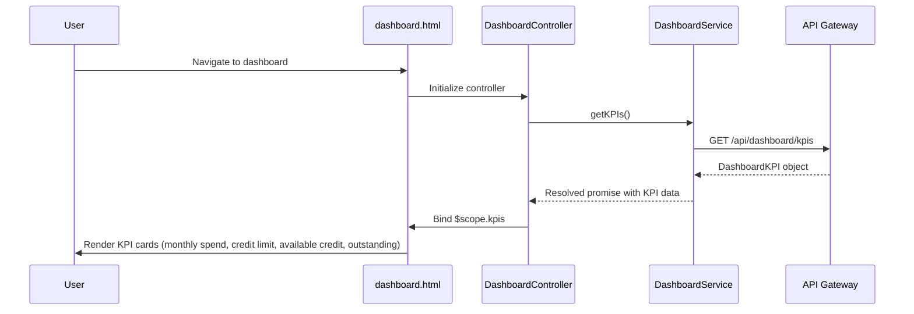

# Low-Level Design: Dashboard KPIs

**Epic ID**: QE-4860

---

## a. Architecture Mapping

- **Dashboard UI Layer** → `DashboardController` + `dashboard.html` view
- **API Gateway interaction** → `DashboardService` (handles API calls)
- **Dashboard Service (backend)** → REST API endpoint consumed by `DashboardService`
- **KPI Display Components** → `appKpiCard` directive (reusable KPI card)
- **Feature grouping** → `app.dashboard` module

**Recommended Folder Structure**:
```
app/
  dashboard/
    dashboard.module.js
    dashboard.controller.js
    dashboard.service.js
    dashboard.routes.js
    views/dashboard.html
  shared/
    directives/kpi-card.directive.js
```

---

## b. Component Specifications

| Name | Artifact Type | Responsibility | Key Dependencies |
|------|---------------|----------------|------------------|
| `app.dashboard` | Module | Groups dashboard feature artifacts | `ui.router`, `ngResource` |
| `DashboardController` | Controller | Orchestrates dashboard view, fetches KPI data, handles user interactions | `DashboardService`, `$scope` |
| `DashboardService` | Service | Fetches aggregated KPI data from API Gateway, handles API errors | `$http`, `$q` |
| `appKpiCard` | Directive | Renders individual KPI card (monthly spend, credit limit, available credit, outstanding) | None |
| `dashboard.html` | View | Displays KPI cards in responsive grid layout using Bootstrap | `DashboardController`, `appKpiCard` |

---

## c. Data Model

```js
DashboardKPI = {
  monthlySpend: Number,
  totalCreditLimit: Number,
  availableCredit: Number,
  outstandingAmount: Number,
  lastUpdated: String
}
```

---

## d. Data Flow

User navigates to dashboard → `dashboard.html` view loads → `DashboardController` initializes and calls `DashboardService.getKPIs()` → `DashboardService` sends GET request to API Gateway endpoint (`/api/dashboard/kpis`) → API Gateway authenticates, routes to Dashboard Service → Dashboard Service aggregates data from Credit Card Data Service and Database, calculates KPIs → Response with `DashboardKPI` object returned to `DashboardService` → `DashboardController` binds data to `$scope.kpis` → `appKpiCard` directives render each KPI in responsive Bootstrap grid → User views consolidated KPI snapshot.

---

## e. Primary Sequence Diagram



---

## f. Implementation Notes

- Use constructor injection with `$inject` array annotation for minification safety: `DashboardController.$inject = ['$scope', 'DashboardService'];`
- Centralize all API calls in `DashboardService`; controller never calls `$http` directly
- Use ES6 `const`/`let`, arrow functions, and template literals (assume Babel transpilation)
- Implement responsive grid with Bootstrap classes (`col-xs-12 col-sm-6 col-md-3`) for KPI cards
- Use `$q` promises for async operations; handle errors in service layer and propagate to controller

---

## g. Error Handling

Implement HTTP interceptor to catch API errors; display user-friendly error messages via `$scope.errorMessage` in dashboard view.

---

## h. Security Notes

Requires token-based authentication via existing SSO; API Gateway validates tokens before routing requests to Dashboard Service.