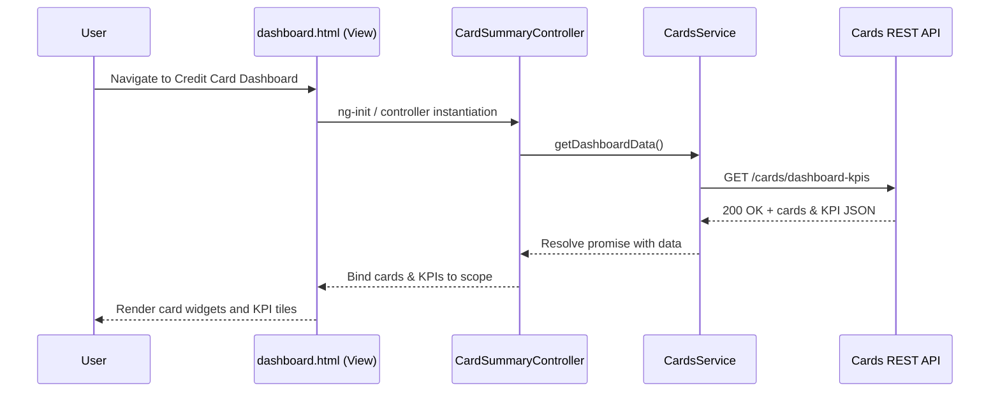

# Credit Card Analysis Dashboard - Low Level Design (LLD)

## a. Architecture Mapping (brief)
- Credit Card Dashboard → `ccDashboardModule` (AngularJS module)
- Card Summary View → `CardSummaryController` (controller) + `cardSummary` (directive)
- Transactions View → `TransactionsController` (controller) + `transactionsList` (directive)
- Spending Analytics View → `SpendingAnalyticsController` (controller) + `spendingChart` (directive)
- Cards Service → `CardsService` (service) for card & limit data
- Transactions Service → `TransactionsService` (service) for transaction data
- Analytics Service → `AnalyticsService` (service) for category-wise aggregations

**Recommended folder structure**
- `app/`
  - `app.module.js`
  - `controllers/`
    - `card-summary.controller.js`
    - `transactions.controller.js`
    - `spending-analytics.controller.js`
  - `services/`
    - `cards.service.js`
    - `transactions.service.js`
    - `analytics.service.js`
  - `directives/`
    - `card-summary.directive.js`
    - `transactions-list.directive.js`
    - `spending-chart.directive.js`
  - `views/`
    - `dashboard.html`
    - `transactions.html`
    - `analytics.html`
  - `assets/css/dashboard.css`

## b. Component Specifications

| Name                       | Artifact Type | Responsibility                                           | Key Dependencies                          |
|----------------------------|--------------|----------------------------------------------------------|-------------------------------------------|
| `ccDashboardModule`        | Module       | Root module wiring controllers, services, and routing    | AngularJS, ui-router/ngRoute              |
| `CardSummaryController`    | Controller   | Load and bind card KPIs: limits, available credit, dues | `CardsService`, `$scope`, `$q`            |
| `cardSummary`              | Directive    | Render responsive card KPIs widget                       | `CardSummaryController`, Bootstrap, CSS   |
| `TransactionsController`   | Controller   | Fetch and display recent card transactions               | `TransactionsService`, `$scope`, `$filter`|
| `transactionsList`         | Directive    | Present transactions table with sorting/filtering        | `TransactionsController`, Bootstrap table |
| `SpendingAnalyticsController` | Controller | Compute & expose category-wise spending data             | `AnalyticsService`, `$scope`              |
| `spendingChart`            | Directive    | Render charts for category-wise spend                    | Charting lib (e.g., Chart.js), controller |
| `CardsService`             | Service      | REST calls for cards, limits, outstanding amounts        | `$http`, REST APIs                        |
| `TransactionsService`      | Service      | REST calls for transaction history per card              | `$http`, REST APIs                        |
| `AnalyticsService`         | Service      | Transform transactions into category/period aggregates   | `TransactionsService`, ES6 array helpers  |
| `DashboardRouteConfig`     | Config       | Define routes/states for dashboard, transactions, charts | `ccDashboardModule`, `$stateProvider`     |

## c. Data Model (brief)

```js
// Card model
Card = {
  id: String,
  cardNumberMasked: String,
  cardAlias: String,
  issuerName: String,
  creditLimit: Number,
  availableCredit: Number,
  outstandingAmount: Number,
  billingCycleDay: Number
};

// Transaction model
Transaction = {
  id: String,
  cardId: String,
  txnDate: Date,
  postedDate: Date,
  amount: Number,
  currency: String,
  category: String, // Food & Dining, Fuel, Shopping, etc.
  merchantName: String,
  city: String,
  country: String
};

// Category spend aggregate
CategorySpend = {
  category: String,
  totalAmount: Number,
  month: String,   // e.g., '2026-08'
  cardId: String | null
};

// Dashboard KPIs snapshot
DashboardKpi = {
  totalMonthlySpend: Number,
  totalCreditLimit: Number,
  totalAvailableCredit: Number,
  totalOutstandingAmount: Number
};
```

## d. Data Flow (one paragraph)

User opens the Credit Card Analysis Dashboard route, which loads `dashboard.html` view; this view initializes `CardSummaryController` that invokes `CardsService` to call REST APIs and retrieve card and KPI data, then binds results to the scope for the `cardSummary` directive to render responsive widgets, while navigation to Transactions or Analytics views triggers respective controllers to call `TransactionsService` and `AnalyticsService` for transaction and category aggregates, and upon successful API responses, AngularJS data binding updates the UI charts and tables without full page reload.

## e. Primary Sequence Diagram (ONE only)



## f. Implementation Notes (brief)
- Use AngularJS 1.x module pattern with dependency injection for controllers, services, and directives.
- Implement REST calls in services using `$http` with ES6 promises, centralizing base URL configuration.
- Use ui-router or ngRoute to manage dashboard, transactions, and analytics views within a single-page layout.
- Apply Bootstrap grid system and responsive utility classes for card widgets and charts layout.
- Encapsulate chart rendering in directives, receiving pre-aggregated data from controllers via isolated scope bindings.

## g. Error Handling (ONE line)

Client-side error handling via `$http` interceptor that maps API errors to user-friendly toast/alert notifications.

## h. Security Notes (ONE line)

Standard input validation and secure API calls assumed, with HTTPS-only REST endpoints and masked display of card numbers.
