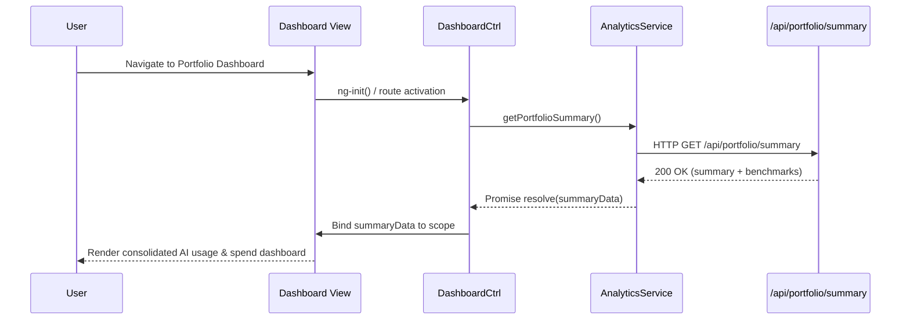

# QE-4918 – Portfolio AI Usage Visibility & Analytics – LLD

## a. Architecture Mapping (brief)
- Portfolio Usage Dashboard → AngularJS module `aiPortfolioDashboard`, controller `DashboardCtrl`, services `AnalyticsService`, `BenchmarkService`, `ExportService`.
- Executive Summary View → AngularJS directive `executiveSummaryCard`, controller `ExecutiveSummaryCtrl`.
- Benchmarking Tools → AngularJS service `BenchmarkService`, directive `benchmarkChart`.
- Company Drill-down View → Controller `CompanyDetailCtrl`, directive `companyUsageGrid`.
- Data Freshness Indicators → Directive `dataFreshnessBadge`, service `DataStatusService`.
- Report Export (PDF/Excel) → Service `ExportService` with REST API integration.

Recommended folder structure (partial):
- `app/modules/portfolio-dashboard/`
- `app/modules/portfolio-dashboard/controllers/`
- `app/modules/portfolio-dashboard/services/`
- `app/modules/portfolio-dashboard/directives/`
- `app/assets/templates/portfolio-dashboard/`

## b. Component Specifications
| Name                    | Artifact Type     | Responsibility (1 line)                                              | Key Dependencies                        |
|-------------------------|------------------|---------------------------------------------------------------------|------------------------------------------|
| aiPortfolioDashboard    | AngularJS Module | Group all portfolio dashboard components and configure routes.      | `ui.router`, `AnalyticsService`         |
| DashboardCtrl           | Controller       | Load consolidated usage/spend KPIs and bind to main dashboard view. | `AnalyticsService`, `$state`, `$q`      |
| ExecutiveSummaryCtrl    | Controller       | Populate high-level AI impact and KPI tiles for executives.         | `AnalyticsService`                      |
| CompanyDetailCtrl       | Controller       | Handle drill-down navigation and data for a selected company.       | `AnalyticsService`, `$stateParams`      |
| AnalyticsService        | Service          | Call REST APIs to fetch portfolio metrics, trends, and drill-downs. | `$http`, `ApiConfig`, `DataStatusService` |
| BenchmarkService        | Service          | Compute client-side benchmark deltas and normalize for charts.      | `AnalyticsService`, `Lodash`            |
| ExportService           | Service          | Trigger PDF/Excel export via REST endpoints and handle downloads.   | `$http`, `ApiConfig`                    |
| DataStatusService       | Service          | Retrieve and format data freshness/status per company/entity.       | `$http`, `ApiConfig`                    |
| DashboardRouteConfig    | Config/Factory   | Define routes/states for dashboard, company detail, and summary.    | `ui.router`                             |
| executiveSummaryCard    | Directive        | Render executive summary tiles as a reusable widget.                | `ExecutiveSummaryCtrl`                  |
| benchmarkChart          | Directive        | Render benchmark comparison charts (portfolio vs. peers).           | `BenchmarkService`, chart library       |
| companyUsageGrid        | Directive        | Tabular view of company-level AI usage by department/project.       | `CompanyDetailCtrl`                     |
| dataFreshnessBadge      | Directive        | Display colored freshness indicator with tooltip for entities.      | `DataStatusService`                     |
| loadingSpinner          | Directive        | Provide reusable loading spinner for dashboard regions.             | `$http` interceptors                     |

## c. Data Model (brief)
- `PortfolioSummary`:
  - `totalCompanies: number`
  - `totalSpend: number`
  - `avgSpendPerCompany: number`
  - `avgLoadTimeMs: number`
  - `dataFreshnessPct: number`

- `CompanyUsage`:
  - `companyId: string`
  - `companyName: string`
  - `industry: string`
  - `totalSpend: number`
  - `aiUsageScore: number`
  - `dataFreshnessStatus: 'FRESH' | 'STALE' | 'MISSING'`
  - `lastUpdatedAt: string` (ISO datetime)

- `DepartmentUsage`:
  - `departmentId: string`
  - `departmentName: string`
  - `projectCount: number`
  - `spend: number`
  - `usageScore: number`

- `BenchmarkMetric`:
  - `metricKey: string`
  - `portfolioValue: number`
  - `benchmarkValue: number`
  - `deltaPct: number`

- `ExportRequest`:
  - `format: 'PDF' | 'XLSX'`
  - `scope: 'PORTFOLIO' | 'COMPANY'`
  - `companyId?: string`

## d. Data Flow (one paragraph)
User selects a portfolio or company view in the dashboard UI, which triggers the AngularJS view to initialize and bind to `DashboardCtrl` or `CompanyDetailCtrl`; the controller invokes `AnalyticsService` (and `DataStatusService` where needed), which calls REST APIs to retrieve consolidated usage, spend, benchmarks, and freshness data, and upon successful response the controller updates the scoped models used by directives like `executiveSummaryCard`, `benchmarkChart`, and `companyUsageGrid`, resulting in the UI dynamically rendering updated charts, tables, and indicators.

## e. Primary Sequence Diagram (ONE only)

## f. Implementation Notes (brief)
- Use AngularJS `ui.router` for state-based navigation between dashboard, company detail, and executive summary views.
- Inject services (`AnalyticsService`, `BenchmarkService`, `ExportService`) via AngularJS DI and keep controllers thin (view-model only).
- Use ES6 features (arrow functions, `const`/`let`, template literals) within services while transpiling if older browsers must be supported.
- Integrate charts via a lightweight directive wrapping the chosen charting library, binding to plain JS model objects.
- Implement REST calls using `$http` with centralized `ApiConfig` for base URLs and timeouts aligned to NFRs.

## g. Error Handling (ONE line)
Client-side errors handled via `$http` interceptor showing non-intrusive toast notifications and fallback empty-state views for widgets.

## h. Security Notes (ONE line)
Standard input validation and secure API calls with TLS/HTTPS assumed, with access scoping enforced by backend RBAC per user/company.
