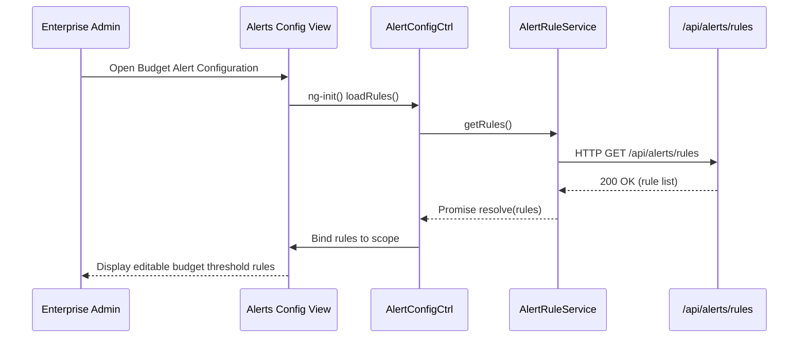

# QE-4919 – Cloud AI Usage Ingestion & Alerts – LLD

## a. Architecture Mapping (brief)
- Secure Ingestion Layer → AngularJS service `CloudIngestionService` exposed via admin console controller.
- Data Pipeline & Normalization → Backend APIs surfaced to UI via `PipelineStatusService` and `NormalizationService` (client view only).
- AI Portfolio Data Store → Accessed through REST APIs, consumed by `PipelineStatusService` for monitoring views.
- Alerting & Notification UI → AngularJS module `aiAlerts`, controller `AlertConfigCtrl`, directive `alertRuleList`.
- Scenario Simulation & Optimization → Controller `ScenarioSimulationCtrl`, service `ScenarioService`.

Recommended folder structure (partial):
- `app/modules/ingestion-admin/`
- `app/modules/ingestion-admin/controllers/`
- `app/modules/ingestion-admin/services/`
- `app/modules/alerts/`
- `app/modules/alerts/directives/`

## b. Component Specifications
| Name                    | Artifact Type     | Responsibility (1 line)                                              | Key Dependencies                     |
|-------------------------|------------------|---------------------------------------------------------------------|---------------------------------------|
| ingestionAdmin          | AngularJS Module | Group ingestion config/status views and related services.           | `ui.router`, `PipelineStatusService` |
| CloudIngestionService   | Service          | Trigger and monitor ingestion jobs from AWS/Azure/GCP APIs.         | `$http`, `ApiConfig`                 |
| PipelineStatusService   | Service          | Fetch pipeline run status, latency, and data freshness metrics.     | `$http`, `ApiConfig`                 |
| NormalizationService    | Service          | Retrieve normalized data schema metadata for display.               | `$http`, `ApiConfig`                 |
| AlertConfigCtrl         | Controller       | Manage budget threshold and data freshness alert rules.             | `AlertRuleService`, `$state`         |
| AlertRuleService        | Service          | CRUD operations for alert rules and notification targets.           | `$http`, `ApiConfig`                 |
| ScenarioSimulationCtrl  | Controller       | Capture user inputs for cost-saving simulations and show results.   | `ScenarioService`                    |
| ScenarioService         | Service          | Call backend APIs for vendor consolidation and cost simulations.    | `$http`, `ApiConfig`                 |
| alertRuleList           | Directive        | Render alert rules grid with enable/disable toggles.                | `AlertConfigCtrl`                    |
| pipelineStatusWidget    | Directive        | Compact component showing latest ingestion status and freshness.    | `PipelineStatusService`              |

## c. Data Model (brief)
- `CloudAccountConfig`:
  - `provider: 'AWS' | 'Azure' | 'GCP'`
  - `accountId: string`
  - `displayName: string`
  - `status: 'CONNECTED' | 'ERROR' | 'PENDING'`

- `PipelineRunStatus`:
  - `runId: string`
  - `startTime: string` (ISO datetime)
  - `endTime?: string` (ISO datetime)
  - `status: 'RUNNING' | 'SUCCESS' | 'FAILED'`
  - `processedCompanies: number`

- `AlertRule`:
  - `ruleId: string`
  - `type: 'BUDGET_THRESHOLD' | 'DATA_FRESHNESS'`
  - `thresholdValue: number`
  - `windowHours: number`
  - `isActive: boolean`

- `SimulationRequest`:
  - `companyId: string`
  - `currentVendors: string[]`
  - `targetVendor: string`
  - `timeHorizonMonths: number`

- `SimulationResult`:
  - `estimatedSavings: number`
  - `baselineCost: number`
  - `optimizedCost: number`

## d. Data Flow (one paragraph)
User opens the ingestion admin or alerts configuration view, the AngularJS view initializes `AlertConfigCtrl` or admin controllers, which call services like `CloudIngestionService`, `PipelineStatusService`, and `AlertRuleService`; these services invoke REST APIs to fetch current ingestion status, data freshness, account configs, or to persist alert rule changes, and on success the controllers update scope models that directives such as `alertRuleList` and `pipelineStatusWidget` use to render live status, thresholds, and simulation results in the UI.

## e. Primary Sequence Diagram (ONE only)

## f. Implementation Notes (brief)
- Use AngularJS services as thin API clients, deferring all ingestion and normalization logic to backend microservices.
- Encapsulate alert rule CRUD in `AlertRuleService` and reuse it across admin and dashboard views where needed.
- Use ES6 modules transpiled into the AngularJS bundle to keep service and model code organized.
- Ensure all admin-only views are protected via route guards that check authorization data provided by backend.
- Apply debounced saves for alert configuration forms to reduce API chatter while editing.

## g. Error Handling (ONE line)
HTTP and business errors surfaced through a shared `$http` interceptor that maps server error codes to inline form messages or toast alerts.

## h. Security Notes (ONE line)
Standard input sanitization and secure API calls assumed, with all ingestion and alert endpoints protected by authenticated, role-based access.
